# 疫情週報 2026-W32

涵蓋期間：2026-08-03 ~ 2026-08-09

> 本報告由 AI 自動產生，內容以疾管署原文為準。

## 監測數據

### 呼吸道病原體（整體）

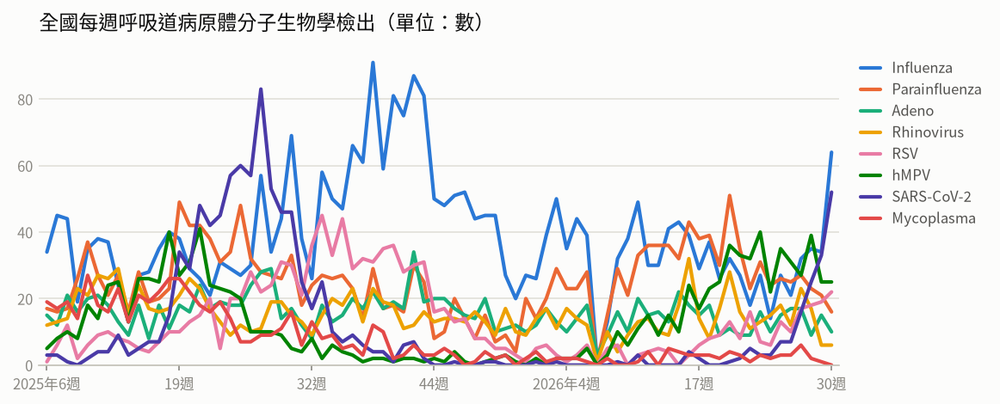

- **全國每週呼吸道病原體分子生物學檢出**（2026年第30週）：共 195，較前一週 ↑ +41（+27%）；陽性率 71.7%

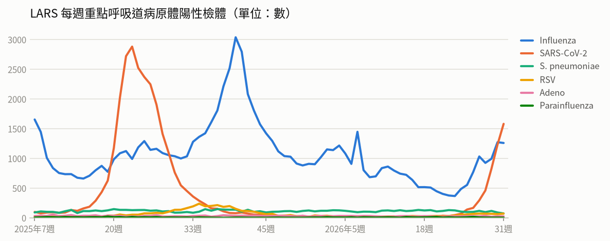

- **LARS 每週重點呼吸道病原體陽性檢體**（2026年第31週）：共 3,009，較前一週 ↑ +325（+12%）

### 新冠（COVID-19）

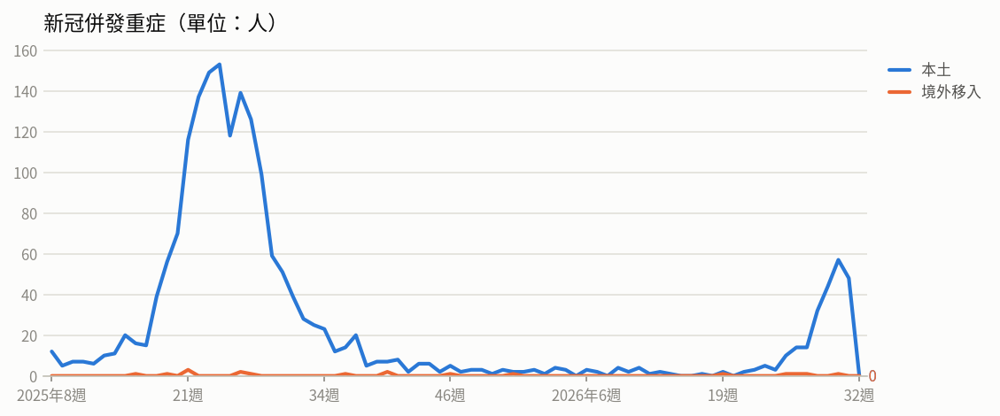

- **新冠併發重症**（2026年第31週）：共 48人（本土 48、境外移入 0），較前一週 ↓ -10（-17%）
  - 統計摘要：上週累計數 48、今年累計數 272、去年總數 1718、今年累計死亡數 34

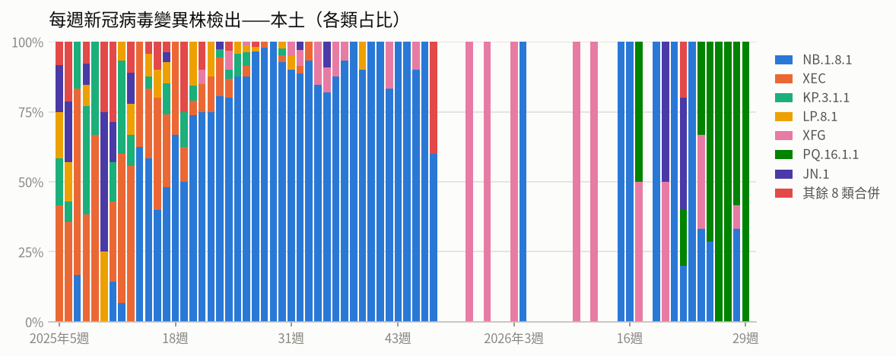

- **每週新冠病毒變異株檢出——本土**（2026年第29週）：共 1，較前一週 ↓ -11（-92%）

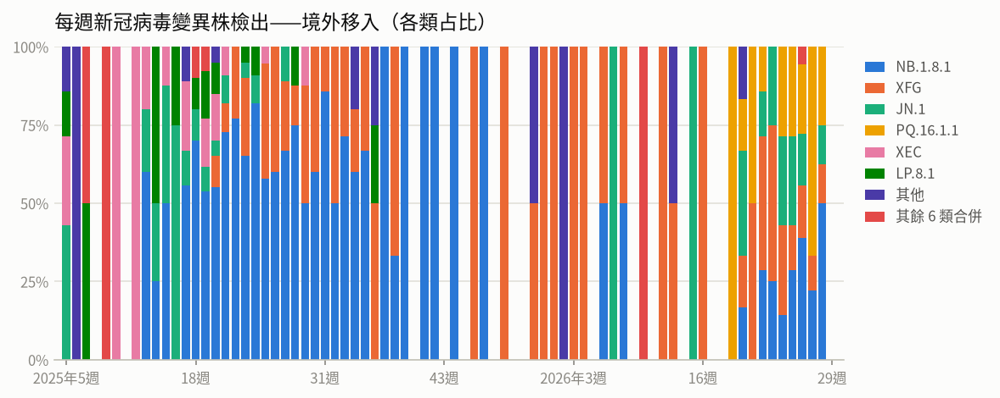

- **每週新冠病毒變異株檢出——境外移入**（2026年第29週）：共 0，較前一週 ↓ -16（-100%）

### 流感

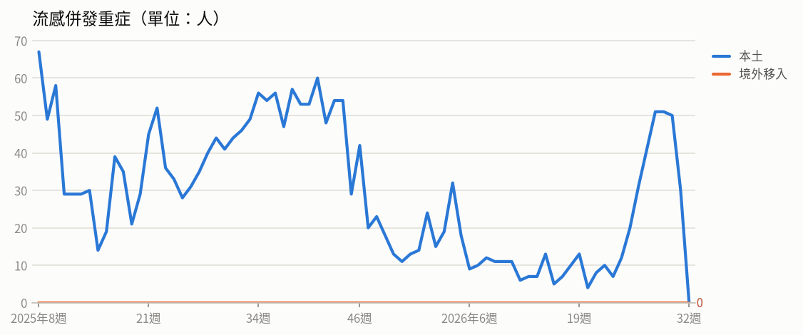

- **流感併發重症**（2026年第31週）：共 30人（本土 30、境外移入 0），較前一週 ↓ -20（-40%）
  - 統計摘要：上週累計數 30、今年累計數 563、去年總數 2290、今年累計死亡數 100

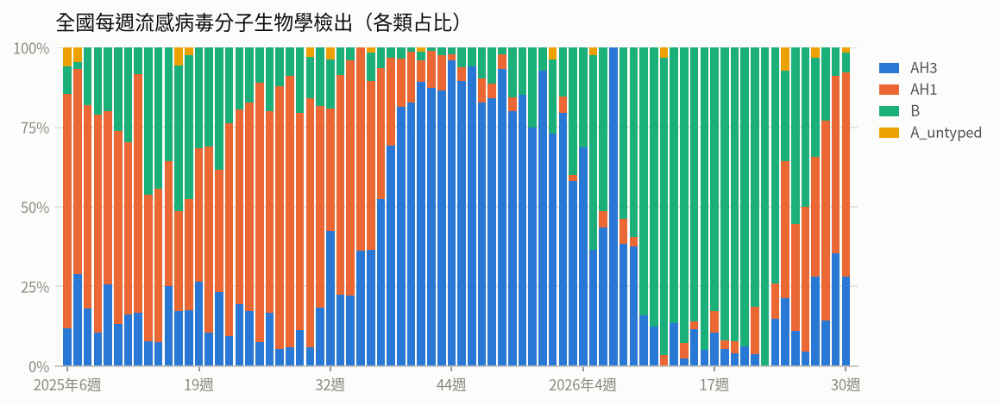

- **全國每週流感病毒分子生物學檢出**（2026年第30週）：共 64，較前一週 ↑ +30（+88%）；陽性率 23.5%

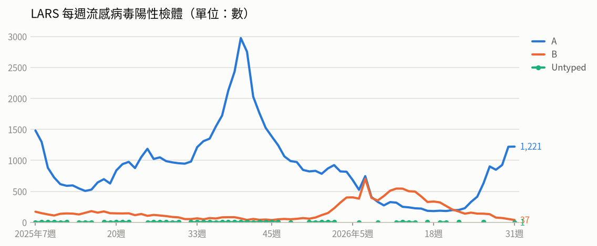

- **LARS 每週流感病毒陽性檢體**（2026年第31週）：共 1,259，較前一週 ↓ -13（-1%）

### 腸病毒

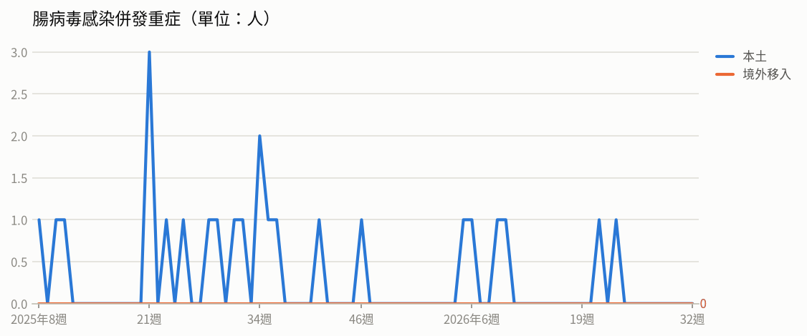

- **腸病毒感染併發重症**（2026年第31週）：共 0人（本土 0、境外移入 0）
  - 統計摘要：上週累計數 0、今年累計數 6、去年總數 19、今年累計死亡數 1

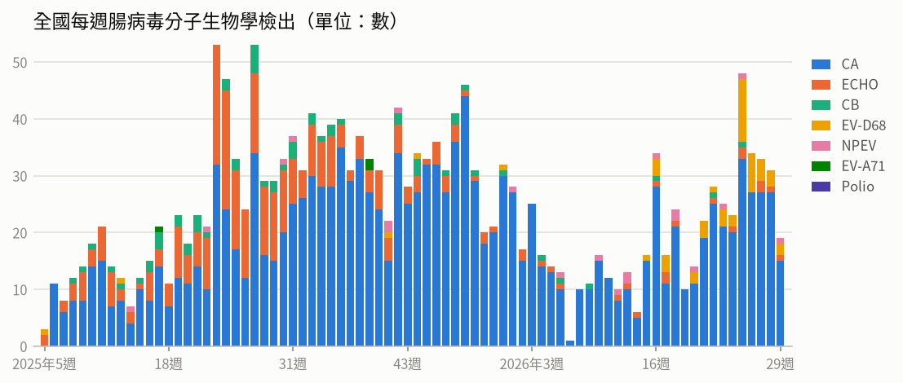

- **全國每週腸病毒分子生物學檢出**（2026年第29週）：共 19，較前一週 ↓ -12（-39%）；陽性率 7.4%

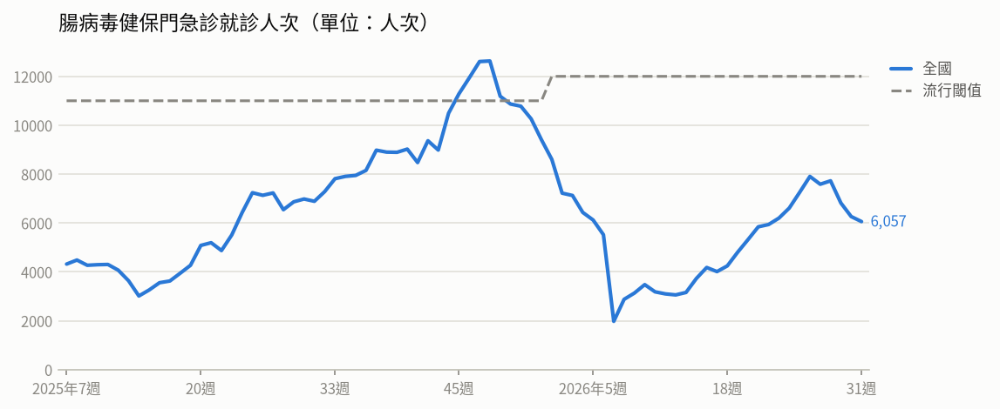

- **腸病毒健保門急診就診人次**（2026年第31週）：共 6,057人次，較前一週 ↓ -205（-3%）（流行閾值 12,000）

### 登革熱

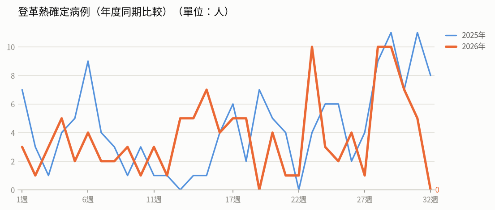

- **登革熱確定病例（年度同期比較）**（2026年第31週）：5人，2025年同期 11人
  - 統計摘要：上週累計數 5、今年累計數 119、去年總數 293、今年累計死亡數 0

> 數據取自 NIDSS（目前為 2026年第32週，統計上一完整週；定序類資料有時間落後，以各項標示的週次為準）。最新資料可能因後續回報而變動。

## 重點速覽

# 本週疫情重點速覽

1. **COVID-19：國內已進入流行期，疫情連續數週急升，疫苗接種延長至 9/28**
   - 第 30 週（7/26–8/1）門急診就診 18,990 人次，較前一週上升 74.8%（第 28 週 4,766 人次、+66.5%；第 29 週 10,605 人次、+117.4%），上週新增 62 例本土重症、3 例死亡。
   - 2025 年 10 月起累計 265 例本土併發重症、28 例死亡；重症以 65 歲以上長者（74.0%）及具慢性病史者（85.3%）為主，89.1% 未接種本季疫苗；近 4 週變異株以 PQ.16.1.1 為主（先前為 NB.1.8.1）。
   - 公費疫苗擴大至滿 6 個月以上民眾，接種期程延長至 2026/9/28；本季已接種約 177.2 萬人次，65 歲以上第 1 劑 21.12%、第 2 劑 0.78%。藥物整備充足（倍拉維 16.9 萬人份、舒冠效 1.7 萬人份、瑞德西韋 15.3 萬劑、家用快篩約 63 萬劑）。
   - 用藥提醒：公費 Molnupiravir 庫存已於 115/7/25 全數屆效銷毀且不再採購，臨床應優先使用 Paxlovid、Remdesivir，不適用者可評估 Xocova 或其他替代藥物。臺北市診所疫苗調度問題已由疾管署跨縣市調撥 300 劑並於 7/27、28 配送 6,000 劑。

2. **伊波拉病毒感染（剛果民主共和國、烏干達）：PHEIC、旅遊警告第三級、暫停核發簽證**
   - WHO 已於 2026/5/17 宣布 DRC 與烏干達疫情構成國際關注公共衛生緊急事件，病原為 Bundibugyo 型伊波拉病毒，目前無核准疫苗或特效藥，部分病例已進入城市地區。
   - 依 DRC 國家公共衛生研究所 8/4 資料，單日新增 99 例確診（52 例死亡），累計 3,973 例確診、1,801 例死亡，致死率 45.3%，疫情涵蓋 5 省 51 個衛生區（以伊圖里省為主）；烏干達累計 7 例確診、1 例死亡。
   - 我國措施：旅遊疫情建議等級自 5/28 提升至第三級「警告」；自 115/6/2 零時起暫停核發兩國居民簽證 90 天（僅 4 類對象排除）；入境前 21 天內有流行地區旅遊史者須至機場檢疫站報到並執行 21 天自主健康管理，疑似症狀者由救護車後送合約醫院。疾管署評估我國整體風險仍低，但無法排除境外移入。

3. **日本腦炎：今年累計 10 例、出現首例死亡，正值流行高峰期**
   - 新增 2 例均為桃園市個案：桃園區 70 多歲女性（具慢性病史）於 7 月下旬病逝，為今年首例死亡；大園區 50 多歲男性住院治療中。今年首例為南部 60 多歲女性，仍於加護病房。
   - 今年累計 10 例（桃園市 6 例，彰化、雲林、嘉義、花蓮各 1 例），低於 2022–2025 年同期（17、19、21、19 例）。流行季 5–10 月、6–7 月為高峰，病例以 40 歲以上成人居多。
   - 疾管署發布致醫界通函第 609 號，遇發燒、頭痛、意識障礙、嘔吐等疑似腦炎病例應儘速通報。

4. **麻疹：今年累計 11 例（3 例本土、8 例境外移入），已發生 2 起群聚**
   - 最新群聚：指標個案為 30 多歲外國籍女性（5 月中旬來臺旅遊，入境 3 天後發燒、咳嗽、鼻炎及紅疹），續發個案為其北部 20 多歲同住友人，累計 2 例、匡列 491 人監測至 6/16。
   - 年初另 1 起群聚（北部 8 個月大男嬰為指標個案、醫院接觸者 40 多歲男性續發），匡列 526 人；4 月另有北部 10 多歲外國籍學生境外移入 1 例，匡列 162 人。
   - 國際疫情持續：日本今年累計 511 例（已超過去年全年 265 例）；孟加拉自 3 月起累計 70,936 例（9,049 例確診）、585 死；東南亞多國持續輸出病例。疾管署已對多國發布第二級警示與第一級注意；接觸者未遵守自主健康管理者可依傳染病防治法處 6–30 萬元罰鍰。

5. **蚊媒傳染病：登革熱進入流行期並出現本土病例，另有茲卡、瘧疾境外移入**
   - 登革熱：5/23 公布今年首例本土病例（高雄市前鎮區 60 多歲男性，登革病毒第一型）。截至 8/3 累計 111 例（7 例本土，均居住高雄市；104 例境外移入），低於 2025 年同期 130 例；上週新增 8 例境外移入，含 1 起赴柬埔寨交流的 3 人群聚。境外移入以印尼 24 例最多、越南 23 例、馬爾地夫 15 例。全球今年截至 6 月逾 158 萬例。
   - 提醒：發病前 1 天至發病後 5 天為病毒血症期，5–11 月為流行期，請醫師提高通報警覺並落實 NS1 快篩。
   - 茲卡：今年首例境外移入（北部 30 多歲男性，感染地泰國），我國自 2016 年累計 31 例全為境外移入。瘧疾：新增 1 例間日瘧復發（20 多歲外國籍男性，2025 年於巴基斯坦確診），今年累計 2 例境外移入。

6. **疫苗與通報政策更新，及其他零星／國際監測疾病**
   - **肺炎鏈球菌疫苗**：自 115/8/10 起成人公費疫苗全面升級為單劑 PCV20 或 PCV21，取代原 PCV13＋PPV23 兩劑方案，PPV23 同日起回收停用；對象為 65 歲以上長者、55–64 歲原住民及 19–64 歲高風險者，約 317 萬人受惠。ACIP 認為兩種疫苗無優劣之分。今年截至 7/27 累計 156 例 IPD、19 例死亡，65 歲以上約占 5 成。
   - **立百病毒感染症**：自 115/4/2 起列為第五類法定傳染病，疑似個案 24 小時內於 NIDRS 通報，負壓隔離收治、檢體以 P620 包裝 2–8°C 送驗。國內尚無人類或動物確診病例。
   - **國內零星個案**：4/3 公布首例本土 H7N7 新型 A 型流感（70 多歲禽類養殖業男性，低病原性禽流感，已解除隔離，致醫界通函第 605 號提醒落實 TOCC）；8/6 公布今年首例本土傷寒（中部 70 多歲女性，已出院）；今年首例境外移入萊姆病（北部 60 多歲女性，感染地瑞典）。
   - **結核病用藥**：致醫界通函第 603 號提醒，開立 levofloxacin／moxifloxacin 前須先完成 FQ 抗藥性分子檢測與公費申請流程，健保自 114/11/20 起對結核病主診斷不予給付。
   - **國際監測**：多明尼加拘留所 M 痘群聚（9 例疑似、2 例確診）、法屬留尼旺島鉤端螺旋體病 221 例／印度喀拉拉州 1,394 例 63 死、加拿大魁北克野生動物狂犬病 126 例（首見流浪貓感染浣熊型）、美國紐約州 3 例疑似兔熱病；另 CMNV 感染症國內風險評估極低，已建立送驗機制。

## 國際重要疫情

- **剛果民主共和國－伊波拉病毒感染**（關注程度：高）：根據剛果民主共和國國家公共衛生研究所（DRC INSP）2026年8月4日資料，該國伊波拉疫情持續新增病例，單日新增99例確定病例，其中52例死亡，主要發生於伊圖里省（85例）、北基伍省（10例）及上韋萊省（4例）。目前累計3,973例確定病例，含1,801例死亡、776例康復，致死率達45.3%。疫情已擴散至5個省份、51個衛生區。
  - 旅遊防疫建議：如非必要應避免前往剛果民主共和國疫情流行地區；於當地應避免接觸疑似病患、其血液或體液及野生動物，返國時如有發燒等不適症狀請主動告知機場檢疫人員並儘速就醫。
  - [原文連結](https://www.cdc.gov.tw/TravelEpidemic/Detail/G3PSay_dafdAwjsYNm3CCA?epidemicId=dXrsJ0wl0DEpdQsJAIcbsw)
- **剛果民主共和國、烏干達－伊波拉病毒感染**（關注程度：高）：WHO已於2026年5月17日宣布剛果民主共和國與烏干達伊波拉疫情構成國際關注公共衛生緊急事件（PHEIC），疫情除DRC伊圖里省熱區外，已擴散至北基伍省、南基伍省及烏干達。WHO將DRC風險等級評為「非常高」、烏干達及周邊區域為「高」、全球風險為「低」，並評估實際感染規模恐遠大於通報數；目前尚無針對該型病毒的核准疫苗與特效藥。疾管署自5月28日將兩國旅遊疫情建議等級由第二級「警示」提升為第三級「警告」，並強化邊境跨機關聯防，加強TOCC與健康評估、機上廣播宣導，具上述旅遊史入境旅客須配合自主健康管理21天。疾管署評估疫情仍集中於該兩國，對我國整體風險仍低，但無法排除境外移入病例之可能。
  - 旅遊防疫建議：民眾如非必要應避免前往剛果民主共和國、烏干達等伊波拉疫情流行地區，必要前往時請勤洗手、咳嗽戴口罩，並避免接觸或食用野生動物。返國後21天自主健康管理期間應每日早晚量測體溫並至「民眾主動E回報系統」回報，如出現發燒、頭痛、肌肉痛、噁心、嘔吐、腹痛、腹瀉或出血等症狀，請立即通報檢疫人員或撥打防疫專線1922。
  - [原文連結](https://www.cdc.gov.tw/Subscription/EpaperPreview?epaperId=101791&typeid=5)
- **剛果民主共和國、烏干達－伊波拉病毒感染症**（關注程度：高）：疾管署宣布自115年6月2日零時起暫停核發剛果民主共和國及烏干達居民簽證，已核發者暫緩入境，為期90天；僅四類對象排除，包括已取得我國入學許可之學位生、外交公務、國人之非本國籍配偶及其未成年子女，以及奔喪、探視重病親屬等緊急或人道專案協處。入境前21天內有流行地區旅遊史之國人、持有效居留證者及得入境者，抵臺時須主動至機場檢疫站報到，由檢疫人員開立自主健康管理敬告單並執行21天自主健康管理。自5月27日起所有國際航班抵臺前進行機上廣播加強宣導，經評估有疑似症狀者將即刻由救護車後送合約醫院診察，管制措施將依國際疫情滾動調整。
  - 旅遊防疫建議：兩國旅遊疫情建議等級為第三級「警告」，請民眾避免所有非必要前往當地的旅遊；如有相關旅遊史，入境時務必主動至檢疫站報到並配合21天自主健康管理，每日早晚量測體溫並至「民眾主動E回報系統」回報，出現發燒、頭痛、肌肉痛、噁心、嘔吐、腹痛、腹瀉或出血等症狀請立即撥打1922。
  - [原文連結](https://www.cdc.gov.tw/Subscription/EpaperPreview?epaperId=101797&typeid=5)
- **全國－麻疹**（關注程度：中）：指標個案為30多歲外國籍女性，今年5月中旬來臺旅遊，入境3天後出現發燒、咳嗽、鼻炎及紅疹等症狀，就醫通報後確診；案2為北部20多歲男性，係案1在臺同住友人，原已列為接觸者健康監測，出現症狀後經安排就醫確診。全球麻疹疫情持續，日本今年累計511例已超過去年全年265例，以東京都、神奈川縣及埼玉縣較多；孟加拉自今年3月疫情爆發迄今累計70,936例（9,049例確診）、585例死亡，達卡地區最嚴峻，東南亞（印尼、越南、泰國等）亦持續報告並輸出病例。麻疹傳染力極強可經空氣傳播，接觸者若未遵守自主健康管理，依傳染病防治法可處6至30萬元罰鍰。
  - 旅遊防疫建議：接種疫苗是預防麻疹最有效方法，請按時帶幼兒接種MMR疫苗；1966年以後出生成人若計劃前往流行地區，可於出國前2至4週至旅遊醫學門診諮詢評估接種。若被列為接觸者請遵循健康監測規定，出現疑似症狀應戴口罩並聯繫衛生局安排就醫，就醫時主動告知旅遊史或接觸史。
  - [原文連結](https://www.cdc.gov.tw/Subscription/EpaperPreview?epaperId=101806&typeid=5)
- **全國（國內尚無病例；流行地區為孟加拉、印度喀拉拉州及西孟加拉州）－立百病毒感染症（Nipah Virus Infection）**（關注程度：中）：疾管署考量國際間立百病毒感染症疫情持續及其致死率、發生率與傳播速度等危害風險，自1月16日起預告將該症列為第五類法定傳染病，預計3月中正式生效。立百病毒為人畜共通傳染病，自然宿主為果蝠（狐蝠屬），可經豬隻等中間宿主、受污染食品及有限的人傳人傳播，臨床可從無症狀到致命性腦炎，WHO資料顯示致死率約40%-75%，目前無核准治療藥物或疫苗，但全球風險仍屬低度。醫師發現符合通報定義之疑似個案應於24小時內於NIDRS通報採檢，並留置指定隔離治療機構隔離治療；預告期間可於「重點監視項目」項下通報。
  - 旅遊防疫建議：建議民眾避免前往立百病毒流行地區；如須前往，應維持良好個人衛生，避免接觸蝙蝠、豬隻及可能受蝙蝠污染的環境物品，並避免飲用生椰棗樹汁及食用受污染水果，有疑似症狀就醫時主動告知旅遊史。
  - [原文連結](https://www.cdc.gov.tw/Subscription/EpaperPreview?epaperId=101528&typeid=5)
- **全國（群聚事件發生於北部）－麻疹**（關注程度：中）：疾管署公布1起麻疹境外移入致國內感染群聚事件，指標個案為2月12日公布之北部8個月大男嬰（去年赴越南探親、1月底返臺後發病確診，已出院），其醫院接觸者為北部40多歲男性，接觸後13天發病、多次自行就醫後通報確診，衛生局已公布其可傳染期公共場所活動史並匡列包括5名同住親友共526名接觸者。今年截至2月26日國內累計3例麻疹（1例本土、2例境外移入，感染國為越南及馬來西亞各1例）；全球疫情持續，日本今年累計43例為近七年同期新高，墨西哥今年截至2月23日逾4千例、美國截至2月20日近千例，歐洲去年30國逾7千例。疾管署對印尼、安哥拉、墨西哥、葉門、巴基斯坦、越南、印度及哈薩克發布第二級警示，另30國列第一級注意，並預估3至5月病例數可能增加；公費MMR疫苗尚有約20萬劑，儲備充足。
  - 旅遊防疫建議：請按時帶幼兒接種MMR疫苗，避免帶未滿1歲或未接種疫苗幼兒前往流行地區，1966年以後出生成人若計劃前往流行地區且不確定免疫力，可於出國前2至4週至旅遊醫學門診評估接種。返國3週內若出現發燒、紅疹、鼻炎、咳嗽、結膜炎等症狀，應戴口罩儘速就醫並主動告知旅遊及接觸史；經匡列為接觸者請依通知書做好健康監測，勿自行就醫，應聯繫衛生局安排。
  - [原文連結](https://www.cdc.gov.tw/Subscription/EpaperPreview?epaperId=101587&typeid=5)
- **剛果民主共和國、烏干達－伊波拉病毒感染**（關注程度：中）：此波疫情為Bundibugyo型伊波拉病毒所引起，目前尚無專門治療方法或疫苗，且部分病例已進入城市地區，防控面臨高度挑戰；WHO評估區域風險為「高」、全球風險為「低」。疾管署已將剛果民主共和國及烏干達旅遊疫情建議等級由第一級「注意」提升至第二級「警示」。疾管署評估本波疫情對我國整體威脅風險仍低，但無法完全排除境外移入病例可能性，將持續強化邊境監測、醫療通報及防疫整備。
  - 旅遊防疫建議：前往剛果民主共和國、烏干達及周邊疫情地區應加強防護措施，返國後進行21天自主健康管理；如出現發燒、倦怠、肌肉痠痛、嘔吐、腹瀉或出血等疑似症狀，應戴口罩儘速就醫並主動告知旅遊史及接觸史，必要時可撥打1922防疫專線。
  - [原文連結](https://www.cdc.gov.tw/Subscription/EpaperPreview?epaperId=101770&typeid=5)
- **加拿大－狂犬病**（關注程度：中）：依MAPAQ、CBC及Beacon於2026年8月4日資料，加拿大魁北克省報告首例流浪貓感染浣熊狂犬病病例；該省今年截至7月27日已確診126例野生動物狂犬病，主要感染動物為浣熊與臭鼬。當局警示流浪貓可能成為狂犬病病毒自野生動物傳入人類生活環境的橋梁，並呼籲飼主務必為寵物完成狂犬病疫苗接種。7月16日另通報流浪貓抓咬傷民眾事件，致3人接受暴露後預防接種。
  - 旅遊防疫建議：前往當地時請勿接觸、餵食流浪貓及野生動物，家中寵物應完成狂犬病疫苗接種；若被動物抓咬傷，應立即以肥皂與清水沖洗傷口並儘速就醫評估暴露後預防接種。
  - [原文連結](https://www.cdc.gov.tw/TravelEpidemic/Detail/G3PSay_dafdAwjsYNm3CCA?epidemicId=gycHfUG0_SSsbv81_ZxC_g)
- **北部（境外移入個案）－麻疹**（關注程度：中）：疾管署公布新增1例境外移入麻疹確定病例，個案為北部10多歲外國籍學生，今年3月底入境，4月上旬出現發燒、喉嚨痛及紅疹等症狀，就醫採檢確診，衛生單位匡列接觸者162人，監測至5月1日。我國今年累計8例麻疹病例，年齡介於未滿1歲至50多歲，境外移入感染國家為越南、馬來西亞、美國、印度、印尼及吉爾吉斯各1例。全球疫情持續，日本今年迄4月8日累計236例為近7年同期最高，吉爾吉斯自2025年迄今逾8,500例、墨西哥逾9千例、美國逾1,700例。疾管署已針對孟加拉、印尼、瓜地馬拉、墨西哥、越南及印度等10國發布第二級警示，另30國列為第一級注意。
  - 旅遊防疫建議：麻疹可經空氣傳播、傳染力極強，如有流行地區旅遊史且返國3週內出現發燒、紅疹、鼻炎、咳嗽、結膜炎等症狀，請戴口罩儘速就醫並主動告知旅遊及接觸史。請按時帶幼兒接種MMR疫苗；1966年（含）以後出生成人若計劃前往流行地區，可於出國前2至4週至旅遊醫學門診諮詢評估接種。
  - [原文連結](https://www.cdc.gov.tw/Subscription/EpaperPreview?epaperId=101691&typeid=5)
- **法屬留尼旺島、印度（喀拉拉州）－鉤端螺旋體病**（關注程度：中）：法屬留尼旺島今年累計221例確定病例（1例死亡），3月達高峰71例後逐步下降，7月僅8例；今年65%病例需住院，可能與延遲就醫或感染毒力較高血清群有關，該島歷來以與韋氏病（Weil disease）相關的Icterohaemorrhagiae血清群為主。印度喀拉拉州疫情已擴及至少10個地區，呈全州性傳播，7月單月新增415例確定病例及30例死亡，死亡個案以40至69歲勞工及農業工作者為主，占該州傳染病死亡總數52%。當地致死率由4.2%升至6%，且8月為流行高峰期，當局持續推廣以去氧羥四環素（doxycycline）進行預防性投藥。
  - 旅遊防疫建議：前往流行地區應避免接觸可能受污染的淡水或土壤，勿於溪河湖泊戲水，從事農作或涉水時穿著防水手套及雨鞋；返國後若出現發燒、頭痛、肌肉痠痛、眼睛紅或黃疸等症狀，應儘速就醫並告知旅遊接觸史。
  - [原文連結](https://www.cdc.gov.tw/TravelEpidemic/Detail/G3PSay_dafdAwjsYNm3CCA?epidemicId=8f6-2lLDzgmRkKZR5hdSwA)
- **全國－瘧疾**（關注程度：低）：疾管署公布新增1例境外移入瘧疾病例，為20多歲外國籍男性，2025年曾在巴基斯坦確診瘧疾，今年1月下旬入境臺灣，6月上旬起出現發燒、嘔吐等症狀，就醫通報後確認為間日瘧復發。近10年（2017-2026年）國內累計67例瘧疾病例均為境外移入，感染地以非洲國家為多，病原體以惡性瘧為主、間日瘧次之。國際疫情持續，全球約94%病例集中於非洲（奈及利亞、剛果民主共和國、烏干達、衣索比亞、莫三比克5國為多），辛巴威西馬紹納蘭省今年累計14,730例、法屬馬約特島至5月下旬累計197例、印尼今年累計約20萬餘例，巴基斯坦2025年仍報告約180萬例。
  - 旅遊防疫建議：前往瘧疾流行地區請至少於出國前一個月至旅遊醫學門診諮詢，並依醫師指示於出國前、期間及返國後持續服用預防藥物；當地應穿著淺色長袖長褲、使用核可防蚊藥劑並住在有紗門紗窗處，返國後若出現發燒等疑似症狀應儘速就醫並告知旅遊史與用藥情況。
  - [原文連結](https://www.cdc.gov.tw/Subscription/EpaperPreview?epaperId=101856&typeid=5)
- **全國－茲卡病毒感染症**（關注程度：低）：疾管署公布2026年國內首例境外移入茲卡病毒感染症確定病例，為北部30多歲本國籍男性，6月中旬自泰國返國後出現發熱、頭暈、頭脹，6月下旬出現皮疹就醫確診；接觸者及同住者均無症狀，衛生單位已進行孳生源清除與接觸者追蹤。我國自2016年迄今共31例，全為境外移入，感染地以東南亞國家為多（占81%）。全球疫情目前發生率遠低於流行高峰期，多集中於美洲，美洲今年截至6月下旬累計逾1.1萬例，泰國今年截至第28週累計76例。
  - 旅遊防疫建議：孕婦及計劃懷孕婦女應暫緩前往茲卡病毒流行地區，前往者須做好防蚊措施；自流行地區返國後男性3個月、女性2個月內應採安全性行為，並落實自主防蚊至少3週、暫緩捐血至少1個月，返國兩週內如有不適應儘速就醫並告知旅遊史。
  - [原文連結](https://www.cdc.gov.tw/Subscription/EpaperPreview?epaperId=101930&typeid=5)
- **全國（北部；感染地為瑞典）－萊姆病**（關注程度：低）：疾管署公布今年首例境外移入萊姆病確定個案，個案自2024年5月起居住瑞典，常至住家附近森林活動，今年3月10日因皮膚紅癢在當地就醫確診並服用抗生素，3月17日入境台灣後因血尿及皮膚症狀未改善就醫，經通報採檢確認感染，目前已返家休養。萊姆病為經受感染硬蜱（壁蝨）叮咬傳播的人畜共通傳染病，不會人傳人，潛伏期3至30天（平均約7天），70%至80%感染者出現遊走性紅斑，初期有頭痛、發燒、寒顫、噁心、嘔吐、肌肉疼痛及淋巴腺腫脹等類似感冒症狀，未妥適治療後期可能出現心臟或神經系統異常。全球疫情近年呈上升趨勢且地理分布擴大，美國2023年至少8萬9千餘例，歐洲每年平均約13萬2千例，瑞典每年約1萬餘例，韓國與日本2023年病例數亦創近年新高。
  - 旅遊防疫建議：前往流行地區或野外活動時應穿著淺色長袖衣褲、手套及長靴並將褲管紮入襪內，裸露皮膚塗抹政府核可防蚊蟲藥劑，返家前檢查是否遭蜱叮咬並儘快沐浴換洗衣物；若發現硬蜱附著應以鑷子夾住口器小心摘除並用肥皂沖洗，出現疑似症狀請儘速就醫並主告旅遊接觸史。
  - [原文連結](https://www.cdc.gov.tw/Subscription/EpaperPreview?epaperId=101666&typeid=5)
- **多明尼加共和國－M痘**（關注程度：低）：依Beacon、多明尼加共和國公共衛生部及WHO 2026年7月29日資料，該國聖克里斯多福省一處拘留所爆發M痘群聚，7月28日報告9例疑似個案，全數為收容人，已確診2例、7例調查中，目前尚無社區傳播情形。當局已展開接觸者追蹤與環境消毒。該國於2022至2024年累計83例確定病例後，已近2年未發生疫情。
  - 旅遊防疫建議：前往多明尼加共和國時應避免與不明皮膚病灶或呼吸道症狀者密切接觸，注意手部衛生；返國後如出現發燒、皮疹等症狀，應儘速就醫並主動告知旅遊史。
  - [原文連結](https://www.cdc.gov.tw/TravelEpidemic/Detail/G3PSay_dafdAwjsYNm3CCA?epidemicId=zt25xSWSjrqAwTidZiT2Xg)
- **美國（紐約州薩福克郡）－兔熱病（Tularemia）**（關注程度：低）：依據CNN與美國CDC 2026年8月4日資訊，紐約州薩福克郡出現3例兔熱病疑似病例，全美近年病例雖有上升趨勢，惟2019至2023年每年通報仍低於200例。該疾病多見於5至9月，蜱蟲或鹿蠅叮咬集中於夏季，而因狩獵及接觸動物引起的感染則不限季節。病例以男性較多，推估與狩獵、園藝等活動暴露風險較高有關；各年齡層皆可能感染，其中兒童屬較高風險族群。
  - 旅遊防疫建議：前往美國相關地區時，於草叢、林地活動應穿著淺色長袖衣褲並使用防蚊蟲藥劑，返家後檢查身上是否有蜱蟲附著；避免徒手接觸野生動物或其屍體，出現發燒、淋巴結腫大等症狀應盡速就醫並告知旅遊及接觸史。
  - [原文連結](https://www.cdc.gov.tw/TravelEpidemic/Detail/G3PSay_dafdAwjsYNm3CCA?epidemicId=yeC-hoofSr3mnJgi79EHig)

## 本週國內公告摘要

### 登革熱

#### 國內出現今年首例本土登革熱病例，籲請各位醫師提高警覺，加強疑似病例通報(疾病管制署致醫界通函第608號)

- **來源／關注程度／地區**：衛生福利部疾病管制署／中／高雄市
- **病例概況**：疾管署5月23日公布今年首例本土登革熱病例，為高雄市前鎮區60多歲男性，確認感染登革病毒第一型。
- **摘要**：個案5月23日出現發燒、肌肉酸痛及頭痛症狀，當日就醫經登革熱NS1快篩陽性，通報採檢確定為登革病毒第一型感染；潛伏期活動地點涵蓋高雄市前鎮區、苓雅區、大社區、仁武區、新興區及屏東縣屏東市。因登革熱個案於發病前1天至發病後5天為具傳染性之病毒血症期，及早發現疑似病例是控制疫情關鍵。目前已進入每年5月至11月登革熱流行期，加上國際疫情嚴峻，境外移入與社區傳播風險增加，疾管署籲請醫師提高通報警覺。
- **防疫建議**：民眾如出現發燒、頭痛、後眼窩痛、肌肉與關節痛、出疹等症狀應盡速就醫並主動告知旅遊史與活動地點；平時請落實住家內外清除孳生源與防蚊措施。
- **原文連結**：https://www.cdc.gov.tw/Bulletin/Detail/w46ZZ_0ipmdLXMtYaX50nQ?typeId=48

#### 國內持續新增登革熱境外移入病例 請民眾出國期間落實防蚊措施 返國後如有不適症請儘速就醫

- **來源／關注程度／地區**：衛生福利部疾病管制署／中／全國（本土病例集中高雄市）
- **病例概況**：上週（7/28-8/3）新增8例境外移入病例，含1起柬埔寨境外群聚3例；今年截至8月3日累計111例確診（7例本土、均居住高雄市；104例境外移入），低於2025年同期130例。
- **摘要**：疾管署表示國際登革熱等蚊媒傳染病疫情持續，東南亞及南亞鄰近國家疫情上升，境外感染風險提高；上週新增8例境外移入病例，其中3例為7月中旬同赴柬埔寨交流活動的群聚感染，返國後陸續出現發燒、頭痛、噁心、肌肉痛、後眼窩痛等症狀確診，該案預計監測至8月6日。境外移入以印尼24例最多，其次為越南23例、馬爾地夫15例。全球今年截至6月累計逾158萬例，主要分布於美洲，亞洲則以斯里蘭卡逾8.4萬例、柬埔寨逾2.8萬例情況較嚴峻。
- **防疫建議**：出國從事戶外活動請穿著淺色長袖衣褲並使用含敵避（DEET）、派卡瑞丁或伊默克等政府核可防蚊藥劑，返國14天內若出現發燒、頭痛、後眼窩痛、肌肉關節痛等症狀應儘速就醫並告知旅遊史。國內請落實「巡、倒、清、刷」清除積水容器，降雨後再次巡檢，學校亦應留意長期未使用的馬桶、水箱等積水處。
- **原文連結**：https://www.cdc.gov.tw/Bulletin/Detail/Stt8v-QIBqLbCLHgyWPaAg?typeId=9

### COVID-19（新冠併發重症）

#### 國內公費 COVID-19口服抗病毒藥物Molnupiravir均已屆效，籲請醫師依「新型冠狀病毒（SARS-CoV-2）感染臨床處置指引」評估使用其他替代藥物(疾病管制署致醫界通函第611號)

- **來源／關注程度／地區**：衛生福利部疾病管制署／中／全國
- **病例概況**：近期國內新冠疫情持續呈上升趨勢且已進入流行期。
- **摘要**：疾管署公布國內庫存公費COVID-19口服抗病毒藥物Molnupiravir已於115年7月25日全數屆效並由存放機構辦理屆期銷毀，因療效有限且作用機轉可能有安全性疑慮，庫存用罄後不再採購。依WHO及我國「新型冠狀病毒（SARS-CoV-2）感染臨床處置指引」，COVID-19個案應優先使用Paxlovid、Remdesivir；不適用Paxlovid者可依藥物適應症評估使用Xocova或其他建議之替代藥物。相關領用方案資訊已置於疾管署全球資訊網COVID-19用藥專區。
- **防疫建議**：民眾如出現COVID-19疑似症狀，尤其是65歲以上、孕婦、慢性病或免疫功能低下等具重症風險因子者，應儘速就醫評估，由醫師評估後及早給予抗病毒藥物，以降低重症與死亡風險。
- **原文連結**：https://www.cdc.gov.tw/Bulletin/Detail/RnoNCS2H0o7BzeHM2G0OAw?typeId=48

### H7N7新型A型流感

#### 疾管署確認首例本土H7N7新型A型流感個案，請醫師提高警覺，如發現疑似個案，應立即通報採檢(疾病管制署致醫界通函第605號)

- **來源／關注程度／地區**：衛生福利部疾病管制署／中／全國
- **病例概況**：疾管署於115年4月3日公布國內首例本土H7N7新型A型流感病例，共1例，個案已解除隔離。
- **摘要**：個案為70多歲男性，從事禽類養殖業並具慢性病史，3月20日出現流鼻水、咳嗽、全身痠痛，3月22日因發燒就醫並住院，影像檢查顯示肺炎，醫師依臨床症狀及接觸史通報並投予流感抗病毒藥劑。檢驗確認為A型H7N7流感病毒，屬低病原性禽流感病毒（LPAI），對抗病毒藥物仍具敏感性；個案病況好轉且2次採檢皆陰性，已於4月3日解除隔離。疾管署發布致醫界通函第605號，籲請醫師提高警覺並落實TOCC詢問。
- **防疫建議**：民眾應避免接觸禽鳥、豬隻及相關場所，落實勤洗手、生禽肉蛋充分煮熟；若出現發燒、咳嗽等呼吸道症狀，就醫時請主動告知職業、旅遊史與禽鳥接觸史。
- **原文連結**：https://www.cdc.gov.tw/Bulletin/Detail/iz_IoRvqF3zGITX4XBzBnA?typeId=48

### 伊波拉病毒感染

#### WHO宣布剛果民主共和國與烏干達伊波拉感染疫情為PHEIC，疾管署籲請醫師提高警覺與加強通報，並落實感染控制防護措施。(疾病管制署致醫界通函第607號)

- **來源／關注程度／地區**：衛生福利部疾病管制署／中／剛果民主共和國、烏干達
- **病例概況**：新聞未公布具體病例數，WHO指出本波疫情由Bundibugyo型伊波拉病毒引起，部分病例已進入城市地區，防控面臨高度挑戰。
- **摘要**：世界衛生組織於115年5月17日宣布剛果民主共和國與烏干達的伊波拉病毒感染疫情構成「國際關注公共衛生緊急事件（PHEIC）」，該疫情由Bundibugyo型伊波拉病毒引起，目前尚無對應之治療方法或疫苗。疾管署評估對我國整體威脅風險仍低，但因國際人員往來頻繁，無法完全排除境外移入病例，已將兩國旅遊疫情建議等級由第一級「注意」提升為第二級「警示」。伊波拉病毒感染屬第五類法定傳染病，疑似個案應於24小時內通報，並依規定通知區管制中心以P620專用容器、2-8℃送驗，同時落實嚴格感染管制措施。
- **防疫建議**：近期避免非必要前往剛果民主共和國與烏干達，於當地應避免接觸病患、屍體、體液及野生動物；返國後如出現發燒、嚴重倦怠、肌肉痠痛、嘔吐腹瀉或出血等症狀，應戴口罩儘速就醫並主動告知旅遊接觸史。
- **原文連結**：https://www.cdc.gov.tw/Bulletin/Detail/xnjKDEsiZTD4GMJYwjNEgg?typeId=48

### 侵襲性肺炎鏈球菌感染症（IPD）／一般公告

#### 自115年8月10日（含）起，成人肺炎鏈球菌疫苗全面升級為20價或21價新型疫苗，籲請醫界朋友鼓勵符合資格民眾踴躍接種(疾病管制署致醫界通函第612號)

- **來源／關注程度／地區**：衛生福利部疾病管制署／不適用／全國
- **病例概況**：本文為疫苗政策公告，未提供病例數統計資料。
- **摘要**：疾管署公告自115年8月10日起，成人公費肺炎鏈球菌疫苗全面升級為單劑PCV20或PCV21新型疫苗，取代原本PCV13+PPV23的2劑接種方式，PPV23將辦理回收不再提供接種。公費對象包含65歲以上長者、55-64歲原住民及19-64歲IPD高風險對象（如脾臟功能缺損、免疫功能不全、人工耳植入、腦脊髓液滲漏、一年內接受免疫抑制劑或放射治療之惡性腫瘤及器官移植者）。ACIP評估PCV20與PCV21兩種疫苗無優劣之分，並訂有疫苗轉換銜接原則；已完整接種者無需再追加，但19-64歲高風險對象若65歲前已完整接種PCV13/15及PPV23，可於滿65歲且間隔滿5年後追加1劑。
- **防疫建議**：符合公費資格的民眾可攜帶健保卡（外籍人士需具健保身分或居留證）至合約院所接種1劑PCV20或PCV21，可透過疾管署「流感新冠肺鏈疫苗及流感藥劑地圖」查詢接種地點。若不確定過去接種紀錄或是否需再接種，請洽醫師評估銜接原則。
- **原文連結**：https://www.cdc.gov.tw/Bulletin/Detail/314drgt9vg05Js-q1Wgdrw?typeId=48

### 侵襲性肺炎鏈球菌感染症（IPD）／肺炎鏈球菌疫苗政策

#### 成人公費肺炎鏈球菌疫苗自2026年8月10日起全面升級為20價或21價新型疫苗 接種「1劑搞定」

- **來源／關注程度／地區**：衛生福利部疾病管制署／中／全國
- **病例概況**：國內今年截至7月27日累計156例IPD確定病例、19例死亡，其中65歲以上約占5成。
- **摘要**：疾管署宣布自115年8月10日起，成人公費肺炎鏈球菌疫苗全面升級為PCV20或PCV21新型疫苗，接種1劑即可獲得完整保護力，取代原本PCV13加PPV23的2劑接種方式，同日起23價疫苗辦理回收、不再提供接種。適用對象為65歲以上長者、55-64歲原住民及19-64歲IPD高風險者，估計約317萬名尚未完整接種者受惠。ACIP評估20價與21價疫苗無優劣之分，可併同提供；65歲以上長者接種完成率已由政策實施前31%提升至36%，預期可望突破40%。
- **防疫建議**：符合資格民眾請備妥健保卡（原住民另帶身分證明文件、高風險對象備診斷書等佐證資料），儘速至約2,800家合約醫療院所接種1劑新疫苗；曾完整接種「13或15價加23價」或「20價」、「21價」者無需再接種，並仍應加強個人衛生、避免出入空氣不流通場所，有疑似症狀盡速就醫。
- **原文連結**：https://www.cdc.gov.tw/Bulletin/Detail/vwMq9VkXIaV7FHyJgpk-5w?typeId=9

### 傷寒

#### 國內出現今年首例本土傷寒確定病例 籲請民眾注意飲食及手部衛生

- **來源／關注程度／地區**：衛生福利部疾病管制署／低／中部（台中、彰化、南投等中部地區）
- **病例概況**：國內出現今年首例本土傷寒確定病例，今年累計4例（1例本土、3例境外移入），本土病例數與2022至2025年同期1至3例相當。
- **摘要**：疾管署於2026年8月6日公布今年首例本土傷寒確定病例，為中部70多歲具慢性病史女性，近期無國內外旅遊史，7月中旬出現發燒、腹瀉等症狀就醫住院確診，目前已出院返家休養。同住家人3人及接觸者42人中，1人有腹瀉症狀，已採檢的4人檢驗結果皆為陰性，衛生單位並衛教接觸者進行健康監測。傷寒屬第二類法定傳染病，由傷寒桿菌引起，潛伏期一般8至14天（可由3至60天不等），主要經食用受病患或帶菌者糞便、尿液污染的食品或飲水傳播，常見症狀為持續性發燒、頭痛、倦怠、厭食、腹痛、腹瀉、相對性心搏過緩或軀幹紅疹。
- **防疫建議**：飲用水應煮沸或選用瓶裝水，食物充分加熱煮熟並避免生熟食交叉污染，飯前便後、處理食品前及更換尿片後以肥皂和清水徹底洗手。出現疑似症狀應儘速就醫並告知飲食史，醫療院所發現疑似個案請於24小時內通報。
- **原文連結**：https://www.cdc.gov.tw/Bulletin/Detail/oK_5RuMcEfhPiXKxOXcUGg?typeId=9

### 新冠肺炎（COVID-19）

#### 新冠疫苗充足 已協助增加配送量提供臺北市政府衛生局撥配轄區合約醫療院所提供民眾接種

- **來源／關注程度／地區**：衛生福利部疾病管制署／中／臺北市
- **病例概況**：新聞未提供具體病例數，僅說明近期新冠疫情呈上升趨勢，民眾接種疫苗意願明顯提高。
- **摘要**：疾管署2026年7月26日表示目前新冠疫苗充足，並針對媒體報導臺北市診所缺疫苗一事說明：新冠疫苗須符合冷鏈管理，配送前需解凍、理貨等作業約需3天，故臨時追加需求須等候作業時間。臺北市衛生局7月23日提報7月27日配送1,900劑，因需求激增於7月24日臨時上調4,100劑，疾管署已協調跨縣市調撥300劑支援臺北市，並將於7月27、28日共配送6,000劑疫苗供轄區合約醫療院所使用。疾管署並已於7月15日函請各縣市衛生局盤點醫療資源、寬估疫苗需求量。
- **防疫建議**：接種疫苗是預防新冠病毒感染及降低重症風險最有效的方法，尚未完成接種者應儘速接種。可至疾管署全球資訊網預防接種專區「流感新冠肺鏈疫苗及流感藥劑地圖」或各地衛生局網站查詢合約醫療院所，或撥打免付費防疫專線1922洽詢。
- **原文連結**：https://www.cdc.gov.tw/Bulletin/Detail/jjjZ92M6bSeLe0m_jmppdQ?typeId=9

#### 國內新冠疫情持續呈上升趨勢 呼籲尚未接種疫苗民眾儘速接種 落實個人防護措施 具重症風險因子民眾出現疑似症狀可由醫師評估後給藥

- **來源／關注程度／地區**：衛生福利部疾病管制署／高／全國
- **病例概況**：第28週（7/12-7/18）門急診就診4,766人次，較前一週上升66.5%，已達流行閾值進入流行期；上週新增25例本土重症及5例本土死亡病例。
- **摘要**：疾管署表示國內新冠疫情持續上升並進入流行期，第28週門急診就診4,766人次，較前7日增加66.5%，上週新增25例本土重症與5例死亡。2025年10月起累計161例本土併發重症、其中23例死亡，重症以65歲以上長者（74.5%）及具慢性病史者（83.9%）為多，92.5%未接種本季疫苗；近4週本土病例變異株以NB.1.8.1為主。目前公費抗病毒藥物與疫苗整備充足，倍拉維11.3萬人份、舒冠效1.8萬人份、瑞德西韋15.5萬劑；公費疫苗擴大提供滿6個月以上民眾接種至2026年7月31日止，本季已接種約173.5萬人次，65歲以上長者第1劑接種率20.98%、第2劑0.53%。
- **防疫建議**：尚未接種本季新冠疫苗者請儘速接種（滿12歲以上可擇一廠牌，6個月至11歲僅限Moderna；65歲以上長者及免疫不全等3類高風險對象已滿間隔180天應接種第2劑），並落實手部衛生、呼吸道禮節，於醫療照護機構、人潮聚集或通風不良場所及接觸長者、免疫低下者時自主佩戴口罩。具重症風險因子者出現疑似症狀應儘速就醫，由醫師評估後開立抗病毒藥物治療。
- **原文連結**：https://www.cdc.gov.tw/Bulletin/Detail/u3YrvIQXQrOtbJXDXxFxQg?typeId=9

#### 國內近期新冠疫情上升，籲請醫師鼓勵尚未接種疫苗者踴躍施打新冠疫苗，就診病患如符合抗病毒藥物使用條件建議進行快篩後評估給藥(疾病管制署致醫界通函第610號)

- **來源／關注程度／地區**：衛生福利部疾病管制署／中／全國
- **病例概況**：疾管署監測顯示近期國內新冠疫情明顯升溫、門急診就診人次呈上升趨勢，感染個案多以輕症為主，但全球及鄰近國家疫情亦明顯上升。
- **摘要**：疾管署以致醫界通函第610號提醒，適逢暑假出遊旺季、人群聚集移動增加，病毒傳播風險上升；現行公費新冠疫苗對流行病毒株仍具保護力，並擴大提供全國滿6個月（180天）以上民眾接種至115年7月31日。呼籲醫師主動詢問並為就診病患及陪病者提供接種服務，65歲以上長者等高風險對象尚未接種、或已接種第1劑且間隔達6個月者應儘速接種。若病患出現新冠疑似症狀且具重症風險因子（如65歲以上、孕婦、慢性病或免疫功能低下者）並符合抗病毒藥物使用條件，建議快篩後依評估結果儘速給藥。目前疫苗庫存約45.7萬劑（Moderna單劑型45.1萬劑、Novavax 0.6萬劑）、口服抗病毒藥物（倍拉維、舒冠效）13.1萬人份、注射用瑞德西韋15.5萬劑，儲備充足。
- **防疫建議**：尚未接種新冠疫苗或符合追加接種條件（如65歲以上長者已接種第1劑並間隔滿6個月）的民眾，請於115年7月31日前儘速接種；若出現疑似症狀且具重症風險因子，應盡早就醫並依醫師評估快篩、及早使用抗病毒藥物。
- **原文連結**：https://www.cdc.gov.tw/Bulletin/Detail/VaWP5erBPQaw5fTbyrUshg?typeId=48

#### 新冠疫苗擴大全民接種延長至9月28日 尚有約44萬劑提供全民免費接種

- **來源／關注程度／地區**：衛生福利部疾病管制署／中／全國
- **病例概況**：國內新冠疫情已進入流行期且近期升溫，本土重症病例仍以65歲以上長者及具慢性病史者為多，其中9成以上未接種本季新冠疫苗。
- **摘要**：疾管署宣布公費新冠疫苗擴大提供滿6個月以上尚未接種者，接種措施延長至2026年9月28日止，目前尚有44.3萬劑疫苗（Moderna約44萬劑、Novavax約0.3萬劑，其中Novavax效期至7月31日）可免費接種。截至7月24日，本季接種累計約174萬人次，65歲以上長者第1劑接種率21%、第2劑0.56%；現有疫苗對流行變異株仍具保護力。醫藥物資整備充足，公費倍拉維(Paxlovid)16.9萬人份、舒冠效(Xocova)1.7萬人份、瑞德西韋15.3萬劑，家用快篩試劑約63萬劑可供應。
- **防疫建議**：尚未接種本季新冠疫苗的民眾請儘速完成接種，65歲以上長者、55歲以上原住民及免疫不全者若已接種1劑並間隔180天可再接種第2劑；並持續勤洗手、戴口罩，具重症風險因子者出現疑似症狀應儘速就醫以及早使用抗病毒藥物。
- **原文連結**：https://www.cdc.gov.tw/Bulletin/Detail/oBrpeEYHlg6CZ32oiSW_1Q?typeId=9

#### 國內新冠疫情上升且處流行期 呼籲尚未接種疫苗的民眾儘快接種 並落實勤洗手、戴口罩等自我防護措施

- **來源／關注程度／地區**：衛生福利部疾病管制署／高／全國
- **病例概況**：第30週（7/26-8/1）新冠門急診就診18,990人次，較前一週上升74.8%，上週新增62例本土重症及3例本土死亡病例，疫情持續上升且處流行期。
- **摘要**：疾管署表示國內新冠疫情持續上升並處於流行期，第30週門急診就診達18,990人次，週增74.8%。自2025年10月起累計265例本土併發重症、其中28例死亡，重症以65歲以上長者（74.0%）與具慢性病史者（85.3%）為多，89.1%未接種本季新冠疫苗；近4週本土病例變異株以PQ.16.1.1為主。本季疫苗接種累計約177.2萬人次，65歲以上長者第1劑接種率21.12%、第2劑0.78%，擴大接種措施延長至2026年9月28日止。
- **防疫建議**：尚未接種本季新冠疫苗者請儘快接種，並落實勤洗手、於醫療照護機構、大眾運輸及人潮擁擠室內場所自主戴口罩。出現喉嚨痛、咳嗽、發燒等症狀可先自我快篩並儘速就醫，具重症風險因子者應及早就醫評估抗病毒藥物。
- **原文連結**：https://www.cdc.gov.tw/Bulletin/Detail/lFK7neXKyk54GdPYg_hNDg?typeId=9

#### Novavax疫苗僅餘4,000劑提供接種至7月底 請民眾把握機會儘速接種

- **來源／關注程度／地區**：衛生福利部疾病管制署／中／全國
- **病例概況**：國內新冠疫情持續上升並進入流行期，疾管署呼籲民眾儘速接種疫苗。
- **摘要**：疾管署2026年7月23日表示，國內新冠疫情持續上升進入流行期，公費疫苗有莫德納及Novavax兩種廠牌，均安全有效對抗目前主流病毒株，滿12歲以上民眾可擇一接種。莫德納疫苗尚有約44.3萬劑、效期至今年9月底；Novavax全國庫存僅餘4,000劑，效期至2026年7月31日，有需求者請儘速接種。滿6個月至11歲兒童依核准適應症僅限接種莫德納疫苗（單劑型排掉半劑量後使用剩餘0.25mL）。
- **防疫建議**：滿12歲以上民眾可擇一廠牌儘速接種，欲接種Novavax者請於7月底前把握機會；65歲以上長者、55-64歲原住民及滿6個月以上免疫不全或免疫力低下者，若已接種1劑並間隔滿6個月（180天），應盡快接種第2劑以降低重症與死亡風險。
- **原文連結**：https://www.cdc.gov.tw/Bulletin/Detail/B79gaZ88SYAZgcTncGUr9A?typeId=9

#### 新冠疫情持續升溫 尚未接種本季新冠疫苗民眾請儘速接種獲得保護力 如有疑似症狀請儘速就醫

- **來源／關注程度／地區**：衛生福利部疾病管制署／高／全國
- **病例概況**：第29週（7/19-7/25）新冠門急診就診10,605人次，較前一週上升117.4%，上週新增42例本土重症及2例本土死亡，疫情已進入流行期。
- **摘要**：疾管署表示國內新冠疫情持續上升並已進入流行期，適逢暑假旅遊旺季，傳播風險提高。2025年10月起累計203例本土併發重症、25例死亡，其中65歲以上長者占73.4%、具慢性病史者占83.7%，90.6%未接種本季新冠疫苗；近4週本土病例變異株以NB.1.8.1為主。公費新冠疫苗擴大接種措施已延長至2026年9月28日，疫苗庫存尚有43.7萬劑，抗病毒藥物倍拉維16.8萬人份、舒冠效1.7萬人份、瑞德西韋15.3萬劑，家用快篩試劑約63萬劑。
- **防疫建議**：尚未接種本季新冠疫苗者請儘速接種，65歲以上長者、55歲以上原住民及免疫不全者若已接種第1劑並間隔6個月，請儘速接種第2劑；平時勤洗手、於醫療照護機構及人潮擁擠場所自主戴口罩，有發燒或呼吸道症狀盡量在家休息，具重症風險因子者出現疑似症狀應儘速就醫。
- **原文連結**：https://www.cdc.gov.tw/Bulletin/Detail/HqTIUKC58EK9fO9AVWU3Cg?typeId=9

### 日本腦炎

#### 國內已出現今年首例日本腦炎個案，請醫師提高警覺，加強對疑似病例通報(疾病管制署致醫界通函第609號)

- **來源／關注程度／地區**：衛生福利部疾病管制署／中／全國
- **病例概況**：今（115）年國內出現首例日本腦炎確定病例，為南部60多歲女性，目前於加護病房治療中。
- **摘要**：疾管署發布致醫界通函第609號，說明國內已出現今年首例日本腦炎確定病例，為南部60多歲女性，現於加護病房治療。依歷年流行病學資料，日本腦炎病例主要發生於5月至10月，6至7月為流行高峰。因重症常留有神經或精神性後遺症，籲請醫師提高警覺，遇發燒、頭痛、意識障礙、嘔吐等疑似腦炎病例應儘速通報，以掌握診療時機並利防疫單位進行疫情調查與防治。
- **防疫建議**：日本腦炎目前尚無治療藥物，接種疫苗為最有效的預防方法，適齡幼童應儘速至衛生所或常規疫苗合約醫療機構完成接種；住家或工作場所鄰近豬舍、水稻田等病媒蚊孳生高風險環境的成人，可至旅遊醫學門診自費接種。
- **原文連結**：https://www.cdc.gov.tw/Bulletin/Detail/GkluPxPIxP2DVpeTVgy8Aw?typeId=48

#### 國內出現今年首例日本腦炎死亡病例 籲請民眾提高警覺 加強防蚊及預防接種

- **來源／關注程度／地區**：衛生福利部疾病管制署／中／桃園市
- **病例概況**：國內今年累計10例日本腦炎確定病例，其中1例死亡（今年首例死亡病例），桃園市占6例。
- **摘要**：疾管署公布新增2例日本腦炎病例，均為桃園市民眾：案1為桃園區70多歲女性，具慢性病史，7月中旬出現無力、嗜睡及發燒等症狀住院，因病況惡化於7月下旬過世，為今年首例日本腦炎死亡病例，住家附近有水稻田、溪流、豬舍及鴿舍等高風險場域；案2為大園區50多歲男性，7月中旬發燒、頭痛，2日後昏倒就醫確診，目前住院治療中。今年累計10例確定病例（桃園市6例，彰化縣、雲林縣、嘉義縣、花蓮縣各1例），2022至2025年同期病例數分別為17、19、21及19例，死亡數與近年同期相當。台灣流行季為5至10月，6至7月為高峰，病例以40歲以上成人較多。衛生單位已於個案居住地周邊高風險場域懸掛誘蚊燈並加強衛教與幼童接種。
- **防疫建議**：請按時帶家中滿15個月幼兒接種日本腦炎疫苗（間隔12個月接種第2劑）；住家或活動地鄰近豬舍、水稻田等高風險環境者，應避免於清晨、傍晚在畜舍附近活動，穿著淺色長袖衣褲並使用含DEET、派卡瑞丁或伊默克等政府核可防蚊藥劑，自覺有風險的成人可至旅遊醫學門診評估自費接種。
- **原文連結**：https://www.cdc.gov.tw/Bulletin/Detail/E9XcpC1Rx1SNvj-ksltbmA?typeId=9

### 立百病毒感染症（Nipah Virus Infection）

#### 115年4月2日公告「立百病毒感染症」為我國第五類法定傳染病，同時訂定病例定義，敬請醫師配合通報及相關防治措施。(疾病管制署致醫界通函第604號)

- **來源／關注程度／地區**：衛生福利部疾病管制署／不適用／全國
- **病例概況**：本則為法定傳染病公告與病例定義訂定通函，未提供國內病例數或疫情趨勢資料。
- **摘要**：衛生福利部自115年4月2日起公告新增「立百病毒感染症」為第五類法定傳染病，疾管署並依國際相關指引訂定病例定義。臨床醫師發現符合通報定義之病例，應於24小時內至傳染病通報系統（NIDRS）通報，並依感染管制措施指引採檢送驗及隔離治療。疑似個案應優先收治於負壓隔離病房，採取嚴格接觸、飛沫及空氣傳播防護措施；檢體可採發病期內鼻咽擦拭液、咽喉擦拭液或腦脊髓液，以A類（P620）感染性物質包裝、2-8°C送疾管署檢驗及疫苗研製中心檢體單一窗口檢驗。
- **防疫建議**：立百病毒感染症屬人畜共通傳染病，民眾應避免在無防護下接觸病豬或其污染組織，勿飲用生椰棗樹汁或食用可能受果蝠尿液、唾液污染的水果；照顧病人時應做好防護，出現疑似症狀請儘速就醫並告知接觸史。
- **原文連結**：https://www.cdc.gov.tw/Bulletin/Detail/eTR7VZfSghNF0NVtlKvKHg?typeId=48

### 結核病

#### 為落實FQ類藥品抗藥性監測，避免影響結核病治療，籲請臨床醫師於診治結核病人若需開立levofloxacin或moxifloxacin前，應事先向疾管署申請核准(疾病管制署致醫界通函第603號)

- **來源／關注程度／地區**：衛生福利部疾病管制署／不適用／全國
- **病例概況**：本通函為臨床用藥規範公告，未提供病例數或疫情趨勢資料。
- **摘要**：疾管署發布致醫界通函第603號，提醒臨床醫師診治結核病人若需開立FQ類藥品（levofloxacin或moxifloxacin），須先依「抗藥性結核病高風險個案快速分子檢測」規範，取新鮮痰液以「消化去汙痰檢體」送三軍總醫院附設民眾診療服務處做藥物敏感性試驗，確認有無FQ抗藥後，再依公費藥品申請流程申請並經核准，方提供公費FQ藥品；用藥期間應加強監測副作用與服藥順從性。FQ類藥品為抗結核重要二線藥，使用不當易誘發前驅廣泛抗藥性結核病（pre-XDR-TB），縮減可用藥物選擇並影響治療效果。健保署114年11月20日更新之「藥品給付規定通則」第十節10.8.2規定，因治療結核病（主診斷碼A15-A19）開立levofloxacin及moxifloxacin不予給付，並已完成自動化審查（REA）檢核邏輯設定。
- **防疫建議**：結核病人用藥應遵醫囑按時服藥、勿自行調整或停藥，並主動回報副作用；相關抗結核公費藥申請資訊可至疾管署全球資訊網結核病治療照護專區查詢。
- **原文連結**：https://www.cdc.gov.tw/Bulletin/Detail/GIdliaRfgGw-7TIJ4aQ0Pw?typeId=48

### 隱蔽性死亡野田病毒（CMNV）感染症

#### 針對「隱蔽性死亡野田病毒(CMNV)」可能造成跨物種人類感染，疾管署已建立送驗機制，籲請醫師如遇疑似個案，建議詢問水生動物與水產品暴露史，必要時可採檢送驗 (疾病管制署致醫界通函第606號)

- **來源／關注程度／地區**：衛生福利部疾病管制署／低／全國
- **病例概況**：目前僅中國報告疑似人類感染CMNV病例，WHO、美國CDC及歐洲ECDC均無相關病例報告，疾管署評估國內傳播風險極低。
- **摘要**：國際期刊《Nature Microbiology》研究指出，存在於自然界水生動物的隱蔽性死亡野田病毒（CMNV）疑似具跨物種傳播至人類的潛在能力，可能導致「持續性高眼壓病毒性前葡萄膜炎（POH-VAU）」。疾管署評估國內傳播風險極低，但已建立CMNV送驗機制並將與農方持續監測。醫師如遇病人有兩次以上輕度或慢性難治型前葡萄膜炎、發作期間眼壓>21 mm Hg、角膜沉積物等特徵，且已排除HLA-B27等自體免疫因素與HSV、VZV、CMV等常見病原，建議詢問發病前一年內是否曾無防護接觸水生動物或水產品、或生食相關水產品；符合者可於LIMS「隱蔽性死亡野田病毒（CMNV）感染症」項目送驗，採集發病期血液及／或前房水，以B類（P650）感染性物質包裝、2-8°C送至疾管署檢驗及疫苗研製中心單一窗口。
- **防疫建議**：依研究推論，高風險行為為「無防護措施下處理生鮮水產品」及「食用生鮮水產品」，建議處理魚類、甲殼類、貝類、海參等水生動物時佩戴手套等防護措施，並避免生食水產品。
- **原文連結**：https://www.cdc.gov.tw/Bulletin/Detail/OlhjtSXORz8Kvo6h9BcbNg?typeId=48
