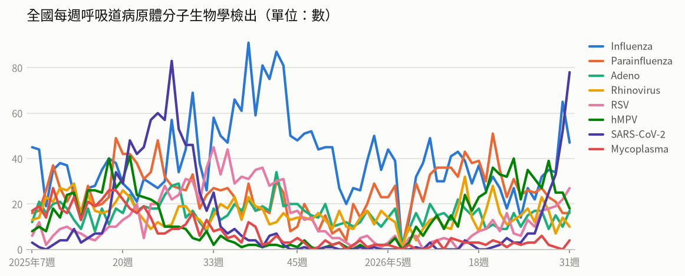
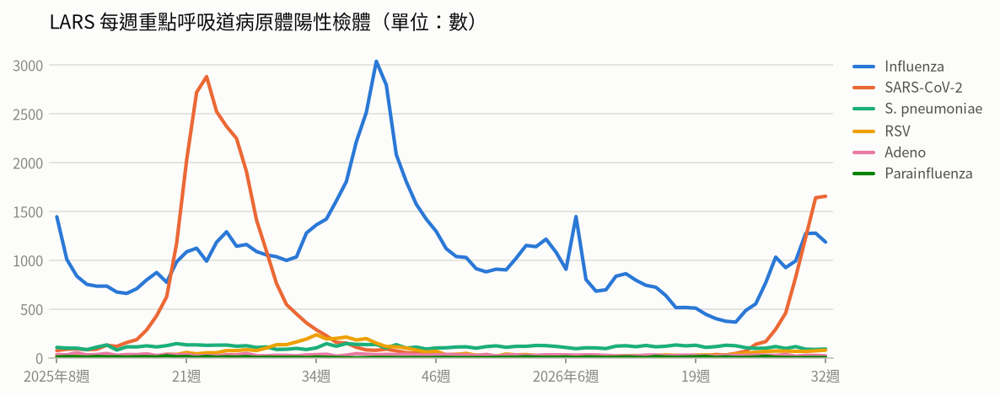
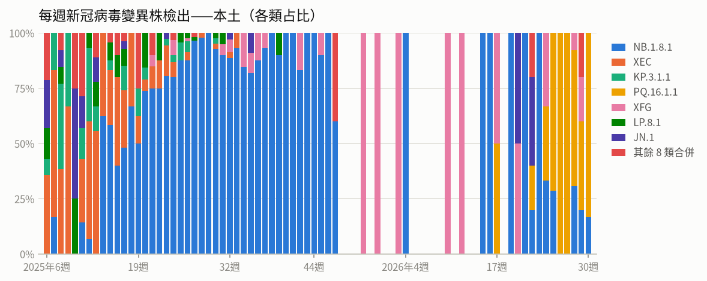
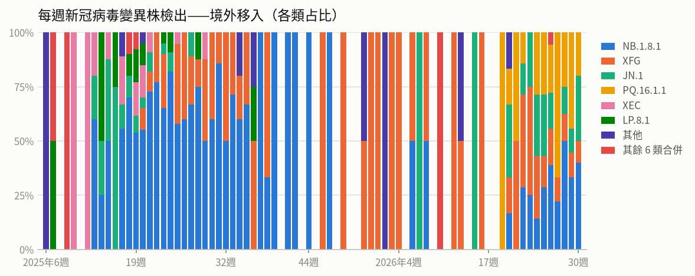
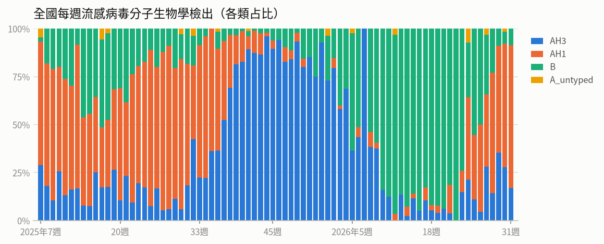
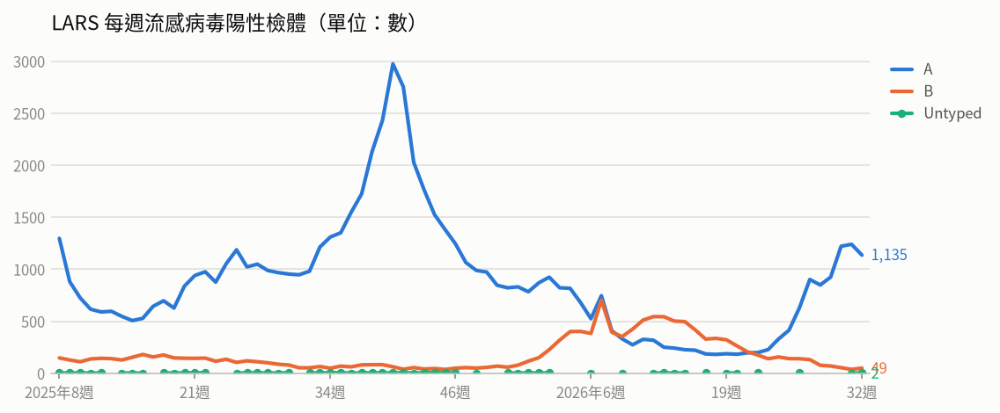
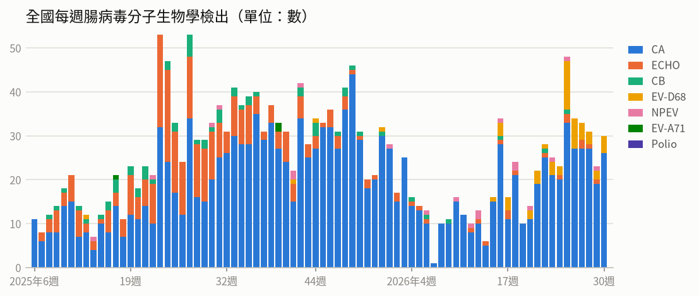
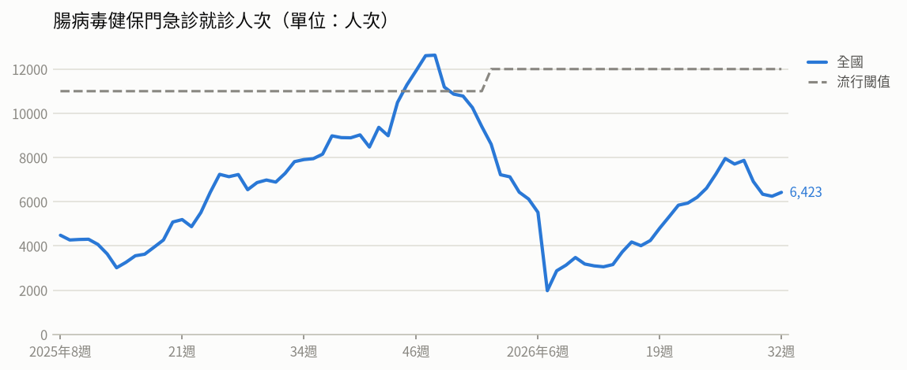

# 疫情週報 2026-W33

涵蓋期間：2026-08-10 ~ 2026-08-16

> 本報告由 AI 自動產生，內容以疾管署原文為準。

## 監測數據

### 呼吸道病原體（整體）

- **全國每週呼吸道病原體分子生物學檢出**（2026年第31週）：共 217，較前一週 ↑ +13（+6%）；陽性率 61.1%

- **LARS 每週重點呼吸道病原體陽性檢體**（2026年第32週）：共 3,034，較前一週 ↓ -69（-2%）

### 新冠（COVID-19）

- **新冠併發重症**：頁面抓取失敗（ValueError）

- **每週新冠病毒變異株檢出——本土**（2026年第30週）：共 6，較前一週 ↑ +1（+20%）

- **每週新冠病毒變異株檢出——境外移入**（2026年第30週）：共 10，較前一週 ↑ +1（+11%）

### 流感

- **流感併發重症**：頁面抓取失敗（ValueError）

- **全國每週流感病毒分子生物學檢出**（2026年第31週）：共 47，較前一週 ↓ -18（-28%）；陽性率 13.2%

- **LARS 每週流感病毒陽性檢體**（2026年第32週）：共 1,186，較前一週 ↓ -91（-7%）

### 腸病毒

- **腸病毒感染併發重症**：頁面抓取失敗（ValueError）

- **全國每週腸病毒分子生物學檢出**（2026年第30週）：共 30，較前一週 ↑ +7（+30%）；陽性率 9.6%

- **腸病毒健保門急診就診人次**（2026年第53週）：共 0人次（流行閾值 12,000）

### 登革熱

- **登革熱確定病例（年度同期比較）**：⚠ 年度比較圖找不到年度序列（現有：['確定病例']）

## 重點速覽

# 重點速覽（本週疾管署疫情摘要）

- **【國內．最高關注】COVID-19 疫情明顯升溫，疫苗接種進入最後期限**
  第31週（8/2–8/8）新冠門急診就診 24,645 人次，較前一週上升 27.6%；上週新增 72 例本土重症、14 例本土死亡，去年10月起累計 337 例本土重症、42 例死亡。重症以 65 歲以上長者（73.9%）及有慢性病史者（84.0%）為主，89.6% 未接種本季疫苗；近4週本土變異株以 PQ.16.1.1 為主。本季疫苗接種累計約 179.6 萬人次，65 歲以上第1劑接種率 21.22%、第2劑 0.97%，中央庫存約 3.7 萬劑將於 8/13 全數撥配至各縣市，**疫苗效期與本季接種均至 9 月 9 日止**；公費抗病毒藥物儲備充足。國際方面，全球第28週（7/13–19）陽性率 1.28%，西太平洋區持續上升，中國第31週門急診陽性率升至 22.3%（連續10週上升），香港連2週下降至 7.51%，流行株以 NB.1.8.1、XFG、JN.1 為主。

- **【國內】流感緩升但尚未進入流行期，長者與幼童風險高**
  第31週類流感門急診 92,075 人次，較前一週上升 2.4%；上週新增 70 例流感併發重症、12 例死亡。社區以A型為主（83.7%），其中 A(H1N1) 占 57%。本流感季累計 995 例重症、188 例死亡，重症以 65 歲以上（63%）及具慢性病史者（82%）居多，73% 未接種本季流感疫苗。公費抗病毒藥劑（克流感、易剋冒、瑞樂沙）配置於全國約 4 千家合約醫療機構，符合條件者**免流感快篩即可開立**。

- **【國際．高】剛果民主共和國伊波拉、奈及利亞拉薩熱疫情持續惡化**
  伊波拉：截至 8/10 累計 4,449 例確診、2,061 例死亡、886 例康復，致死率 46.3%，疫情分布 5 省 53 個衛生區，以伊圖里省最嚴峻（8/7 資料占全國 86.3%），南基伍省已連續 75 天無新增。非洲 CDC 指出傳播速度為 2014–2016 西非大流行同期的 7 倍，接觸者追蹤率僅 75%（目標 95%）、70% 新增病例不在接觸者名單、逾三分之二死亡發生於社區。WHO 已於 8/7 建議將現行核准之薩伊株疫苗 Ervebo 納入臨床試驗，與邦迪布焦疫苗二/三期試驗一併評估效力。
  拉薩熱：今年截至第30週累計 1,000 例確診、237 例死亡，致死率 23.7%（去年同期 18.8%），波及 23 州 116 區，以 21–30 歲為主，並有 53 名醫療人員確診；主因為治療費用高昂、延遲就醫及環境衛生不佳。

- **【國際】多國麻疹疫情擴大，M痘出現 Clade I 與隱性傳播疑慮**
  麻疹：葉門馬里卜今年截至 8/2 累計 1,624 例（290 例確診、12 死）並宣布公共衛生緊急狀態；哈薩克庫斯塔奈上半年 167 例確診（去年同期 10 例的 16 倍），34.1% 為未滿 1 歲嬰兒；馬達加斯加瓦卡南卡拉特拉至 7 月中旬 229 例確診、2 死，42 區中 24 區處於活躍期；美國今年截至 8/9 累計 2,465 例，已高於去年全年 2,289 例，68% 為 19 歲以下、93% 未接種或接種史不明、7% 住院。
  M痘：美國加州聖地牙哥郡出現當地**首例第一分支（Clade I）**病例（具疫區旅遊史，接觸者無症狀），該郡今年累計 27 例；香港 8/5 新增 1 例 31 歲男性，與先前個案無流行病學關聯，今年累計 8 例、2022 年迄今 94 例。**赴流行地區前應完成疫苗接種並避免高風險性行為。**

- **【國際】蟲媒與水域相關傳染病多點流行，出國前後留意防蚊與傷口防護**
  登革熱：越南胡志明市今年至第30週累計 23,481 例（較去年同期＋23.9%）；菲律賓三寶顏市 8/4 宣布爆發疫情，累計 1,241 例、12 死，逾五成為 10 歲以下兒童。茲卡：美國、紐西蘭各報告 3 例境外移入，多具斐濟旅遊史，美國 CDC 呼籲孕婦及備孕婦女加強防蚊。西尼羅熱：希臘至 8/5 累計 65 例、6 死（皆 65 歲以上）；義大利至 7/28 累計 84 例、2 死。屈公病：哥斯大黎加今年 82 例（48 例確診），為近十年首度出現確診疫情。創傷弧菌：美國路易斯安那州至 8/6 累計 9 例、5 死（致死率 56%），均為傷口接觸海水感染，佛州另有 2 例死亡。

- **【國內作業與其他監視訊息】本土傷寒病例已排除、首次立百病毒演習，其他疫情持續監測**
  傷寒：8/6 公布之今年首例本土傷寒確定病例，經全基因定序確認實為非傷寒之沙門氏菌，已於 8/10 排除，**全國目前無本土傷寒確診個案**；誤判源於血清凝集試驗人工判讀誤差，疾管署已要求認可實驗室落實「雙人核對」並進行矯正預防措施。立百病毒：8/10–11 衛福部與臺南市府辦理國內首次以立百病毒為主題之生物病原災害防救演習（35 單位、205 人參演），**為演習非真實疫情**，國內尚無病例；該病致死率 40–100%，已於 115 年 4 月 2 日列為第五類法定傳染病。其他：全球新型A型流感人類病例本週無新增（今年累計 37 例），8/4–7 共 6 國報告 62 起 H5N1 禽鳥疫情；小兒麻痺於剛果民主共和國、奈及利亞新增 cVDPV2 共 13 例及 cVDPV3 1 例，巴基斯坦環境檢出 WPV1 6 件；腸病毒於俄羅斯外貝加爾邊疆區（第31週 139 例）及韓國（門診就診千分比 35）維持高點；美國俄亥俄州凱霍加郡 2 個月內檢出 5 隻蝙蝠狂犬病陽性、另有長照機構退伍軍人病群聚 8 例（皆住院、無死亡）。

## 國際重要疫情

- **剛果民主共和國－伊波拉病毒感染**（關注程度：高）：剛果民主共和國伊波拉疫情持續擴大，截至8月7日累計4,053例確診、1,850例死亡，致死率達45.6%，疫情已擴及5個省份。因應疫情快速發展，WHO於8月7日建議將現行已核准、針對薩伊株（Zaire）的伊波拉疫苗Ervebo納入臨床試驗；研發單位將在邦迪布焦（Bundibugyo）疫苗的第二/三期臨床試驗中一併評估Ervebo的疫苗效力。（資料來源：Reuters、Jamaica Observer、CEPI，2026/8/8）
  - 旅遊防疫建議：計劃前往剛果民主共和國者應審慎評估行程，避免接觸疑似病患、其血液體液及野生動物；返國後如出現發燒、頭痛、肌肉痠痛、嘔吐、腹瀉或不明原因出血等症狀，應主動告知港埠檢疫人員或就醫時說明旅遊接觸史。
  - [原文連結](https://www.cdc.gov.tw/TravelEpidemic/Detail/G3PSay_dafdAwjsYNm3CCA?epidemicId=x_x_T5Py_a895mFpCWgcRA)
- **剛果民主共和國－伊波拉病毒感染**（關注程度：高）：依據剛果民主共和國國家公共衛生研究所（DRC INSP）2026/8/7資料，該國伊波拉疫情持續新增病例，當日新增89例確定病例，其中21例死亡，分布於伊圖里省（73例）、北基伍省（12例）及上韋萊省（4例），並新增4個受影響衛生區，地理範圍持續擴大。累計確定病例4,209例，其中1,916例死亡、828例康復，致死率45.5%，疫情已擴及5個省份共53個衛生區。伊圖里省疫情最為嚴峻，占全國病例數的86.3%。
  - 旅遊防疫建議：非必要應避免前往剛果民主共和國疫區，如須前往務必避免接觸病患、其血液體液及野生動物；返國時如有發燒等不適應主動告知機場檢疫人員，返國21天內出現疑似症狀請儘速就醫並告知旅遊史。
  - [原文連結](https://www.cdc.gov.tw/TravelEpidemic/Detail/G3PSay_dafdAwjsYNm3CCA?epidemicId=6iEZEKN2ZqktfWwQ4A6xjA)
- **剛果民主共和國－伊波拉病毒感染**（關注程度：高）：剛果民主共和國伊波拉疫情持續擴大，病例主要集中於伊圖里省，南基伍省則已連續75天無新增病例。非洲CDC指出，此次疫情傳播速度為2014至2016年西非大流行同期的7倍；目前接觸者追蹤率僅75%，遠低於95%目標，且高達70%的新增病例未列於接觸者名單。逾三分之二死亡個案發生於社區而非治療中心，顯示患者可能普遍延遲就醫或未能及時獲得醫療照護。
  - 旅遊防疫建議：民眾應避免非必要前往剛果民主共和國疫區，於當地避免接觸疑似病患、其血液體液及野生動物；返國後如出現發燒等不適，請主動告知醫師旅遊史並儘速就醫。
  - [原文連結](https://www.cdc.gov.tw/TravelEpidemic/Detail/G3PSay_dafdAwjsYNm3CCA?epidemicId=Sg5rO5aBp53OlOF0uIAOBg)
- **奈及利亞－拉薩熱**（關注程度：高）：奈及利亞拉薩熱疫情持續升溫，今年截至第30週累計1,000例確定病例、237例死亡，致死率23.7%，高於去年同期18.8%，疫情波及23州116個區，病例以21至30歲族群為主。另累計53名醫療人員確診，顯示醫療機構感染管制不佳，當局已在WHO及美國CDC支持下啟動為期30天的緊急防護計畫。NCDC指出個案數與致死率上升主因為治療費用高昂、延遲就醫及環境衛生不佳。
  - 旅遊防疫建議：前往奈及利亞等西非國家應避免接觸鼠類及其排泄物污染的食物與environment，落實手部衛生；返國後如出現發燒等不適，應盡速就醫並主動告知旅遊史。
  - [原文連結](https://www.cdc.gov.tw/TravelEpidemic/Detail/G3PSay_dafdAwjsYNm3CCA?epidemicId=1Z2fb5rM9WigOSxR6I4ctg)
- **俄羅斯、韓國－腸病毒**（關注程度：中）：俄羅斯外貝加爾邊疆區腸病毒疫情自6月底以來維持高點，病例以6歲以下幼童為主，並有校園或機構群聚傳播，當局已發布指引呼籲加強手部衛生、生病學童停課在家休養。韓國疫情自高點略降，仍以0至6歲幼童為多，檢出型別以克沙奇A6型為主，並有急性無力肢體麻痺（AFP）病例報告；當前疫情雖高，但仍低於2019及2024年歷史高峰，當局已發布警示。
  - 旅遊防疫建議：前往上述地區旅遊時應加強手部衛生、勤洗手並避免與生病者接觸；幼童如出現疑似腸病毒症狀應停課在家休養並儘速就醫。
  - [原文連結](https://www.cdc.gov.tw/TravelEpidemic/Detail/G3PSay_dafdAwjsYNm3CCA?epidemicId=UIJn3UECDC2XmN741Zexag)
- **全球（重點：中國、香港）－COVID-19（新冠肺炎/新冠併發重症）**（關注程度：中）：依WHO FluNet、GISAID、中國疾控中心與香港衛生防護中心資料（2026/8/6），全球新冠陽性率於第28週為1.28%，西太平洋區署持續上升，近期流行變異株以NB.1.8.1、XFG及JN.1為主。中國疫情上升，第31週（7/27-8/2）門急診陽性率22.3%，較前1週增加1.9個百分點，已連續10週上升，為陽性率最高的呼吸道病原體，變異株以NB.1.8.1為主。香港疫情連續2週下降，第31週陽性率7.51%（前1週9.44%），污水監測顯示變異株以PQ.16（含PQ.16.1.1）占49.5%最多，其次為NB.1.8.1占29.7%。
  - 旅遊防疫建議：計畫前往中國等疫情上升地區者，請留意當地疫情、於人潮擁擠或密閉場所配戴口罩並落實手部衛生；符合條件者建議接種新冠疫苗，返國後如出現發燒、呼吸道症狀應盡速就醫並告知旅遊史。
  - [原文連結](https://www.cdc.gov.tw/TravelEpidemic/Detail/G3PSay_dafdAwjsYNm3CCA?epidemicId=v4_otzbJ8Bti48PcDaZGTQ)
- **剛果民主共和國、奈及利亞、巴基斯坦、索馬利亞－小兒麻痺症（脊髓灰質炎）**（關注程度：中）：疾管署引述全球小兒麻痺根除倡議組織（GPEI）2026/8/5公布資料，7/30至8/5期間，疫苗衍生病毒（cVDPV2）於剛果民主共和國新增12例、奈及利亞新增1例，cVDPV3於奈及利亞新增1例。環境監測方面，巴基斯坦檢出野生株WPV1陽性環境樣本6件，cVDPV2陽性環境樣本則有索馬利亞4件、剛果民主共和國1件。顯示非洲及南亞部分國家小兒麻痺病毒仍持續傳播。
  - 旅遊防疫建議：前往剛果民主共和國、奈及利亞、巴基斯坦、索馬利亞等流行地區前，應確認已完成小兒麻痺疫苗接種，必要時依醫囑追加一劑；旅途中注意手部衛生與飲食衛生，返國後如出現肢體無力等症狀應盡速就醫並告知旅遊史。
  - [原文連結](https://www.cdc.gov.tw/TravelEpidemic/Detail/G3PSay_dafdAwjsYNm3CCA?epidemicId=oVW0pppyoe1z47Ks18J93g)
- **哥斯大黎加－屈公病**（關注程度：中）：疾管署引述Outbreak News Today（2026/8/8）資訊指出，哥斯大黎加今年累計通報82例屈公病病例，包含48例確定病例，疫情主要集中在西北部地區。該國自2016年至2025年間均未曾報告確定病例，2025年雖有8例疑似病例，但最終皆未確診，顯示今年為近十年來首度出現確診疫情。
  - 旅遊防疫建議：前往哥斯大黎加（尤其西北部地區）的民眾應加強防蚊措施，包括穿著淺色長袖衣褲、使用政府核可的防蚊藥劑；返國後如出現發燒、關節疼痛、皮疹等症狀，請儘速就醫並主動告知旅遊史。
  - [原文連結](https://www.cdc.gov.tw/TravelEpidemic/Detail/G3PSay_dafdAwjsYNm3CCA?epidemicId=rqbcS4IHeGLUUAQ9wal6xw)
- **希臘、義大利－西尼羅熱**（關注程度：中）：疾管署引述Outbreak News Today（2026/8/7）資料指出，希臘今年截至8月5日累計報告65例西尼羅熱病例，其中6例死亡且皆為65歲以上長者，疫情分布於25個行政區，多數病患出現中樞神經系統症狀；該國疫情多集中於5至11月流行。義大利自今年2月至7月28日累計報告84例、2例死亡，其中19例為透過捐血篩檢發現的無症狀感染者，整體疫情與去年同期相當。
  - 旅遊防疫建議：前往希臘、義大利等流行地區應加強防蚊措施，穿著淺色長袖衣褲並使用政府核可的防蚊藥劑；返國後如出現發燒、頭痛或神經學症狀，應儘速就醫並告知旅遊史。
  - [原文連結](https://www.cdc.gov.tw/TravelEpidemic/Detail/G3PSay_dafdAwjsYNm3CCA?epidemicId=-Gwobo5uk-C3ibqoVUpQjA)
- **美國－茲卡病毒感染症**（關注程度：中）：依BEACON 2026年8月6日資料，美國報告3例茲卡病毒感染症確定病例，均有斐濟旅遊史；紐西蘭同期亦報告3例境外移入病例，旅遊史分別為斐濟與印尼。斐濟當局並未報告感染症病例，可能與當地使用的檢驗工具敏感度較低，或與登革熱等產生血清交叉反應有關，估計實際感染人數可能被低估。美國CDC呼籲赴斐濟旅客，特別是孕婦及備孕婦女，應加強防蚊措施。
  - 旅遊防疫建議：計畫前往斐濟等茲卡病毒流行地區者，務必落實防蚊措施，包括使用政府核可之防蚊藥劑、穿著淺色長袖衣褲；孕婦及備孕婦女應審慎評估行程必要性，返國後如有發燒、紅疹、關節痛或結膜炎等症狀應儘速就醫並告知旅遊史。
  - [原文連結](https://www.cdc.gov.tw/TravelEpidemic/Detail/G3PSay_dafdAwjsYNm3CCA?epidemicId=j6h0yJi4txZnrMLU7RMfow)
- **美國、香港－M痘（猴痘）**（關注程度：中）：疾管署引述Outbreak news today、香港衛生防護中心資料指出，美國加州聖地牙哥郡報告當地首例Clade I（第一分支）M痘病例，個案具疫區旅遊史，密切接觸者目前均無症狀；該郡今年累計27例，皆為17至53歲男性且多數未完整接種疫苗。香港8月5日報告1例31歲男性確定病例，患者曾有多次高風險性行為，目前住院隔離治療；因與先前個案無流行病學關聯，顯示社區恐存在未偵測到的隱性傳播鏈。香港今年累計8例，自2022年迄今共94例（75例本土、19例境外移入），皆為男性且多與高風險性行為密切相關。
  - 旅遊防疫建議：前往流行地區應避免高風險性行為與親密接觸，符合資格者建議完成2劑M痘疫苗接種；如出現發燒、皮疹或水泡等症狀，應儘速就醫並主動告知旅遊史與接觸史。
  - [原文連結](https://www.cdc.gov.tw/TravelEpidemic/Detail/G3PSay_dafdAwjsYNm3CCA?epidemicId=3Hs66sj55Ox-gP4o_cOgew)
- **美國（路易斯安那州、佛羅里達州）－創傷弧菌感染**（關注程度：中）：依BEACON 2026年8月8日資料，美國路易斯安那州今年截至8月6日累計報告9例創傷弧菌感染病例，其中5例死亡，致死率達56%，死亡數較過去10年同期平均（7例病例、1例死亡）顯著上升。所有病患皆因傷口接觸海水而感染，未發現與食用海鮮相關之食媒傳染途徑。當地衛生當局已發布公衛警示，另佛羅里達州今年迄今亦報告2例死亡病例。
  - 旅遊防疫建議：前往美國相關地區旅遊或從事海邊活動時，若身上有傷口應避免接觸海水；免疫力低下、慢性肝病等高風險族群更應特別留意，傷口接觸海水後如出現紅腫熱痛、發燒等症狀，請立即就醫並告知接觸史。
  - [原文連結](https://www.cdc.gov.tw/TravelEpidemic/Detail/G3PSay_dafdAwjsYNm3CCA?epidemicId=vnli3G_qRYW0x9V9jeB14g)
- **葉門、哈薩克、馬達加斯加、美國－麻疹**（關注程度：中）：疾管署引述Beacon、US CDC、PA GOV及CIDRAP資訊指出，多國麻疹疫情持續擴大。葉門馬里卜因戰亂致疫苗接種不足、診斷能力受限，實際疫情負擔恐高於通報數；哈薩克北部疫苗猶豫造成免疫覆蓋率偏低，確診中34.1%為未滿1歲嬰兒，該國2024年曾報告27,967例為歐洲區域負擔最重國家。馬達加斯加去年疫苗覆蓋率僅72%，42區中24區處於活躍期，當局已補接種並規劃10月全國大規模接種。美國病例68%為19歲以下兒童及青少年、93%未接種或接種史不明、7%住院，以南卡羅萊納州670例及猶他州524例最多，賓州8/10當週新增57例、今年累計232例。
  - 旅遊防疫建議：計畫前往上述國家或地區者，出發前應確認是否完成麻疹疫苗（MMR）接種，必要時可洽旅遊醫學門診評估；返國後如出現發燒、出疹等症狀，應戴口罩儘速就醫並主動告知旅遊史。
  - [原文連結](https://www.cdc.gov.tw/TravelEpidemic/Detail/G3PSay_dafdAwjsYNm3CCA?epidemicId=gVEXCTZBRWgKeLrWnjw0XQ)
- **越南（胡志明市）、菲律賓（三寶顏市）－登革熱**（關注程度：中）：疾管署引述Congly及Outbreak News Today報導指出，越南胡志明市今年截至第30週（7/20-26）累計報告2萬3,481例登革熱，較去年同期增加23.9%，第30週單週995例，較近4週平均增加20%。菲律賓三寶顏市於8月4日宣布爆發疫情，今年截至8月初報告1,241例及12例死亡，疫情持續上升並已達流行閾值，超過五成感染者為10歲以下兒童，全市98個行政區中有39個受影響，當局已加強防治措施。
  - 旅遊防疫建議：前往越南、菲律賓等登革熱流行地區時，請穿著淺色長袖衣褲並使用政府核可的防蚊藥劑；返國後如出現發燒、頭痛、後眼窩痛、肌肉關節痛或出疹等症狀，應儘速就醫並主動告知旅遊史。
  - [原文連結](https://www.cdc.gov.tw/TravelEpidemic/Detail/G3PSay_dafdAwjsYNm3CCA?epidemicId=9I_7qadmkNqAL3qTHaRtOQ)
- **全球（澳大利亞、荷蘭、智利、瑞典、美國、芬蘭、墨西哥等）－新型A型流感（禽流感）**（關注程度：低）：疾管署每週更新全球新型A型流感疫情，資料來源為WAHIS。本週人類無新增病例，今年累計37例，個案發病前多具易感動物相關暴露史。禽鳥及動物疫情方面，2026/8/4-7期間共6國報告62起H5N1疫情，包括澳大利亞44起、荷蘭10起、智利5起，瑞典、美國、芬蘭各1起；墨西哥於8月7日報告1起H7N3疫情。
  - 旅遊防疫建議：前往流感病毒活動地區時，請避免接觸禽鳥、生鮮禽肉及禽鳥排泄物，勿生食蛋類與禽肉並落實勤洗手；返國後如出現發燒、咳嗽等症狀，應戴口罩儘速就醫並主動告知旅遊與接觸史。
  - [原文連結](https://www.cdc.gov.tw/TravelEpidemic/Detail/G3PSay_dafdAwjsYNm3CCA?epidemicId=VrqVadpNzJ0l_nSv3noUfQ)
- **美國（俄亥俄州凱霍加郡）－狂犬病**（關注程度：低）：美國俄亥俄州凱霍加郡於2026年8月10日發布狂犬病警訊，該郡近2個月內檢出5隻蝙蝠狂犬病陽性，檢出率高於往年。目前尚無人類感染病例，但該郡人口密集，民眾接觸風險較高。蝙蝠為美國人類狂犬病主要感染來源，2000至2024年間報告的42例本土病例中，有35例（83%）具蝙蝠接觸史。
  - 旅遊防疫建議：前往當地旅遊時避免接觸蝙蝠及野生動物，如遭抓咬傷或疑似接觸，應立即以肥皂和大量清水沖洗傷口並儘速就醫評估接種狂犬病疫苗。
  - [原文連結](https://www.cdc.gov.tw/TravelEpidemic/Detail/G3PSay_dafdAwjsYNm3CCA?epidemicId=Qq2PEVILiiFdwkoVjD3hWw)
- **美國（俄亥俄州）－退伍軍人病**（關注程度：低）：依據Beacon 2026年8月6日資料，美國俄亥俄州1間長期照護機構發生退伍軍人病群聚，今年截至8月6日累計8例確定病例，因病情嚴重全部個案皆已住院，尚無死亡病例。該機構收治的住民多為罹患呼吸道疾病及癌症等高風險族群。目前感染源仍在調查中，當局已於該機構採取全面防治措施。
  - 旅遊防疫建議：前往當地或入住長照等機構時，留意水源與空調系統等環境衛生；長者及慢性呼吸道疾病、癌症等免疫力低下族群若出現發燒、咳嗽、呼吸急促等症狀，應盡速就醫並告知旅遊與接觸史。
  - [原文連結](https://www.cdc.gov.tw/TravelEpidemic/Detail/G3PSay_dafdAwjsYNm3CCA?epidemicId=uE4GKLNz0Nw0087qa09aXA)

## 本週國內公告摘要

### 流感

#### 國內流感疫情雖尚未進入流行期，但已有緩升趨勢，以A型流感為主

- **來源／關注程度／地區**：衛生福利部疾病管制署／中／全國
- **病例概況**：第31週（8/2-8/8）類流感門急診就診9萬2,075人次，較前一週上升2.4%，上週新增70例流感併發重症及12例死亡，疫情雖未進入流行期但呈緩升趨勢。
- **摘要**：疾管署表示，國內流感疫情自7月上旬起逐漸升溫，近4週門急診就診人次及就診病例百分比持續上升，以幼童與65歲以上長者門診就診率最高；社區流行病毒以A型為主（占83.7%），其中A型H1N1占57%。本流感季累計995例重症、188例死亡，重症以65歲以上長者（63%）及具慢性病史者（82%）居多，73%未接種本季流感疫苗。公費流感抗病毒藥劑（克流感、易剋冒、瑞樂沙）配置於全國約4千家合約醫療機構，符合條件者不需流感快篩即可開立。
- **防疫建議**：請落實勤洗手、咳嗽禮節，有呼吸道症狀時在家休息並佩戴口罩，出入醫療照護機構或人潮擁擠場所建議戴口罩；若出現呼吸急促、呼吸困難、發紺、血痰、胸痛、意識改變、低血壓等危險徵兆應儘速就醫。
- **原文連結**：https://www.cdc.gov.tw/Bulletin/Detail/BKmpR5jsioonmVADsZ-4tQ?typeId=9

### 傷寒

#### 疾管署說明今年首例本土傷寒病例排除事件

- **來源／關注程度／地區**：衛生福利部疾病管制署／低／全國
- **病例概況**：今年首例本土傷寒確定病例經全基因定序確認為非傷寒之沙門氏菌，已於8月10日排除，全國目前無本土傷寒確診個案。
- **摘要**：疾管署說明，8月6日公布的今年首例本土傷寒確定病例，係認可實驗室於7月下旬採檢後檢出「傷寒桿菌」並通報、經系統自動研判確定；後續進行菌株全基因定序，確認實為非傷寒之沙門氏菌，已要求實驗室更正報告並於8月10日排除該傷寒病例。經查誤判原因為血清凝集試驗人工判讀誤差，傷寒桿菌與其他特定細菌可能有交叉反應，微弱凝集顆粒易因操作者經驗不足、試劑效價下降或反應時間掌控不當而出現偽陽性。疾管署已要求傷寒認可檢驗機構於確認生化特性後，對血清凝集陽性結果落實「雙人核對」機制，並就此實驗室品質管制不符合事件進行原因登錄分析與矯正預防措施。
- **防疫建議**：該個案住院期間已依臨床評估治療並於8月5日康復出院，因排除傷寒感染，無需再進行糞便採檢與追蹤管理；民眾平時仍應注意飲食與飲水衛生、勤洗手，如有持續發燒、腹瀉等症狀應就醫並告知旅遊與飲食史。
- **原文連結**：https://www.cdc.gov.tw/Bulletin/Detail/Kwl-OtQxyadxHe-9CuFc1A?typeId=9

### 新冠肺炎（COVID-19）

#### 國內新冠疫情持續升溫，本季新冠疫苗將於8月13日全數撥配至各縣市提供民眾接種 有需求民眾請儘速接種

- **來源／關注程度／地區**：衛生福利部疾病管制署／高／全國
- **病例概況**：第31週（8/2-8/8）新冠門急診就診24,645人次，較前一週上升27.6%；上週新增72例本土重症及14例本土死亡，去年10月起累計337例本土重症、42例死亡。
- **摘要**：疾管署表示國內新冠疫情持續升溫，門急診就診人次與重症、死亡病例均增加，重症以65歲以上長者（73.9%）及有慢性病史者（84.0%）為多，且89.6%未接種本季新冠疫苗，近4週本土病例變異株以PQ.16.1.1為主。全球陽性率呈上升趨勢，中國、泰國、韓國及美國疫情上升，流行變異株以NB.1.8.1、XFG及JN.1為主。本季新冠疫苗接種累計約179.6萬人次，65歲以上長者第1劑接種率21.22%、第2劑0.97%；疾管署將於8月13日把中央庫存約3.7萬劑全數撥配至各縣市，疫苗效期至9月9日止，本季接種亦至該日為止。公費抗病毒藥物儲備量充足。
- **防疫建議**：有接種需求的民眾請把握9月9日前儘速接種本季新冠疫苗，並落實手部衛生、呼吸道禮節，有症狀時在家休息、外出戴口罩。若出現呼吸困難、發紺、血痰、胸痛、意識改變等危險徵兆應立即就醫，高風險族群有疑似症狀宜儘速就醫以利及早使用抗病毒藥物。
- **原文連結**：https://www.cdc.gov.tw/Bulletin/Detail/rKEajQHrBk-SYtJSD4SB5w?typeId=9

### 立百病毒感染症

#### 中央地方聯合辦理「115年度生物病原災害防救演習」 貫徹防疫一體(One Health)精神 強化新興人畜共通傳染病跨域應變量能

- **來源／關注程度／地區**：衛生福利部疾病管制署／不適用／臺南市
- **病例概況**：本則為防疫演習報導，非真實疫情，國內尚無立百病毒感染症病例，演習情境設定為臺南市某豬場外籍移工確診本土首例並死亡。
- **摘要**：衛福部與臺南市政府於115年8月10日至11日聯合辦理「生物病原災害防救演習」，為國內首次以立百病毒感染症為主題，結合中央及地方35個單位、205人參演，以兵棋推演及實兵演練驗證跨領域應變能力。演習秉持防疫一體（One Health）精神，情境設定為豬場外籍移工確診本土首例立百病毒並死亡、豬隻同步檢出陽性，涵蓋個案就醫收治、指揮中心開設、遺體處置、接觸者匡列與感染溯源等6大應變階段。疾管署說明，立百病毒為新興人畜共通傳染病，自然宿主為狐蝠，可經中間宿主（如豬隻）或受污染食物傳染給人，致死率達40%至100%，我國已於115年4月2日公告列為第五類法定傳染病。
- **防疫建議**：民眾應避免接觸蝙蝠、生病豬隻及其排泄物，勿飲用未經處理的生鮮椰棗汁或食用受污染食物；如有相關接觸史並出現發燒、頭痛、意識改變等症狀，應儘速就醫並主動告知接觸史。
- **原文連結**：https://www.cdc.gov.tw/Bulletin/Detail/WEkkqobO1yo89wjZkIci8g?typeId=9
