# 疫情週報 2026-W34

涵蓋期間：2026-08-17 ~ 2026-08-23

> 本報告由 AI 自動產生，內容以疾管署原文為準。

## 監測數據

### 呼吸道病原體（整體）

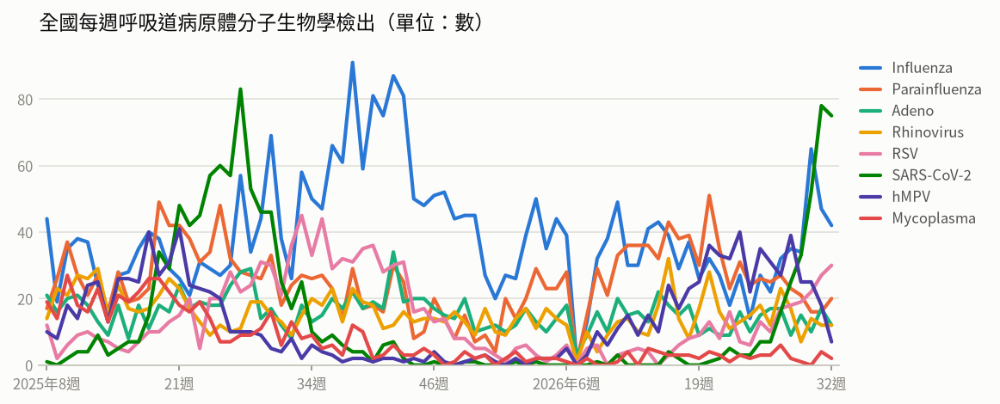

- **全國每週呼吸道病原體分子生物學檢出**（2026年第32週）：共 200，較前一週 ↓ -19（-9%）；陽性率 63.7%

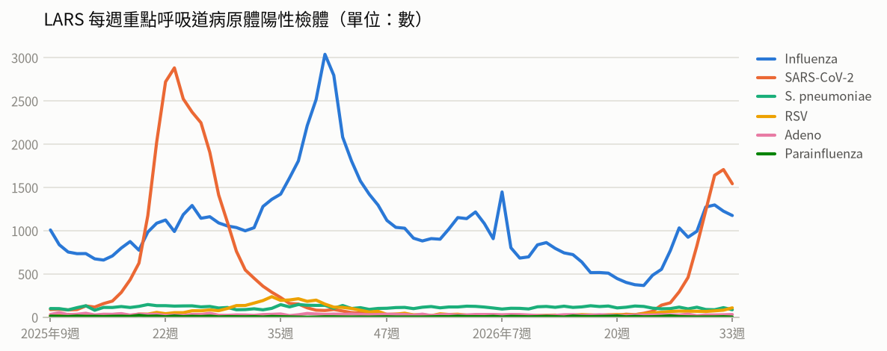

- **LARS 每週重點呼吸道病原體陽性檢體**（2026年第33週）：共 2,943，較前一週 ↓ -212（-7%）

### 新冠（COVID-19）

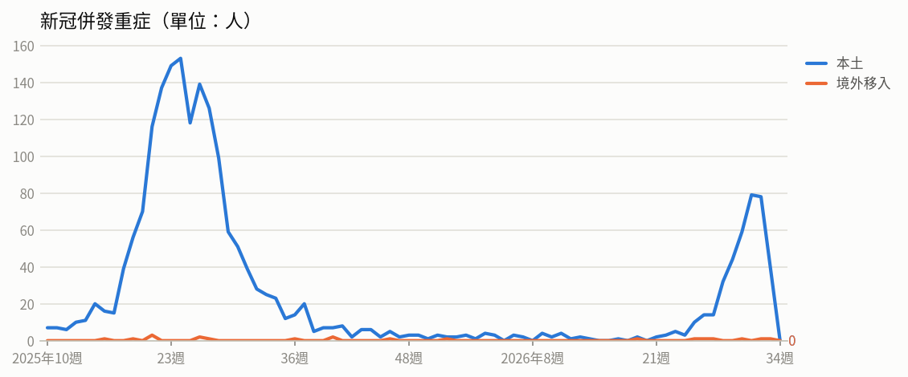

- **新冠併發重症**（2026年第32週）：共 79人（本土 78、境外移入 1），較前一週 → +0（+0%）
  - 統計摘要：上週累計數 40、今年累計數 424、去年總數 1718、今年累計死亡數 66

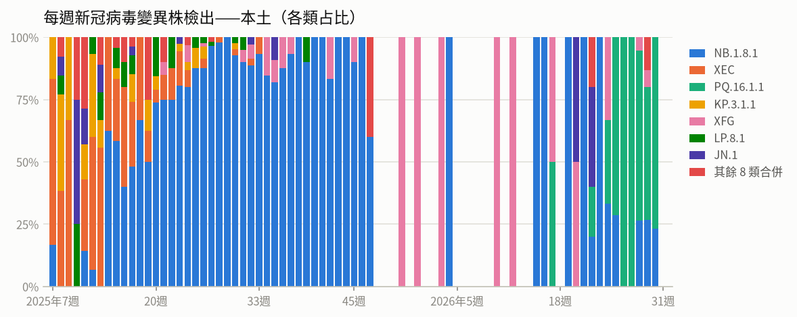

- **每週新冠病毒變異株檢出——本土**（2026年第30週）：共 13，較前一週 ↓ -2（-13%）

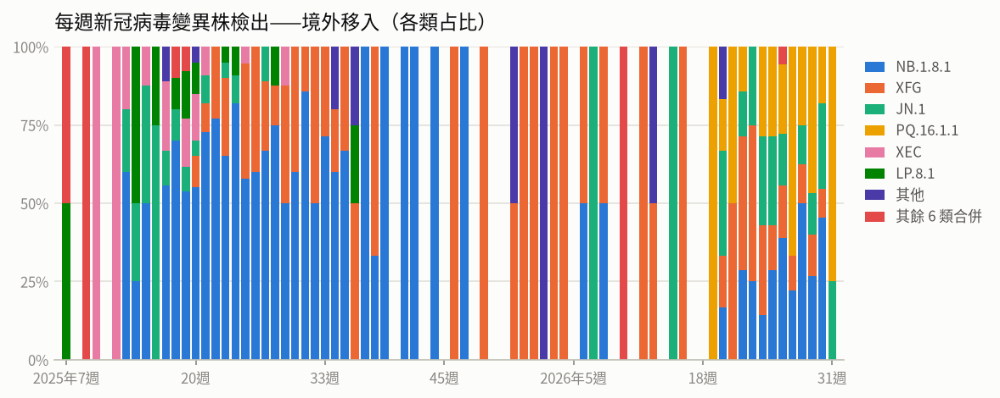

- **每週新冠病毒變異株檢出——境外移入**（2026年第31週）：共 4，較前一週 ↓ -7（-64%）

### 流感

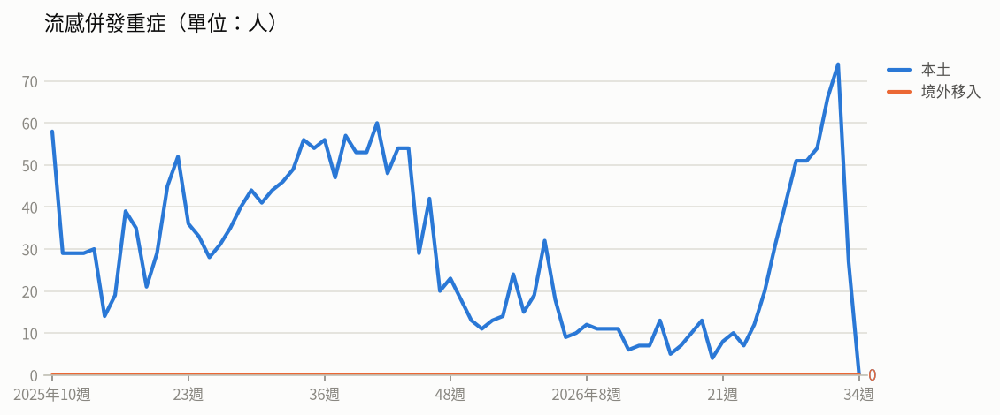

- **流感併發重症**（2026年第32週）：共 74人（本土 74、境外移入 0），較前一週 ↑ +8（+12%）
  - 統計摘要：上週累計數 27、今年累計數 704、去年總數 2290、今年累計死亡數 131

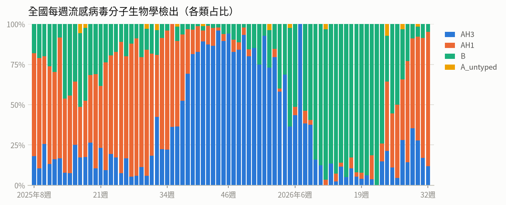

- **全國每週流感病毒分子生物學檢出**（2026年第32週）：共 42，較前一週 ↓ -5（-11%）；陽性率 13.4%

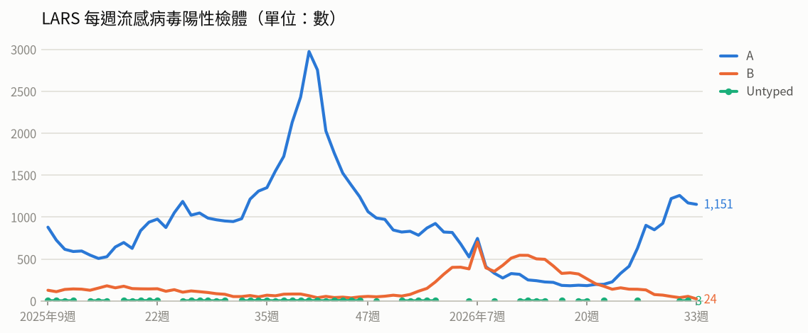

- **LARS 每週流感病毒陽性檢體**（2026年第33週）：共 1,175，較前一週 ↓ -50（-4%）

### 腸病毒

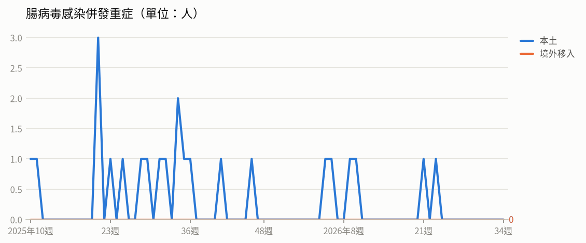

- **腸病毒感染併發重症**（2026年第32週）：共 0人（本土 0、境外移入 0）
  - 統計摘要：上週累計數 0、今年累計數 6、去年總數 19、今年累計死亡數 1

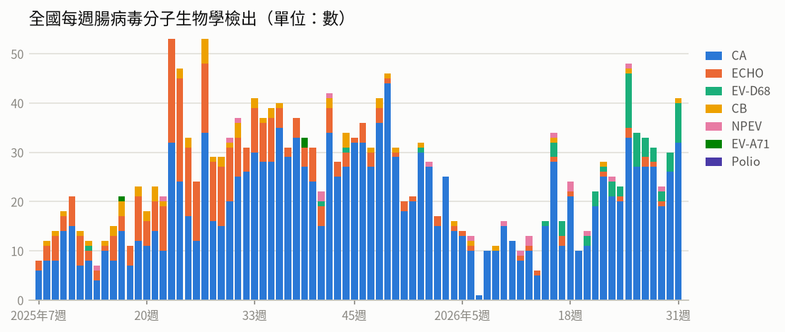

- **全國每週腸病毒分子生物學檢出**（2026年第31週）：共 41，較前一週 ↑ +11（+37%）；陽性率 11.3%

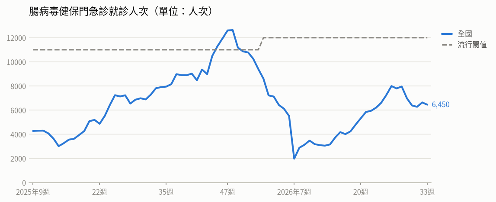

- **腸病毒健保門急診就診人次**（2026年第33週）：共 6,450人次，較前一週 ↓ -188（-3%）（流行閾值 12,000）

### 登革熱

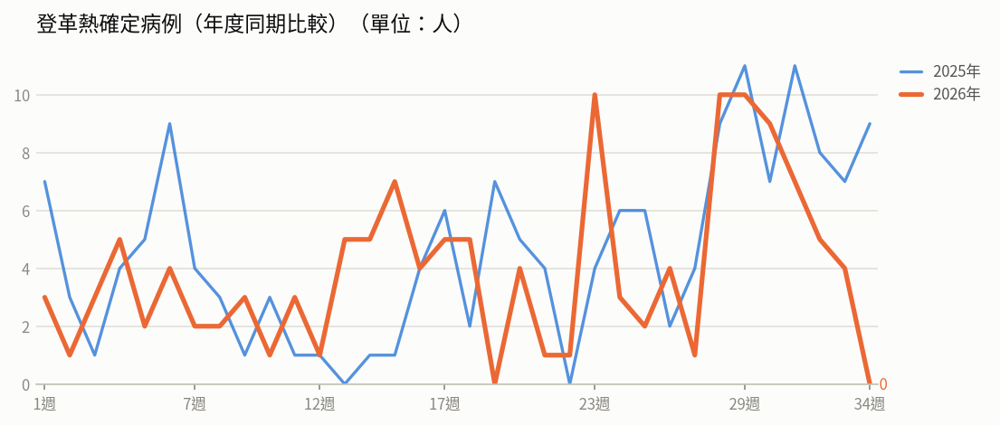

- **登革熱確定病例（年度同期比較）**（2026年第33週）：4人，2025年同期 7人
  - 統計摘要：上週累計數 4、今年累計數 132、去年總數 293、今年累計死亡數 0

> 數據取自 NIDSS（目前為 2026年第34週，統計上一完整週；定序類資料與通報有時間落後，併發重症等項目改取再前一週，以各項標示的週次為準）。最新資料可能因後續回報而變動。

## 重點速覽

- 🔴 **剛果伊波拉疫情失控，我延長邊境管制90天**：剛果民主共和國累計逾5,000例確診、致死率約47%，WHO指約8成新增病例不在既有接觸者名單；我國邊境暫行管制延長至11月28日，烏干達若無新增病例可望8/28解除管制。
- 🔴 **全球麻疹升溫，美洲區病例創2004年以來新高**：美洲區今年累計47,459例確定病例、44例死亡，較去年同期增加8倍；孟加拉累計近14萬例報告病例、880例死亡，瑞典亦出現音樂節相關疑似群聚，出國前應確認麻疹疫苗接種史。
- 🟠 **流感緩升，8/24起擴大公費抗病毒藥劑對象**：第32週類流感門急診95,011人次、較前週升1.2%，本季累計1,075例重症、205例死亡；8/24至9/30針對學生、長照機構、醫事人員等高傳播族群，有症狀即可免快篩開立公費藥劑。
- 🟠 **新冠疫情持續上升，公費疫苗僅打到9月9日**：第32週門急診26,214人次、較前週升4.5%，新增84例本土重症與12例死亡，重症者近9成未接種本季疫苗；剩餘約12.4萬劑受解凍效期限制，65歲以上長者宜儘速接種。
- 🟠 **馬來西亞登革熱已超越去年全年病例數**：該國今年截至8/11累計5萬5,855例、49例死亡，流行型別由DENV-2轉為DENV-3恐增加重症風險；美國佛州坦帕灣地區亦出現10例本土病例，前往流行地區務必防蚊。
- 🟠 **緬甸仰光爆發霍亂，逾500人腹瀉住院**：自8月9日以來至少149例快篩陽性、1例死亡，疑與污染水源及街頭小吃有關，並已外溢至孟邦；當地赴訪者應飲用煮沸水、避免生食並注意手部衛生。

## 國際重要疫情

- **剛果民主共和國－伊波拉病毒感染**（關注程度：高）：依WHO DON資料，剛果民主共和國伊波拉疫情傳播加劇，疫情已擴散至伊圖里省、北基伍省、南基伍省、上韋萊省、喬波省及新增的巴斯韋萊省共6省54個衛生區，其中伊圖里省最嚴峻，占全國85%病例數及79%死亡數。本次疫情規模與擴散速度已超越2018至2020年累計3,317例的紀錄。醫護人員感染持續發生，截至8/9至少155例確診（45例死亡、68例康復），顯示職業暴露風險與院內感染管制挑戰；在安全局勢動盪與人口大規模流離失所下防疫行動屢遭阻礙，自5/17宣布國際關注公共衛生緊急事件（PHEIC）以來已記錄12起針對醫療設施的襲擊事件。
  - 旅遊防疫建議：民眾應避免前往疫情流行地區，如需前往務必避免接觸疑似病患、其血液或體液及野生動物；自當地返國後如出現發燒等不適症狀，請主動告知醫師旅遊史並儘速就醫。
  - [原文連結](https://www.cdc.gov.tw/TravelEpidemic/Detail/G3PSay_dafdAwjsYNm3CCA?epidemicId=Ci0xRhuKWrHmsgxORGlJfw)
- **國際－伊波拉病毒感染**（關注程度：高）：世界衛生組織依據《國際衛生條例》於2026年8月19日召開緊急委員會第二次會議，資料顯示本次伊波拉疫情傳播速度較以往更快，且疫情尚未受到控制。WHO於7月估計約有80%的新增感染病例並未列在既有接觸者名單中，顯示仍有大量傳播鏈未被掌握。病毒可能持續在家庭、社區及治療中心等場域傳播，疫情控制仍面臨高度挑戰。（資料來源：CIDRAP、Reuters，2026/8/19）
  - 旅遊防疫建議：計畫前往疫情流行地區者應提高警覺，避免接觸病人血液或體液、屍體及野生動物；返國後如出現發燒等疑似症狀，應主動告知檢疫人員或就醫時說明旅遊接觸史。
  - [原文連結](https://www.cdc.gov.tw/TravelEpidemic/Detail/G3PSay_dafdAwjsYNm3CCA?epidemicId=n-2eBvv8clKim5Nj-fqf2g)
- **孟加拉、美洲區（瓜地馬拉、墨西哥、美國、祕魯）、瑞典－麻疹**（關注程度：高）：孟加拉麻疹疫情持續擴大，全國各行政區皆有病例，以首都達卡最嚴重（60,866例、404例死亡），其次為吉大港與巴里薩爾，當局持續擴大疫苗接種活動。美洲區今年確定病例較去年同期5,123例增加8倍，其中瓜地馬拉、墨西哥、美國及祕魯合計占95%，以20-29歲年齡組比例最高（31%）。美國病例主要集中於南卡羅萊納州（670例）及猶他州（526例），賓州為目前熱區（累計307例），93%病患未接種疫苗或接種史不明，7%需住院。瑞典10例疑似病例可能與7/31至8/1音樂節相關，多為18歲以下兒童，已啟動接觸者追蹤與跨國通報。
  - 旅遊防疫建議：計畫前往上述流行地區前，請確認自身及同行孩童的麻疹疫苗（MMR）接種史，必要時諮詢旅遊醫學門診並完成接種；返國後如出現發燒、出疹等症狀，應戴口罩儘速就醫並主動告知旅遊史。
  - [原文連結](https://www.cdc.gov.tw/TravelEpidemic/Detail/G3PSay_dafdAwjsYNm3CCA?epidemicId=B-0-ZQAXkOClaPJMSuEhvA)
- **亞塞拜然（西北部薩穆赫區 Samukh）－炭疽病**（關注程度：中）：疾管署引述Beacon、亞塞拜然國家新聞社等2026/8/14資訊指出，亞塞拜然西北部薩穆赫區爆發炭疽病疫情，1例確診、9例疑似，個案初期因食用受污染肉品出現腸胃道及皮膚病變。當局研判極端乾旱使牲畜接觸受孢子污染的土壤而引發此波疫情，已啟動跨部門應變機制並強化屠宰管制。未經治療的腸胃道炭疽病致死率可達25%至60%，及早診斷與治療為防治重點。
  - 旅遊防疫建議：前往當地應避免接觸牛隻等牲畜及其生鮮製品，勿食用來源不明或未充分煮熟的肉品；返國後如出現皮膚潰瘍焦痂、發燒或腸胃道不適等症狀，應儘速就醫並主動告知旅遊及動物接觸史。
  - [原文連結](https://www.cdc.gov.tw/TravelEpidemic/Detail/G3PSay_dafdAwjsYNm3CCA?epidemicId=LAzbrcPeir97Cfq5hOfdwA)
- **以色列－狂犬病**（關注程度：中）：依據以色列衛生部及Beacon於2026/8/18資料，以色列特拉維夫區拉馬干市與耶路撒冷郊區分別於8/12、8/18各確診1例犬隻狂犬病病例。其中拉馬干市染疫流浪犬（病毒基因型VIIA）曾在公園咬傷居民，當局已緊急安排10名接觸者接受暴露後預防接種。過去疫情多集中於北部，近期逐漸向中部人口稠密區蔓延，恐加劇人畜頻繁接觸及染疫風險。
  - 旅遊防疫建議：前往以色列等狂犬病流行地區時，請避免接觸、餵食流浪犬貓等動物；如遭抓咬傷，應立即以肥皂與清水沖洗傷口並儘速就醫評估暴露後預防接種。
  - [原文連結](https://www.cdc.gov.tw/TravelEpidemic/Detail/G3PSay_dafdAwjsYNm3CCA?epidemicId=BcCN7JuDHSJftfYfS1g0tg)
- **全球（含中國、香港、韓國）－COVID-19（新冠併發重症）**（關注程度：中）：疾管署每週更新全球新冠疫情，資料截至2026/8/13：全球第29週陽性率為1.21%，歐洲與非洲區上升、西太平洋區處高原期，流行變異株以NB.1.8.1、XFG及JN.1為主。中國第32週(8/3-8/9)門急診陽性率21.1%，為陽性率最高的呼吸道病原體，7月新增52萬1,751例確定病例，其中487例重症、1例死亡，以NB.1.8.1為主。香港疫情連續3週下降，第32週陽性率5.2%（前週7.51%），污水監測以PQ.16（含PQ.16.1.1）占49.5%為主、NB.1.8.1占29.7%；韓國第32週陽性率5.7%、新增46例住院，變異株以BA.3.2占50.0%為主。
  - 旅遊防疫建議：前往中國、香港、韓國等鄰近地區旅遊時，請留意當地疫情並落實勤洗手、生病戴口罩等個人衛生防護；符合條件者建議接種新冠疫苗，如有發燒或呼吸道症狀應盡速就醫並告知旅遊史。
  - [原文連結](https://www.cdc.gov.tw/TravelEpidemic/Detail/G3PSay_dafdAwjsYNm3CCA?epidemicId=9gg-pmcUdeXVH39d-Q_0qw)
- **南韓（京畿道坡州市、漣川郡）－瘧疾**（關注程度：中）：南韓疾病管理廳（KDCPA）於8月13日發布全國瘧疾警報。第31週（7/27-8/2）在京畿道坡州市及漣川郡採集的瘧蚊體內檢出間日瘧原蟲（Plasmodium vivax）基因，顯示遭叮咬後的感染風險上升。受熱浪影響，今年病媒蚊密度整體低於去年，累計病例數亦較去年同期下降43.4%。
  - 旅遊防疫建議：前往南韓京畿道北部等疫區時應加強防蚊措施，如穿著淺色長袖衣褲並使用政府核可之防蚊藥劑；若出現發燒、畏寒等症狀，應儘速就醫並告知旅遊史。
  - [原文連結](https://www.cdc.gov.tw/TravelEpidemic/Detail/G3PSay_dafdAwjsYNm3CCA?epidemicId=MapjJ6VPmPwwouPM01lL4w)
- **尼泊爾、印度（阿薩姆州）－日本腦炎**（關注程度：中）：尼泊爾日本腦炎疫情上升，並逐漸向東部特萊平原（Terai）蔓延，以藍毗尼省最為嚴重；該國流行高峰為6至10月，但高風險區疫苗接種計畫要到2027年才展開，預期疫情將持續上升。該國去年累計141例、41例死亡（致死率23%），其中76%死亡病例年齡大於40歲，顯示疾病影響大量超出常規兒童疫苗接種年齡的族群。印度阿薩姆州自2018年迄今占全國死亡總數達6成，雖已於高風險地區推動疫苗接種（涵蓋率約75%），但近期洪災加上水稻種植及雨季，恐加劇病媒蚊孳生，預期疫情將持續至季風季節結束。
  - 旅遊防疫建議：計畫前往尼泊爾或印度阿薩姆州等流行地區者，建議出國前至旅遊醫學門診諮詢並評估接種日本腦炎疫苗；旅途中應穿著淺色長袖衣褲、使用政府核可的防蚊藥劑，避免於黃昏及夜間在豬舍、水稻田等病媒蚊孳生地點活動。
  - [原文連結](https://www.cdc.gov.tw/TravelEpidemic/Detail/G3PSay_dafdAwjsYNm3CCA?epidemicId=ZApDBy4N5VDHBWJzRkAfGA)
- **歐洲（以義大利、希臘、西班牙為主）－西尼羅熱（西尼羅病毒感染症）**（關注程度：中）：依據ECDC 2026/8/12資料，歐洲今年截至8/5共7國累計245例西尼羅熱病例，其中12例死亡，致死率約5%；病例以義大利139例、希臘65例、西班牙17例為多。患者多為65歲以上男性，72%需住院治療。今年病例數雖低於過去10年同期平均，但地理擴散範圍更廣，且多國首次報告本土病例。該疾病傳播季節為每年5至11月，當局評估目前氣候條件有利病媒蚊傳播，預估8至9月人類與動物病例將持續增加。
  - 旅遊防疫建議：前往義大利、希臘、西班牙等歐洲流行地區旅遊時，請加強防蚊措施，穿著淺色長袖衣褲並使用政府核可之防蚊藥劑；返國後如出現發燒、頭痛、肌肉痠痛等症狀，應盡速就醫並主動告知旅遊史。
  - [原文連結](https://www.cdc.gov.tw/TravelEpidemic/Detail/G3PSay_dafdAwjsYNm3CCA?epidemicId=LJ2220cWWpJUxGTtFu4TAQ)
- **法國（東南部薩瓦省 Savoie）－退伍軍人病（軍團病）**（關注程度：中）：疾管署引述Beacon與OutbreakNews Today（2026/8/15）資料指出，法國東南部薩瓦省(Savoie)自今年6月1日至8月12日累計43例退伍軍人病確定病例，41例住院、2例死亡（致死率4.7%），患者年齡26至91歲。當地衛生當局正針對排水系統及冷卻水塔等進行環境採樣，感染源仍在調查中。
  - 旅遊防疫建議：前往法國薩瓦省等疫情地區的民眾，應留意水源與空調冷卻水塔相關暴露風險，長者及慢性病等免疫力較弱族群尤須注意；返國後如出現發燒、咳嗽、呼吸困難、肌肉痠痛等症狀，應儘速就醫並主動告知旅遊史。
  - [原文連結](https://www.cdc.gov.tw/TravelEpidemic/Detail/G3PSay_dafdAwjsYNm3CCA?epidemicId=OMFaL7OkhxYUoter_8_--Q)
- **法屬馬約特島－M痘（猴痘）**（關注程度：中）：依franceinfo與Beacon於2026/8/4資料，法屬馬約特島今年至7月26日累計43例M痘確定病例，其中本土23例、境外移入19例。個案以男性為主（70%），近8成具高風險性行為史。疫情已波及當地17個市鎮中的10個，以首府馬穆楚13例最為嚴峻，當局呼籲加強監測與接觸者追蹤。
  - 旅遊防疫建議：計劃前往馬約特島或鄰近之馬達加斯加等地區者，應避免與不明對象發生高風險性行為及親密接觸，落實手部衛生；返國後如出現發燒、皮疹等疑似症狀，應戴口罩儘速就醫並主動告知旅遊接觸史。
  - [原文連結](https://www.cdc.gov.tw/TravelEpidemic/Detail/G3PSay_dafdAwjsYNm3CCA?epidemicId=ih8EMOhntaUWwmyNrAt6hQ)
- **緬甸－霍亂**（關注程度：中）：疾管署引述外電指出，緬甸仰光自2026年8月9日迄今通報逾500人因腹瀉住院，至少149例霍亂快篩陽性並有1例死亡，病例主要集中於仰光市中心，疑似感染源為受污染水源及街頭小吃，且已出現輸出至孟邦等地區的病例。仰光過去罕見霍亂疫情，惟因基礎設施缺乏維護、嚴重降雨洪災，加上內戰導致醫療公衛系統脆弱，大幅加劇傳播風險。
  - 旅遊防疫建議：前往緬甸等霍亂流行地區應勤洗手、只飲用煮沸或包裝完好的水，food避免生食及路邊攤飲食；返國後如出現嚴重腹瀉等症狀，應盡速就醫並告知旅遊史。
  - [原文連結](https://www.cdc.gov.tw/TravelEpidemic/Detail/G3PSay_dafdAwjsYNm3CCA?epidemicId=Wz_wtGHNh2tWF_-xuv5NKA)
- **英國－沙門氏菌感染症**（關注程度：中）：依據UKHSA與BBC 2026年8月19日資訊，英國出現由特定單一菌株引起之沙門氏菌感染疫情，累計207例確診，38%需住院並有1例死亡，病例以英格蘭居多。基因定序顯示各病例間存在共同感染源，疑似感染源為受污染之進口雞蛋。當局評估實際感染人數可能高於通報數，並呼籲幼童等高風險族群應食用具安全認證之雞蛋。
  - 旅遊防疫建議：前往英國旅遊或當地民眾應選購具安全認證之雞蛋，避免生食或食用未充分加熱之蛋品；幼童、長者及免疫力低下者尤須注意，如出現腹瀉、發燒、腹痛等症狀應儘速就醫並告知旅遊史。
  - [原文連結](https://www.cdc.gov.tw/TravelEpidemic/Detail/G3PSay_dafdAwjsYNm3CCA?epidemicId=_AdJ1EUQ7QRg3lnDofaNkA)
- **非洲區（阿爾及利亞、查德、幾內亞、馬利、茅利塔尼亞、尼日、奈及利亞、南非、塞內加爾）－白喉**（關注程度：中）：WHO與Beacon資料顯示，非洲區白喉疫情持續，疑似病例已逾2萬9千例，致死率偏高，WHO評估區域傳播風險為中、全球風險為低，主因為疫情有地理擴散潛力、疫苗與白喉抗毒素（DAT）等防疫資源嚴重不足，且監測與實驗室系統受限。奈及利亞尼日州疫情多點擴散，今年截至8月累計124例確定病例、17例死亡（致死率13.7%），高於該國同期平均2.3%，病例多為未接種疫苗兒童，該國正推動逐戶接種及與宗教領袖合作。塞內加爾於今年5至8月進行病歷回溯調查，591例曾出現喉嚨痛、扁桃腺炎等症狀，其中7例為確定病例，主要分布於東部凱杜古及薩拉亞地區，已加強補接種與主動監測。
  - 旅遊防疫建議：計畫前往非洲相關國家者，出發前應確認白喉相關疫苗（如破傷風、白喉、百日咳混合疫苗）接種是否完整，並可至旅遊醫學門診諮詢。旅途中注意手部衛生與呼吸道衛生，返國後如出現發燒、喉嚨痛、扁桃腺有灰白色偽膜等症狀，應盡速就醫並告知旅遊史。
  - [原文連結](https://www.cdc.gov.tw/TravelEpidemic/Detail/G3PSay_dafdAwjsYNm3CCA?epidemicId=KDRlz3r4l1zdeaPiasgEbw)
- **馬來西亞、美國（佛羅里達州）－登革熱**（關注程度：中）：疾管署引述Asia News Network與Outbreak News Today（2026/8/14）指出，馬來西亞登革熱疫情持續上升，今年截至8/11累計5萬5,855例、49例死亡，已超越2025年全年病例數；該國流行型別由過往的DENV-2轉為DENV-3構成威脅，曾感染DENV-2者對DENV-3不僅無保護力，反而更易引發重症，當局評估聖嬰現象高溫將使疫情續升，但應不會達2023及2024年約12萬例的高峰。美國佛羅里達州坦帕灣地區近日累計10例本土確定病例，南部邁阿密戴德郡及棕櫚灘郡亦報告本土病例。
  - 旅遊防疫建議：前往馬來西亞、美國佛州等登革熱流行地區時，應穿著淺色長袖衣褲、使用政府核可的防蚊藥劑，並住宿有紗窗、紗門或冷氣的场所；返國後如出現發燒、頭痛、後眼窩痛、肌肉關節痛或出疹等症狀，應盡速就醫並主動告知旅遊史。
  - [原文連結](https://www.cdc.gov.tw/TravelEpidemic/Detail/G3PSay_dafdAwjsYNm3CCA?epidemicId=kFSGKEanfINbxyHiYCvuuQ)
- **中國－A型肝炎**（關注程度：低）：依據中國疾控中心2026年8月18日資料，中國今年截至7月累計報告急性病毒性A型肝炎1萬20例。其中6月單月報告逾2,000例，7月則降至1,638例，病例數呈現下降趨勢。整體而言，近期疫情與去年同期相當。
  - 旅遊防疫建議：前往中國等A型肝炎流行地區時，應注意飲食及手部衛生，飲用水煮沸、食物徹底煮熟，避免生食；可於出國前諮詢旅遊醫學門診評估接種A型肝炎疫苗。
  - [原文連結](https://www.cdc.gov.tw/TravelEpidemic/Detail/G3PSay_dafdAwjsYNm3CCA?epidemicId=bwyi5fqTvzqNtT7XbheZNQ)
- **全球（本週禽流感疫情涉及秘魯、智利、荷蘭、挪威、瑞典等國）－新型A型流感（禽流感）**（關注程度：低）：疾管署引用WAHIS資料進行每週更新，全球今年累計38例人類新型A型流感病例，包括27例H9N2、8例H5N1、1例H5、1例H5N6及1例H10N3，個案發病前多有易感動物相關暴露史。禽鳥及動物疫情方面，今年已有67個國家/地區報告4,065起高/低病原性禽流感疫情；2026年8月8日至11日期間，秘魯24起、智利4起、荷蘭2起、挪威與瑞典各1起，共32起H5N1疫情。
  - 旅遊防疫建議：前往有禽流感疫情的國家或地區時，請避免接觸禽鳥、生鮮禽肉及其排泄物，落實勤洗手並確保禽肉蛋類充分煮熟；返國後如出現發燒、咳嗽等呼吸道症狀，應戴口罩儘速就醫並主動告知旅遊與動物接觸史。
  - [原文連結](https://www.cdc.gov.tw/TravelEpidemic/Detail/G3PSay_dafdAwjsYNm3CCA?epidemicId=-PdMUVJa4CJHfhalUAiOgw)
- **南蘇丹、奈及利亞、索馬利亞、巴基斯坦、阿富汗、利比亞等－小兒麻痺症（脊髓灰質炎）**（關注程度：低）：疾管署引用全球小兒麻痺根除倡議組織（GPEI）2026/8/12資料，8月6日至12日期間新增人類病例3例，包括南蘇丹cVDPV1一例，以及奈及利亞、索馬利亞cVDPV2各一例。環境樣本方面，WPV1新增2國共15件（巴基斯坦10件、阿富汗5件）；cVDPV1新增南蘇丹1件；cVDPV2新增3國共5件（索馬利亞3件、利比亞及奈及利亞各1件）；cVDPV3新增奈及利亞1件。顯示野生型與疫苗衍生病毒仍在部分國家持續傳播。
  - 旅遊防疫建議：計畫前往上述流行國家者，出國前應確認小兒麻痺疫苗接種完整並視需要於旅遊醫學門診諮詢追加劑；旅途中注意飲食與手部衛生，返國後如有肢體無力等症狀應儘速就醫並告知旅遊史。
  - [原文連結](https://www.cdc.gov.tw/TravelEpidemic/Detail/G3PSay_dafdAwjsYNm3CCA?epidemicId=bEzlW0uCsrcVgjkb1Ij05A)

## 本週國內公告摘要

### 流感

#### 國內外近期流感疫情緩升，疾管署自今年8月24日起至9月30日擴大公費流感抗病毒藥劑使用條件

- **來源／關注程度／地區**：衛生福利部疾病管制署／中／全國
- **病例概況**：第32週(8/9-8/15)類流感門急診95,011人次較前週上升1.2%，上週新增80例流感併發重症、17例死亡，本流感季累計1,075例重症、205例死亡，社區流行以A型(89.0%)為主。
- **摘要**：疾管署表示國內外流感疫情近期呈緩升趨勢，自2026年8月24日起至9月30日止擴大公費流感抗病毒藥劑使用條件，適用於有類流感症狀且屬流感高傳播族群者，包括醫事防疫人員、長照與安養機構住民及工作人員、托育人員、幼兒園至高中職與五專1-3年級學生、與重症高風險者同住或照顧者、禽畜養殖及動物防疫相關人員，以及軍營等人口密集機構人員。本季重症以65歲以上長者(63%)及具慢性病史者(82%)居多，72%未接種本季流感疫苗。公費藥劑配置於全國約4千家合約醫療機構，符合條件者不需流感快篩即可開立。
- **防疫建議**：如出現呼吸急促、呼吸困難、發紺、血痰、胸痛、意識改變或低血壓等危險徵兆應儘速就醫，由醫師評估用藥；平時落實勤洗手、咳嗽禮節，出入人潮多或通風不良場所建議自主佩戴口罩，生病時在家休息不上課。
- **原文連結**：https://www.cdc.gov.tw/Bulletin/Detail/kMJD41yHUS0usXapeA0BGw?typeId=9

#### 疾管署自今年8月24日至9月30日擴大公費藥劑使用對象(疾病管制署致醫界通函第613號)

- **來源／關注程度／地區**：衛生福利部疾病管制署／中／全國
- **病例概況**：第32週（8/9-8/15）類流感門急診就診共95,011人次，較前一週略升1.2%，近期呈緩升趨勢。
- **摘要**：疾管署發布致醫界通函第613號，因類流感門急診就診人次呈緩升趨勢，自2026年8月24日至9月30日擴大公費流感抗病毒藥劑使用對象，涵蓋具類流感症狀的流感高傳播族群，包括醫事單位防疫相關人員、安養及長照機構受照顧者與工作人員、幼兒園托育及居家托育人員、幼兒園至高中職與五專1至3年級學生、與流感重症高風險族群同住者或照顧者、禽畜養殖與動物防疫相關人員，以及軍營等人口密集機構人員。全國約4千家合約醫療機構配置克流感及易剋冒，經醫師依主訴與臨床判斷符合條件者，不需流感快篩即可開立公費藥劑，並應於用藥後儘速至SMIS流感抗病毒藥劑子系統回報。非合約醫療機構應轉介病患或聯繫當地衛生局。
- **防疫建議**：如出現類流感症狀且屬公費用藥對象，請儘速至合約醫療機構就醫評估，把握用藥時機。平時落實勤洗手、佩戴口罩、咳嗽禮節，生病在家休息，避免出入人潮擁擠、空氣不流通的公共場所。
- **原文連結**：https://www.cdc.gov.tw/Bulletin/Detail/KIhbnuQlku7dyr341a-pzw?typeId=48

### 伊波拉病毒感染

#### 因應伊波拉國際疫情 調整邊境暫行管制措施 針對剛果民主共和國措施延長90天 針對烏干達措施達預計自8月28日零時起解除

- **來源／關注程度／地區**：衛生福利部疾病管制署／高／剛果民主共和國、烏干達
- **病例概況**：依WHO截至2026年8月16日資料，剛果民主共和國累計5,021例確診（含2,378例死亡），致死率約47%且疫情持續地理擴散，以伊圖里省占全國84%最嚴峻；烏干達累計20例，自6月21日後無新增病例，未出現社區傳播。
- **摘要**：疾管署於8月21日邀集外交部、移民署、民航局及教育部等部會研商，決議延長對剛果民主共和國（DRC）邊境暫行管制措施90天至115年11月28日，包含暫緩核發DRC居民簽證（維持學位生、外交公務、國人非本國籍配偶及未成年子女、緊急或人道專案等四類排除對象），入境前21天內有DRC旅遊史者須至機場檢疫站報到、可免費自願採檢並自主健康管理21天。烏干達若8月27日前無新增病例，將自8月28日零時起解除各項邊境管制措施、恢復受理簽證申請並解除旅遊疫情警示。WHO已於8月14日將烏干達風險等級由極高調降為高風險，並自國際公共衛生緊急事件國家名單移除，僅保留DRC。截至8月20日共43名入境旅客（DRC 5名、烏干達38名）皆配合自主健康管理，其中10名自願採檢結果均為陰性。
- **防疫建議**：具流行地區旅遊史的入境旅客務必配合檢疫措施，返國後21天自主健康管理期間每日透過「民眾主動E回報系統」據實回報健康狀況；如出現發燒、頭痛、肌肉痛、噁心、嘔吐、腹痛、腹瀉或出血等疑似症狀，請立即通報檢疫人員或撥打1922防疫專線，不配合者將依傳染病防治法裁罰。
- **原文連結**：https://www.cdc.gov.tw/Bulletin/Detail/uI2ixUrSKfQMwAPZI1tK2Q?typeId=9

### 性傳染病（梅毒、愛滋病毒感染、淋病、M痘）

#### 七夕將至 呼籲浪漫時刻落實安全性行為；如有需求可多利用性傳染病伴侶服務之匿名第三方告知平台

- **來源／關注程度／地區**：衛生福利部疾病管制署／中／全國
- **病例概況**：今年截至7月，國內梅毒新增通報6,116例、愛滋病毒感染新增537例、淋病新增通報3,092例，較去年同期分別上升4%、上升5%及下降15%；M痘今年截至7月底新增27例，與去年同期28例持平，自2023年列入法定傳染病以來累計543例。
- **摘要**：疾管署趁七夕情人節前提醒民眾落實安全性行為。監測顯示梅毒與愛滋病毒感染通報數較去年同期上升，淋病則下降，疫調顯示多因不安全性行為感染，社區傳播風險仍不容忽視。疾管署與台灣愛滋病護理學會合作建置的「性傳染病伴侶匿名第三方告知平台」已於2026年7月上線，具資料完全匿名、關心即時送達與雙方隱私保護三大特色，僅需填寫伴侶電子郵件，寄送後即刪除聯絡資訊；收到告知信不代表已受感染，主要是提醒安排篩檢。
- **防疫建議**：親密時刻應全程正確使用保險套並搭配水性潤滑液，有感染風險者可經醫師評估使用PrEP，發生不安全性行為後72小時內儘速就醫評估PEP或doxy-PEP。有不安全性行為者建議定期篩檢，出現症狀儘速就醫、完成治療，切勿自行購買抗生素服用；可多利用疾管家「性健康友善資源地圖」與匿名諮詢服務。
- **原文連結**：https://www.cdc.gov.tw/Bulletin/Detail/63i4Okm5fOHntmVdz0gb1Q?typeId=9

### 新冠肺炎（COVID-19）

#### 國內新冠疫情仍處流行期 提醒各級學校於開學前妥為整備 加強自主防疫觀念宣導

- **來源／關注程度／地區**：衛生福利部疾病管制署／中／全國
- **病例概況**：第32週（8/9-8/15）新冠門急診就診26,214人次，較前一週上升4.5%；上週新增84例本土重症及12例本土死亡，自2025年10月起累計421例本土併發重症、54例死亡。
- **摘要**：疾管署表示國內新冠疫情持續上升且開學後仍將處於流行期，重症個案以65歲以上長者（73.9%）及具慢性病史者（83.6%）為多，88.8%未接種本季疫苗，近4週本土病例變異株以PQ.16.1.1為主。全球陽性率呈上升趨勢，美國上升、日本高點波動、韓國持平、中國與香港下降。本季疫苗累計接種約181.2萬人次，65歲以上長者第1劑接種率21.28%、第2劑1.08%，全國尚餘約12.4萬劑，因解凍效期因素僅提供接種至今年9月9日止。
- **防疫建議**：呼籲年長者及具重症風險因子民眾把握9月9日前儘速接種本季新冠疫苗；各級學校應加強宣導勤洗手、呼吸道禮節、環境清潔與教室通風，出現發燒或呼吸道症狀時戴口罩儘速就醫並在家休息。
- **原文連結**：https://www.cdc.gov.tw/Bulletin/Detail/lCnPtiCcsOLLsYsQqdYp3w?typeId=9
