# 疫情週報 2026-W35

涵蓋期間：2026-08-24 ~ 2026-08-30

> 本報告由 AI 自動產生，內容以疾管署原文為準。

## 監測數據

### 呼吸道病原體（整體）

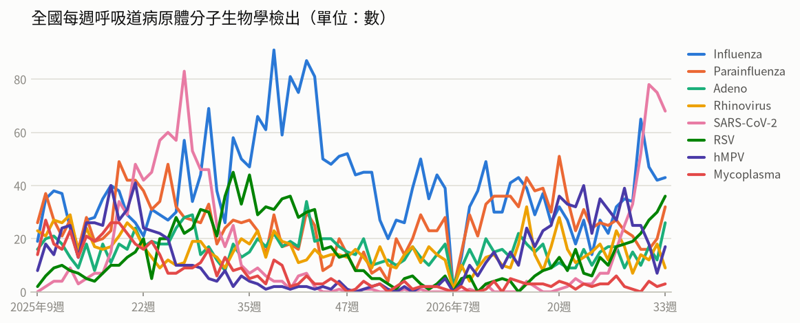

- **全國每週呼吸道病原體分子生物學檢出**（2026年第33週）：共 234，較前一週 ↑ +28（+14%）；陽性率 70.5%

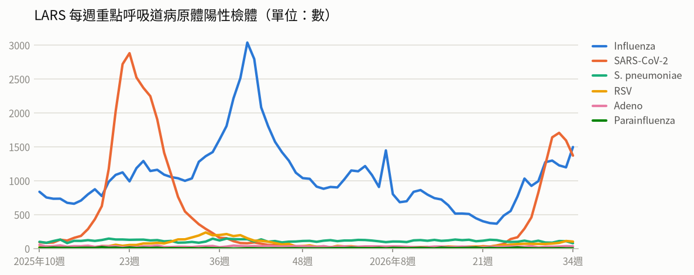

- **LARS 每週重點呼吸道病原體陽性檢體**（2026年第34週）：共 3,081，較前一週 ↑ +35（+1%）

### 新冠（COVID-19）

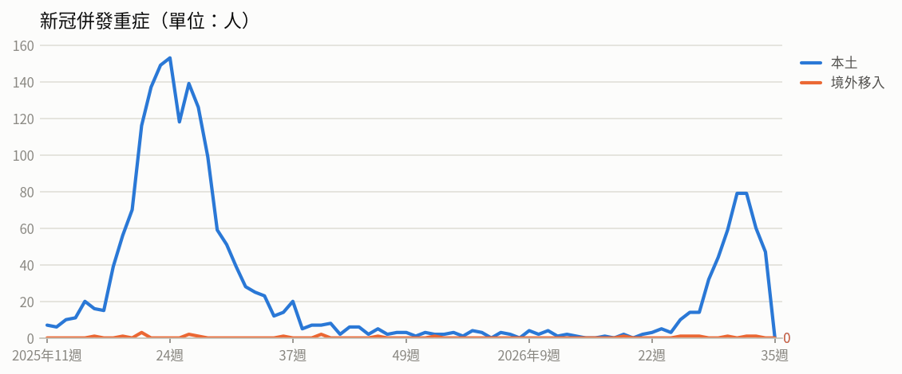

- **新冠併發重症**（2026年第33週）：共 61人（本土 60、境外移入 1），較前一週 ↓ -19（-24%）
  - 統計摘要：上週累計數 47、今年累計數 493、去年總數 1718、今年累計死亡數 83

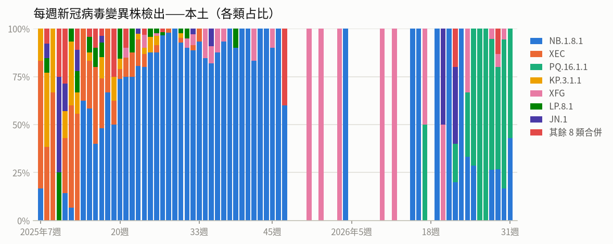

- **每週新冠病毒變異株檢出——本土**（2026年第31週）：共 7，較前一週 ↓ -11（-61%）

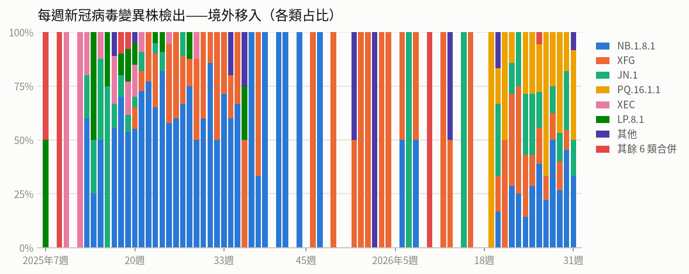

- **每週新冠病毒變異株檢出——境外移入**（2026年第31週）：共 12，較前一週 ↑ +1（+9%）

### 流感

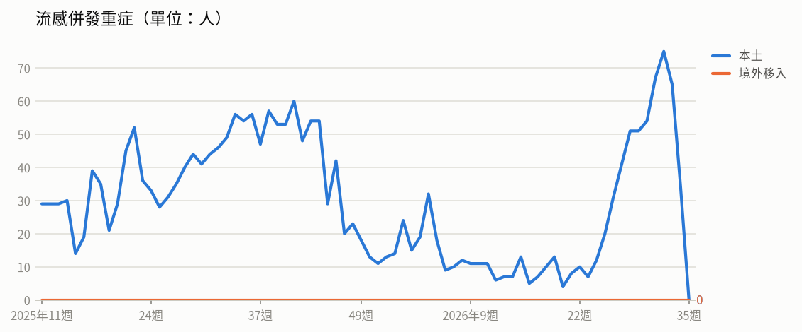

- **流感併發重症**（2026年第33週）：共 65人（本土 65、境外移入 0），較前一週 ↓ -10（-13%）
  - 統計摘要：上週累計數 34、今年累計數 778、去年總數 2290、今年累計死亡數 146

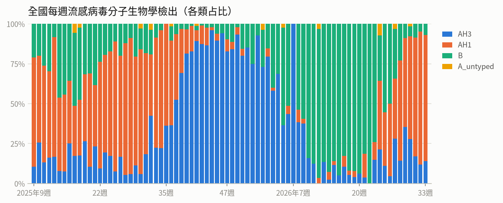

- **全國每週流感病毒分子生物學檢出**（2026年第33週）：共 43，較前一週 ↑ +1（+2%）；陽性率 13%

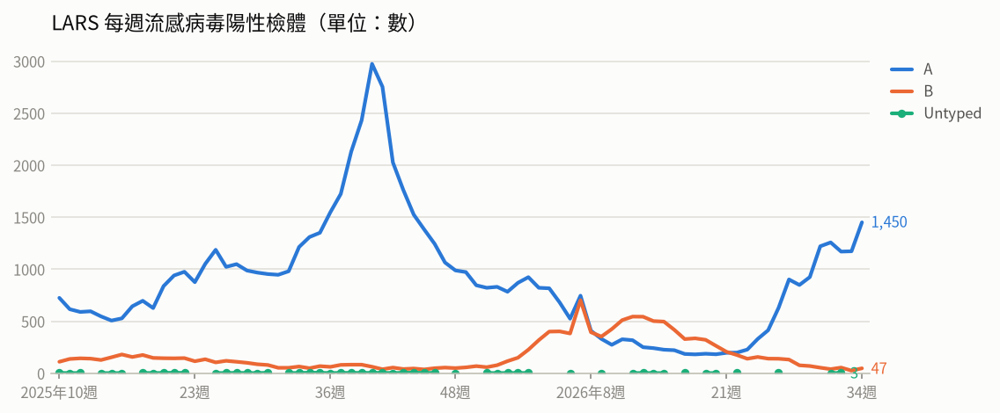

- **LARS 每週流感病毒陽性檢體**（2026年第34週）：共 1,497，較前一週 ↑ +300（+25%）

### 腸病毒

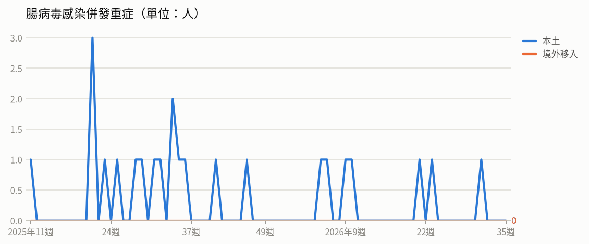

- **腸病毒感染併發重症**（2026年第31週）：共 1人（本土 1、境外移入 0）
  - 統計摘要：上週累計數 0、今年累計數 7、去年總數 19、今年累計死亡數 1

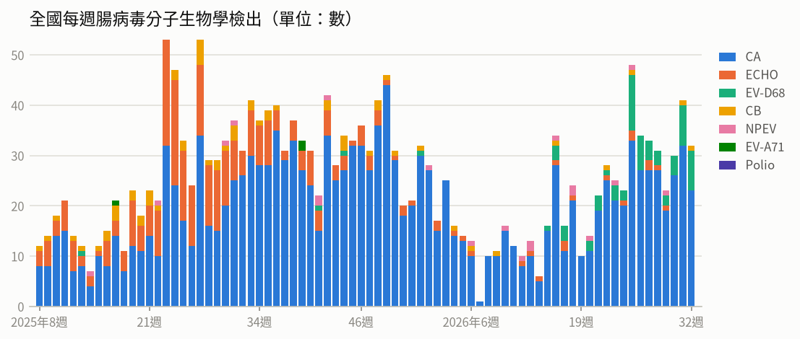

- **全國每週腸病毒分子生物學檢出**（2026年第32週）：共 32，較前一週 ↓ -9（-22%）；陽性率 9.6%

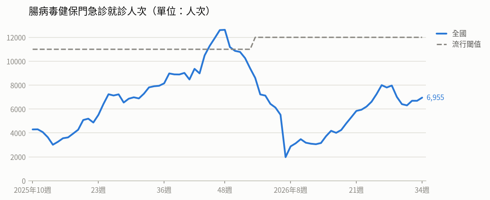

- **腸病毒健保門急診就診人次**（2026年第34週）：共 6,955人次，較前一週 ↑ +265（+4%）（流行閾值 12,000）

### 登革熱

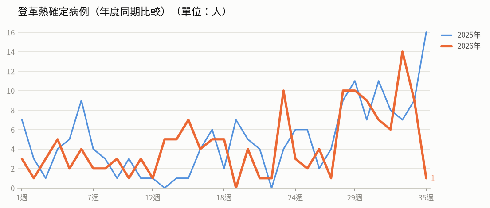

- **登革熱確定病例（年度同期比較）**（2026年第34週）：9人，2025年同期 9人
  - 統計摘要：上週累計數 9、今年累計數 153、去年總數 293、今年累計死亡數 0

> 數據取自 NIDSS（目前為 2026年第35週，統計上一完整週；定序類資料與通報有時間落後，併發重症等項目改取再前一週，以各項標示的週次為準）。最新資料可能因後續回報而變動。

## 重點速覽

- 🔴 **國內首度出現2例Clade Ib型本土M痘**：2名30多歲男性發病前均未接種疫苗，Ib型皮疹分布較廣、較易家戶內傳播，現行疫苗仍有保護效果，籲尚未完成2劑者盡速接種。
- 🔴 **高雄岡山出現家庭群聚，新增3例本土病例**：3人均無國外旅遊史、檢出第二型登革病毒，今年國內10例本土病例全在高雄市；馬來西亞、孟加拉等東南亞及南亞疫情升溫，返國後有發燒症狀應就醫並告知旅遊史。
- 🔴 **剛果民主共和國疫情持續擴大，致死率近5成**：累計5,713例確定病例、2,744例死亡，疫情涵蓋6省58個衛生區；WHO維持該國極高傳播風險、鄰國列高風險，並已緊急分配7萬劑Ervebo疫苗。
- 🔴 **美國賓州出現逾30年來首見麻疹死亡**：美國今年累計2,777例確定病例、94%未接種或接種史不明；剛果民主共和國、瑞典、莫三比克亦有疫情，出國前應確認MMR接種史。
- 🟠 **豪雨積淹水後，水媒傳染病風險升高**：南部及高屏災情最重，清理家園請穿雨鞋、手套避免接觸污水污泥；醫師對淹水地區不明原因發燒者應列入鑑別診斷並於24小時內通報。
- 🟠 **開學在即，三大呼吸道與腸道疫情須留意**：第33週新冠與類流感門急診人次微降、腸病毒持平，新冠疫情仍處高原期且重症個案86.5%未接種本季疫苗；本季新冠疫苗接種至9月9日止。

## 國際重要疫情

- **剛果民主共和國－伊波拉病毒感染**（關注程度：高）：依WHO與剛果民主共和國INSP資料（2026/8/20），剛果民主共和國（DRC）伊波拉疫情持續新增病例，8/20新增85例確定病例、其中18例死亡，分別發生於伊圖里省（63例）、北基伍省（17例）與上韋萊省（5例）。WHO於8/14最新風險評估中，DRC維持極高傳播風險，與DRC接壤的所有鄰國（含烏干達）列為高風險，其中烏干達由「極高風險」調降為「高風險」；非洲其他地區及全球維持低風險。WHO呼籲各國維持高度監測並落實各項防治措施。
  - 旅遊防疫建議：計畫前往剛果民主共和國及其鄰近國家者應留意當地疫情，避免接觸疑似病患、其體液及野生動物；返國後如出現發燒等不適症狀，應主動告知醫師旅遊史並儘速就醫。
  - [原文連結](https://www.cdc.gov.tw/TravelEpidemic/Detail/G3PSay_dafdAwjsYNm3CCA?epidemicId=sbEEbS1A7qe20LzrFtd8mQ)
- **剛果民主共和國－伊波拉病毒感染**（關注程度：高）：剛果民主共和國伊波拉疫情持續擴大，8/25新增57例確定病例（伊圖里省34例、北基伍省18例、上韋萊省5例），其中11例死亡；累計5,713例確診、2,744例死亡、1,269例康復，致死率達48.0%。伊圖里省逾80%新感染個案不在接觸者名單內、約60%查無流行病學關聯，近三分之二死亡發生在治療中心之外，社區與葬禮感染風險升高；確定病例中女性占53%，以18–49歲最多，推測與承擔照護及準備葬禮等暴露有關。WHO與非洲CDC已緊急分配7萬劑Ervebo疫苗，5萬劑供第一線醫療人員使用，2萬劑投入第三期臨床試驗以評估對邦迪布焦病毒的防護效果。
  - 旅遊防疫建議：民眾應避免前往疫區非必要旅遊，如需前往務必避免接觸病患、屍體、體液及野生動物，並勿參與喪葬儀式；返國後如出現發燒、腹瀉、出血等症狀，應主動告知檢疫或醫療人員旅遊史並儘速就醫。
  - [原文連結](https://www.cdc.gov.tw/TravelEpidemic/Detail/G3PSay_dafdAwjsYNm3CCA?epidemicId=PCK9GfgvMG8XqJXAWCWwdg)
- **剛果民主共和國、瑞典、莫三比克－麻疹**（關注程度：高）：剛果民主共和國麻疹疫情嚴峻，疑似病例中78%為5歲以下兒童，以北基伍省與南基伍省最嚴重（占47.7%），因武裝衝突、人口流離及伊波拉、霍亂與瘧疾同時流行使醫療體系負擔沉重，無國界醫師已在兩省實施介入措施。瑞典30例確定病例均與今年7/30-8/2音樂節相關，多數為18歲以下未接種疫苗兒童，以斯德哥爾摩（9例）及西博滕省（6例）較多，該國正進行接觸者追蹤並建議未完成接種者自主健康監測。莫三比克疫情以北部南普拉省（1,137例、4例死亡）最嚴重，其次索法拉省（585例），較今年3月資料短期內增加1,898例。
  - 旅遊防疫建議：計劃前往上述國家或地區者，建議出發前確認麻疹疫苗接種史，未接種或接種不完整者應諮詢旅遊醫學門診並completed接種；返國後如出現發燒、出疹等症狀，應戴口罩儘速就醫並告知旅遊史。
  - [原文連結](https://www.cdc.gov.tw/TravelEpidemic/Detail/G3PSay_dafdAwjsYNm3CCA?epidemicId=SyvPfLkkorvJJ1Ort3OOwg)
- **美國－麻疹**（關注程度：高）：依PA GOV與US CDC資料，賓州今年累計393例麻疹確定病例並出現2例死亡（均未接種疫苗），為該州自1991年以來首見麻疹相關死亡，州衛生部計劃增設臨時疫苗診所加強接種。全美疫情持續，累計2,777例確定病例，66%為19歲以下兒童及青年，94%未接種疫苗或接種史不明，7%需住院；病例數以南卡羅萊納州670例、猶他州526例最多。美國兒童疫苗接種率已自2019-20年的95.2%下降至2025-26年的92.4%。
  - 旅遊防疫建議：計劃前往美國者，出國前應確認麻疹疫苗（MMR）接種史，未具免疫力者建議提前諮詢旅遊醫學門診評估接種；返國後如出現發燒、出疹等症狀，應戴口罩儘速就醫並告知旅遊史。
  - [原文連結](https://www.cdc.gov.tw/TravelEpidemic/Detail/G3PSay_dafdAwjsYNm3CCA?epidemicId=M7go168phjbkCdKVOZ5icQ)
- **馬來西亞、孟加拉－登革熱**（關注程度：高）：疾管署引述The Straits Times與The Daily Star（2026/8/22）指出，馬來西亞今年截至8月22日累計報告5萬8,079例登革熱、55例死亡，病例數較去年同期增加56.2%，疫情主要集中於中部雪蘭莪州（報告逾2.5萬例），吉隆坡等地亦上升；當局歸因於天氣變化，已啟動早期病例偵測與病媒蚊防治，但因自費疫苗價格偏高及宣導不足，接種率處於低點。孟加拉今年截至8月22日累計2萬8,090例住院病例、77例死亡，高於去年同期，且8月增幅高於7月，部分醫院專責病房已滿載，多數患者入院時已出現血壓下降及休克等併發症。孟加拉當局表示近期間歇性降雨有利病媒蚊孳生，加上全國蚊媒防治未達預期，預期疫情將持續攀升至10月。
  - 旅遊防疫建議：前往馬來西亞、孟加拉等登革熱流行地區時，應穿著淺色長袖衣褲、使用政府核可的防蚊藥劑，並選擇有紗窗、紗門或空調的住宿。返國後如出現發燒、頭痛、後眼窩痛、肌肉關節痠痛或出疹等症狀，應儘速就醫並主動告知旅遊史。
  - [原文連結](https://www.cdc.gov.tw/TravelEpidemic/Detail/G3PSay_dafdAwjsYNm3CCA?epidemicId=ZkxTRUH9crFJXnTG3SWl2g)
- **全球（中國、香港、韓國）－COVID-19（新冠併發重症）**（關注程度：中）：疾管署引用WHO FluNet、WHO、中國疾控中心、香港衛生防護中心及韓國KCDA資料（2026/8/20），指出全球新冠陽性率於第30週為1.24%，歐、非洲區呈上升趨勢，西太平洋區處高原期，流行變異株以PQ.16.1.1為主，其次為NB.1.8.1、XFG。中國第33週（8/10-16）門急診陽性率21.2%，為陽性率最高的呼吸道病原體，以15-59歲族群較高，變異株以NB.1.8.1為主。香港疫情持續下降，第33週陽性率3.4%，污水監測顯示PQ.16（含PQ.16.1.1）占77.3%；韓國疫情上升，陽性率9.1%，新增56例住院，變異株以BA.3.2占50.0%為主。
  - 旅遊防疫建議：前往上述國家或地區旅遊時，請留意當地疫情，於人潮擁擠或通風不良場所佩戴口罩並落實勤洗手；符合資格者建議依規定接種新冠疫苗，出現發燒、呼吸道症狀時儘速就醫並告知旅遊史。
  - [原文連結](https://www.cdc.gov.tw/TravelEpidemic/Detail/G3PSay_dafdAwjsYNm3CCA?epidemicId=BbcAPNy4k04zS6ijOHGZrQ)
- **全球（疫情風險集中非洲，包括馬達加斯加、剛果民主共和國；另巴基斯坦、英國、印度、卡達）－M痘（猴痘）**（關注程度：中）：依WHO 2026/8/24資料，M痘疫情風險目前主要集中於非洲：馬達加斯加自2025年12月起爆發全球最大規模疫情，61%行政區受影響，近期檢驗陽性率達74%且疫情尚未控制；剛果民主共和國持續有Clade Ia及Ib共同流行，但監測與檢驗量能下降，實際規模可能被低估。巴基斯坦年初發生Clade Ib院內群聚，34例確定病例中8名嬰幼兒死亡。英國、印度及卡達共發現3例Clade Ib/IIb重組病毒株，目前尚無證據顯示傳播力或疾病嚴重度增加，仍須持續監測。WHO評估全球風險維持為中等，傳播以高風險性行為族群為主（該族群風險為中），一般大眾風險為低。
  - 旅遊防疫建議：前往非洲等疫情流行地區應避免與不明健康狀況者發生親密接觸或性行為，並注意手部衛生；高風險族群建議依規定完成M痘疫苗接種，返國後如出現發燒、皮疹或水泡等症狀請儘速就醫並告知旅遊史。
  - [原文連結](https://www.cdc.gov.tw/TravelEpidemic/Detail/G3PSay_dafdAwjsYNm3CCA?epidemicId=j2Ara_A-etjEi8K3d9nqog)
- **全球（阿富汗、巴基斯坦、德國、阿爾及利亞、剛果民主共和國、吉布地、以色列、寮國、喀麥隆、查德、奈及利亞等）－小兒麻痺症**（關注程度：中）：WHO於5/14召開第45次IHR小兒麻痺症緊急委員會，並於8/25公布決議，評估小兒麻痺症持續構成國際關注公共衛生緊急事件（PHEIC），臨時性措施再延長3個月，但不構成緊急大流行。委員會建議11個具WPV1、cVDPV1或cVDPV3傳播風險國家（含阿富汗、巴基斯坦、德國、阿爾及利亞、剛果民主共和國、吉布地、以色列、寮國、喀麥隆、查德、奈及利亞）加強疫情監測與疫苗接種，另建議24個有cVDPV2國內傳播風險國家加強防治。因核心疫區持續傳播、偏鄉與衝突地區疫苗覆蓋率不均及跨國人口流動頻繁，WPV1與cVDPV仍具高度國際傳播風險。此外WHO於8/19宣布蒲隆地、迦納、幾內亞比索、剛果共和國及烏干達等非洲5國cVDPV2疫情已終止。
  - 旅遊防疫建議：前往上述疫情流行國家前，應確認自身及同行幼童已完成小兒麻痺疫苗接種，必要時諮詢旅遊醫學門診評估追加接種；旅途中注意手部衛生與飲食衛生，返國後如出現肢體無力或麻痺症狀應儘速就醫並告知旅遊史。
  - [原文連結](https://www.cdc.gov.tw/TravelEpidemic/Detail/G3PSay_dafdAwjsYNm3CCA?epidemicId=U6KDJdnwBzrqnJZbLUeMvg)
- **歐洲（英國、荷蘭、比利時、德國等7國）－沙門氏菌感染症**（關注程度：中）：依歐洲疾病預防管制中心（ECDC）2026年8月21日資料，歐洲沙門氏菌感染症疫情更新，去年5月迄今年8月累計341例確定病例、至少34例住院，病例分布於英國（207例）、荷蘭（106例）、比利時（15例）、德國（6例）等7國。英國研判疑似感染源為進口雞蛋，荷蘭則懷疑感染源為雞肉。全基因定序顯示，本次菌株與2025年荷蘭通報之雞蛋與家禽疫情相關。
  - 旅遊防疫建議：前往歐洲旅遊或當地居留期間，應避免生食或食用未煮熟的蛋品與禽肉，並落實飲食及手部衛生；如出現腹瀉、發燒、腹痛等症狀，應儘速就醫並告知旅遊史。
  - [原文連結](https://www.cdc.gov.tw/TravelEpidemic/Detail/G3PSay_dafdAwjsYNm3CCA?epidemicId=ZVUSl-BJ_A5pmKiM1wBo-w)
- **法國－屈公病**（關注程度：中）：依BEACON 2026/8/22資料，法國今年截至8/17共報告25例屈公病本土確定病例，分別來自3起疫情事件，其中規模最大者位於西部吉倫特省（Gironde）。當地已展開疫情調查與病媒蚊防治，並評估至11月前仍有傳播風險。該國2010至2024年累計僅報告32例本土病例，但2025年曾爆發大規模疫情，共報告809例本土病例。
  - 旅遊防疫建議：前往法國（尤其吉倫特省）旅遊時應加強防蚊措施，穿著淺色長袖衣褲並使用政府核可的防蚊藥劑；返國後如出現發燒、關節疼痛、皮疹等症狀，應儘速就醫並主動告知旅遊史。
  - [原文連結](https://www.cdc.gov.tw/TravelEpidemic/Detail/G3PSay_dafdAwjsYNm3CCA?epidemicId=zethE0SyDr2k7p8kCADljQ)
- **紐西蘭－流感（A型H3N2）併發重症**（關注程度：中）：紐西蘭流感疫情上升，主要流行型別為A型H3N2流感K分支，與本流感季歐洲高流感活動有關。該國同時流行呼吸道融合病毒（RSV）、鼻病毒及SARS-CoV-2等多種呼吸道病毒，個案主要集中於0至4歲幼童及65歲以上長者。疫情對醫療體系造成衝擊，當局已啟動冬季應變計畫，增設醫護人力與病床，並推動社區藥局分流及遠距醫療服務，以緩解急診與住院壓力。
  - 旅遊防疫建議：紐西蘭當局呼籲民眾接種流感疫苗以降低重症風險；前往當地旅遊者應留意呼吸道防護、加強手部衛生，長者與幼童等高風險族群尤應提高警覺。
  - [原文連結](https://www.cdc.gov.tw/TravelEpidemic/Detail/G3PSay_dafdAwjsYNm3CCA?epidemicId=RfmATvj5eVVc5QhyLIQpCw)
- **美國－桿菌性痢疾／沙門氏菌感染症（苜蓿芽相關食品中毒群聚）**（關注程度：中）：美國自今年5月31日至8月8日已有15個州通報55例與本次疫情相關的病例，其中4例住院。76%病例發病前曾食用苜蓿芽，調查確認感染源為明尼蘇達州某生產商經銷的苜蓿芽。本事件在流行病學上屬罕見，單一食品同時涉及3種產志賀毒素大腸桿菌（STEC）型別及1種沙門氏菌株，美國當局已要求產品下架並擴大檢測。
  - 旅遊防疫建議：赴美旅遊或當地民眾應避免食用生鮮苜蓿芽等生食芽菜，注意飲食及手部衛生；如出現腹瀉、腹痛、發燒等症狀應儘速就醫並告知飲食與旅遊史。
  - [原文連結](https://www.cdc.gov.tw/TravelEpidemic/Detail/G3PSay_dafdAwjsYNm3CCA?epidemicId=0gyY18h9ysT74cMJ08bzTQ)
- **美國－蜱蟲相關傳染病（萊姆病、AGS紅肉過敏症、波旁病毒感染）**（關注程度：中）：依據New York Times及星島日報2026/8/20報導，美國蜱蟲相關傳染病疫情持續擴張，每年估計約有50萬例病例，並推估有50萬人曾因孤星蜱叮咬而罹患AGS紅肉過敏症。孤星蜱活動範圍已從過去僅限於南部，擴張至東北部及中西部地區；屬蜱蟲高風險地區的紐約州蘇福克郡（Suffolk County）於今年7月報告罕見的波旁病毒（Bourbon virus）感染病例。氣候變遷、郊區擴張及白尾鹿等宿主數量增加為疫情上升原因，相關疫苗仍在研發階段。
  - 旅遊防疫建議：前往美國南部、東北部及中西部等蜱蟲活動地區時，應避免進入草叢及樹林密集處，穿著淺色長袖長褲、使用政府核可的防蟲藥劑，返家後儘速檢查身體與衣物是否附著蜱蟲。若被叮咬後出現發燒、皮疹或食用紅肉後過敏等症狀，應儘速就醫並告知旅遊接觸史。
  - [原文連結](https://www.cdc.gov.tw/TravelEpidemic/Detail/G3PSay_dafdAwjsYNm3CCA?epidemicId=ifFg3IrfBdN2gXP9XgBmCA)
- **菲律賓－鉤端螺旋體病**（關注程度：中）：受降雨影響，菲律賓鉤端螺旋體病疫情持續，截至8月17日累計3,760例確定病例，雖低於去年同期，但以奎松市最為嚴峻，兩週內新增62例病例及5例死亡，其中71%（44例）為男性，多為司機、保全、清潔工及外送員等需涉水工作者。大馬尼拉都會區多家大型醫院已滿床，被迫限制非緊急收治。當局呼籲涉水民眾應穿戴防護裝備、及早投藥預防。
  - 旅遊防疫建議：前往菲律賓應避免接觸可能受污染的積水與泥水，必須涉水時穿著防水鞋靴等防護裝備；返國後若出現發燒、肌肉痠痛等疑似症狀，應儘速就醫並告知旅遊史。
  - [原文連結](https://www.cdc.gov.tw/TravelEpidemic/Detail/G3PSay_dafdAwjsYNm3CCA?epidemicId=2UWzAr66N0CP5evR0-LXlw)
- **全球（美國、秘魯、挪威、墨西哥、巴西、智利、瑞典、荷蘭）－新型A型流感**（關注程度：低）：美國密西根州於8月21日報告2例未滿18歲的A(H1N2)v病例，於今年第32週發病就醫，其中1例曾接受抗病毒藥物治療，均已康復；2人發病前均曾參加有染病豬隻的農業博覽會，個案間無接觸史，尚未發現其他病例，該國自2025年起累計4例A(H1N2)v。禽鳥/動物疫情方面，今年已有67個國家／地區報告4,095起高／低病原性禽流感疫情。2026/8/14-21期間美國報告2起H5(N未定型)疫情；2026/7/21-8/21期間7國共報告28起H5N1疫情，以秘魯20起最多，挪威3起，墨西哥、巴西、智利、瑞典、荷蘭各1起。
  - 旅遊防疫建議：前往疫情發生地區應避免接觸禽鳥、豬隻及其排泄物，遠離農場、活禽市場與動物展覽場所，注意手部衛生並將禽肉蛋類徹底煮熟；返國後如出現發燒、咳嗽等呼吸道症狀，應戴口罩儘速就醫並主動告知旅遊及接觸史。
  - [原文連結](https://www.cdc.gov.tw/TravelEpidemic/Detail/G3PSay_dafdAwjsYNm3CCA?epidemicId=-4t7f7kpRPqp0cI9Ch1oyQ)
- **加拿大－退伍軍人病**（關注程度：低）：疾管署引述Beacon與Outbreak News Today（2026/8/18）資訊指出，加拿大多倫多報告6例退伍軍人病確定病例，個案於7月2日至26日期間出現症狀，主要為居住、工作或造訪該區域之人員。當地衛生機構已透過環境採樣調查可能感染源，並採行預防性防治措施，包括通知醫療機構協助識別潛在病例。
  - 旅遊防疫建議：前往疫情地區時可留意當地衛生單位公告，避免暴露於可能受污染的水氣環境；返國後如出現發燒、咳嗽、呼吸道症狀，應盡速就醫並告知旅遊史。
  - [原文連結](https://www.cdc.gov.tw/TravelEpidemic/Detail/G3PSay_dafdAwjsYNm3CCA?epidemicId=9Sy_28kFI749-lWADpjmIw)
- **美國（路易斯安那州）－福氏內格里阿米巴腦膜腦炎**（關注程度：低）：疾管署引述Beacon、CIDRAP及美國CDC消息（2026/8/21），美國路易斯安那州出現1例罕見福氏內格里阿米巴腦膜腦炎確定病例，病患為7歲兒童，於克萊本湖游泳後感染並住院治療。該病原體常存在於夏季溫暖淡水中，引發之腦膜腦炎症狀進展快速，致死率超過97%，但不具人傳人能力，整體人群感染風險極低。
  - 旅遊防疫建議：戲水時應避免將頭部浸入水中，並避免攪動淺水區底部的泥沙，以降低感染風險；若曾接觸溫暖淡水後出現快速惡化的頭痛、發燒等症狀應儘速就醫並告知接觸史。
  - [原文連結](https://www.cdc.gov.tw/TravelEpidemic/Detail/G3PSay_dafdAwjsYNm3CCA?epidemicId=SA36WHr6CAP9fJ4oPWpoUw)

## 本週國內公告摘要

### 登革熱

#### 高雄市新增3例本土登革熱病例，請民眾落實「巡、倒、清、刷」，出現疑似症狀儘速就醫

- **來源／關注程度／地區**：衛生福利部疾病管制署／中／高雄市
- **病例概況**：新增3例本土登革熱病例（同一家庭群聚），今年全國累計145例確定病例，其中10例本土病例均居住高雄市，另135例為境外移入，累計數低於2025年同期154例。
- **摘要**：疾管署8月27日公布3例本土登革熱病例，為高雄市岡山區一起家庭群聚，指標個案為60多歲男性，8月26日出現發燒、肌肉痠痛、關節痛及噁心等症狀就醫後確診，檢出登革病毒第二型；同住5人中另2人採檢確診，同為第二型，3人均住院治療中。3名個案潛伏期均無國外旅遊史，主要活動地點為住家附近。衛生單位已於社區擴大疫調，並在個案居住地周邊進行緊急防治、病媒蚊密度調查與孳生源清除。今年境外移入感染地以越南28例、印尼27例、馬爾地夫16例等東南亞及南亞國家為主。
- **防疫建議**：近期豪大雨後住家積水容器增加，請主動巡檢家戶內外並落實「巡、倒、清、刷」，雨後再次巡檢；戶外活動穿著淺色長袖衣褲並使用含DEET、Picaridin或IR-3535之核可防蚊藥劑，若出現發燒、頭痛、後眼窩痛、肌肉關節痛、出疹等症狀應儘速就醫並告知旅遊活動史。
- **原文連結**：https://www.cdc.gov.tw/Bulletin/Detail/8eAEgrTiTtn8vAijonSNLw?typeId=9

### M痘（猴痘）

#### 國內出現2例M痘Ib本土個案，請符合公費M痘疫苗接種條件民眾，儘速完成2劑公費疫苗接種

- **來源／關注程度／地區**：衛生福利部疾病管制署／中／全國
- **病例概況**：今年8月新增2例M痘Clade Ib型本土病例（國內首2例），今年截至8月23日累計新增28例M痘確定病例（19例本土、9例境外移入），病例數低於2024年及2025年同期。
- **摘要**：疾管署公布2名30多歲男性確診M痘Clade Ib型本土病例，均為發病前未接種M痘疫苗，經基因分型確認為國內首2例Ib型本土個案；國內自今年5月出現首例境外移入Ib型後，已累計9例Ib型病例（7例境外移入、2例本土）。Ib型與II型症狀相似、致死率相近，但Ib型全身性皮疹分布較廣，且較易在家戶內傳播，免疫力不足者（如幼童、孕婦、慢性病患者）較易出現重症；現行M痘疫苗可有效預防Ib型，抗病毒藥物Tecovirimat亦適用於Ib型重症患者。截至今年7月底已有110,971人接種至少1劑疫苗，其中79,216人完成2劑，仍有31,755人（29%）待接種第2劑。
- **防疫建議**：符合公費接種條件者（近1年有風險性行為、曾罹患性病，或性接觸對象有上述情形）應儘速至全國318家合作院所完成2劑M痘疫苗接種，完成2劑可達9成保護力。如出現皮疹、水泡、膿疱或發燒、淋巴結腫大等疑似症狀，請佩戴口罩儘速就醫並主動告知旅遊史、風險場域暴露史及接觸史。
- **原文連結**：https://www.cdc.gov.tw/Bulletin/Detail/Q8zNdJFLrJQ8ymZWL8bUqw?typeId=9

### 流感、COVID-19（新冠）

#### 115年秋冬公費首度導入加強型流感及新世代新冠疫苗 疫苗株全更新精準防護 疾管署呼籲流感新冠同時打「左流右新 護肺顧心」

- **來源／關注程度／地區**：衛生福利部疾病管制署／不適用／全國
- **病例概況**：本篇為疫苗採購與接種政策公告，未提供病例數或疫情趨勢數據。
- **摘要**：疾管署宣布115年秋冬公費流感疫苗採購705萬150劑（含標準型684萬9,360劑、免疫加強型20萬790劑），為歷年首次超過700萬劑；新冠疫苗採購240萬劑（Moderna 220萬劑、Novavax 20萬劑）。今年開亞洲先例首度採購20萬劑加強型流感疫苗，優先提供長照及安養機構65歲以上長者，其預防重症保護力較標準型高出25-30%；流感疫苗為三價不活化疫苗，3種疫苗株全數更新並與社區流行株吻合。12歲以上單劑型新冠疫苗（190萬劑）全面升級為新世代疫苗，抗原劑量僅前一代1/5，發燒與局部不良反應約減少一半，抗體反應提升近2倍、預防重症效力提高約36%，並以XFG疫苗株為優先。公費對象維持10類並擴大納入公共衛生師、托嬰中心廚工及行政等非臨時性工作人員、6個月內嬰兒實際扶養者，新冠幼兒條件調整為「從未接種新冠疫苗之滿6個月至未滿6歲幼兒」。
- **防疫建議**：符合資格的65歲以上長者、幼兒、慢性病病人、醫事防疫人員及學生等自10月1日起，50至64歲無高風險慢性病成人自11月2日起，可依「左流右新」策略同時接種流感與新冠疫苗，建議開打後及早施打以獲得充足防護力。18歲以上民眾接種流感或新冠疫苗（公費或自費）還可獲得健康幣獎勵。
- **原文連結**：https://www.cdc.gov.tw/Bulletin/Detail/PdJqXvsZjg1Q5TA301JYpg?typeId=9

### 腸病毒、新冠肺炎、流感、登革熱（開學防疫綜合提醒）

#### 因應各級學校即將開學，疾管署呼籲學校與家長落實衛生防護，防範腸病毒、新冠、流感及登革熱疫情

- **來源／關注程度／地區**：衛生福利部疾病管制署／中／全國
- **病例概況**：第33週（8/16-8/22）新冠門急診24,995人次較前週降6.0%、類流感門急診94,340人次降2.5%、腸病毒門急診6,546人次與前週持平；今年截至8/24累計134例登革熱確定病例（7例本土均在高雄市、127例境外移入），低於2025年同期152例。
- **摘要**：疾管署表示各級學校即將開學，校園人際互動頻繁，加上天氣炎熱多雨利於病媒蚊孳生，腸病毒、新冠、流感與登革熱傳播風險升高。新冠疫情處高原期，上週新增59例本土重症與19例死亡，去年10月起累計480例重症、73例死亡，86.5%未接種本季疫苗，近4週以PQ.16.1.1變異株為主；本季疫苗尚餘約11.1萬劑，接種至9月9日止。流感社區以A型H1N1（占69.7%）為主，上週新增64例重症、15例死亡，本流感季累計1,139例重症、220例死亡。腸病毒社區以克沙奇A6型為多，其次為腸病毒D68型及克沙奇A16型，今年累計6例重症（含1例死亡）。
- **防疫建議**：請落實肥皂勤洗手、呼吸道禮節與生病不上學，並做好環境清潔及「巡、倒、清、刷」清除孳生源；符合資格者儘速於9月9日前接種本季新冠疫苗，出現腸病毒重症前兆（嗜睡、活力不佳、肌抽躍、持續嘔吐等）或呼吸困難、疑似登革熱症狀應戴口罩儘速就醫並告知活動史。
- **原文連結**：https://www.cdc.gov.tw/Bulletin/Detail/QiAsLBvifNAj7FJzGc-ApQ?typeId=9

### 鉤端螺旋體病、類鼻疽

#### 積淹水過後可能導致鉤端螺旋體病及類鼻疽等傳染病發生風險上升，疾管署籲請臨床醫師提高警覺加強通報(疾病管制署致醫界通函第614號)

- **來源／關注程度／地區**：衛生福利部疾病管制署／中／全國（尤以臺南、高雄、屏東等南部地區最嚴重）
- **病例概況**：本則通函未公布病例數，僅指出強降雨積淹水後鉤端螺旋體病及類鼻疽等水媒傳染病發生風險上升。
- **摘要**：近日全臺強降雨造成多處積水或淹水，南部及高屏地區最為嚴重，民眾接觸污水、污泥使鉤端螺旋體病與類鼻疽等水媒傳染病風險提高。鉤端螺旋體病潛伏期平均5至14天，初期發燒、頭痛、肌肉酸痛、噁心、嘔吐、腹瀉，易與流感、登革熱、急性腸胃炎混淆；類鼻疽潛伏期平均9天，症狀從無症狀到肺炎、敗血性休克，糖尿病、肺病、肝病、腎病、癌症或免疫功能受損者重症風險較高。疾管署籲請臨床醫師對淹水地區不明原因發燒者將兩病列入鑑別診斷，並於24小時內通報衛生單位並採檢送驗。
- **防疫建議**：災後清理家園請穿著雨鞋、手套等防護裝備，避免皮膚傷口接觸污水與污泥，並勿生飲生食可能受污染的水與食物。若出現發燒、頭痛、肌肉酸痛或呼吸道症狀，應儘速就醫並主動告知污水、污泥接觸史。
- **原文連結**：https://www.cdc.gov.tw/Bulletin/Detail/84OkJqRLepwRWrdj2s1xGQ?typeId=48

### 類鼻疽、鉤端螺旋體病（另含腸道傳染病、登革熱）

#### 近日豪大雨來襲，籲請民眾清理家園務必落實佩戴口罩等預防措施，如有類鼻疽或鉤端螺旋體病疑似症狀請儘速就醫

- **來源／關注程度／地區**：衛生福利部疾病管制署／中／全國（南部及東半部豪雨地區）
- **病例概況**：新聞未提供國內災後個案數字，僅指出暑期國際旅遊頻繁，國內仍持續出現登革熱境外移入病例。
- **摘要**：疾管署表示，受熱帶性低氣壓及西南風影響，南部及東半部持續顯著豪雨，民眾雨後清理家園易接觸污水、污泥，或因環境積水孳生病媒蚊，增加感染鉤端螺旋體病、類鼻疽、腸道傳染病及登革熱風險。鉤端螺旋體可經皮膚傷口或黏膜侵入，類鼻疽病原菌則存在於受污染土壤與積水，可經接觸、食入污染水或吸入感染。疾管署已盤點全國消毒劑儲備共159,556瓶（漂白水137,832瓶、酚類消毒劑21,724瓶）分置各區，並將發布致醫界通函，籲請醫療院所加強詢問TOCC並即時通報。
- **防疫建議**：清理家園務必落實「裝備要齊全、飲食要注意、清除孳生源」，佩戴口罩、手套並穿長筒雨鞋，脫除裝備後洗手；飲水澈底煮沸、泡水食物勿食用，並落實「巡、倒、清、刷」清除積水。若出現發燒、頭痛、肌肉痛、腹瀉、黃疸、倦怠或出疹等症狀，請儘速就醫並主動告知污水接觸史、傷口情形或蚊蟲叮咬與活動史。
- **原文連結**：https://www.cdc.gov.tw/Bulletin/Detail/M7P_YHo3UICIUSFJ0Hakcg?typeId=9
