# 疫情週報 2026-W36

涵蓋期間：2026-08-31 ~ 2026-09-06

> 本報告由 AI 自動產生，內容以疾管署原文為準。

## 監測數據

### 呼吸道病原體（整體）

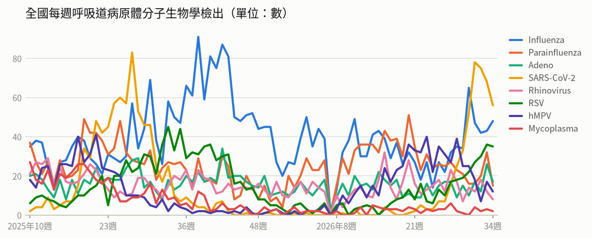

- **全國每週呼吸道病原體分子生物學檢出**（2026年第34週）：共 193，較前一週 ↓ -44（-19%）；陽性率 65%

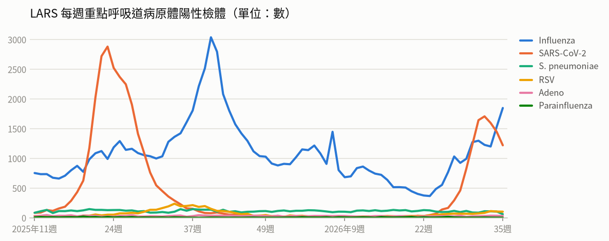

- **LARS 每週重點呼吸道病原體陽性檢體**（2026年第35週）：共 3,264，較前一週 ↑ +39（+1%）

### 新冠（COVID-19）

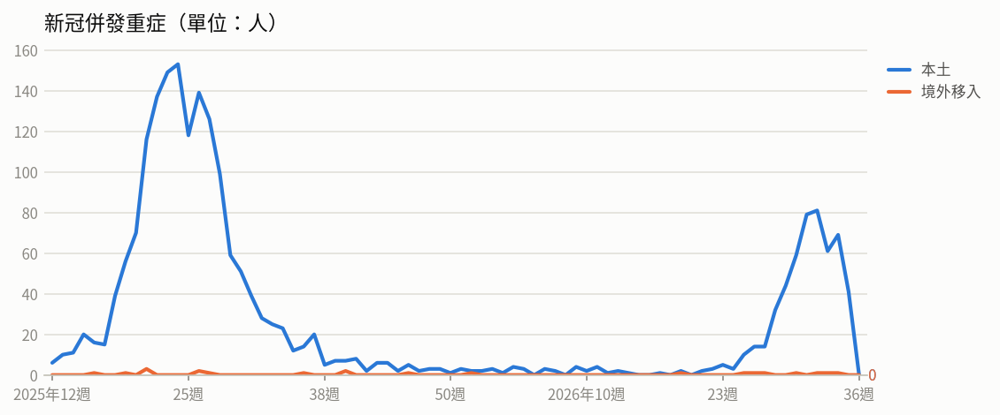

- **新冠併發重症**（2026年第34週）：共 70人（本土 69、境外移入 1），較前一週 ↑ +8（+13%）
  - 統計摘要：上週累計數 41、今年累計數 560、去年總數 1718、今年累計死亡數 98

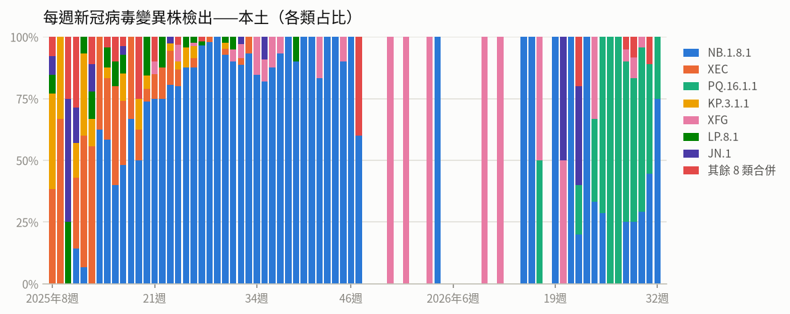

- **每週新冠病毒變異株檢出——本土**（2026年第32週）：共 4，較前一週 ↓ -5（-56%）

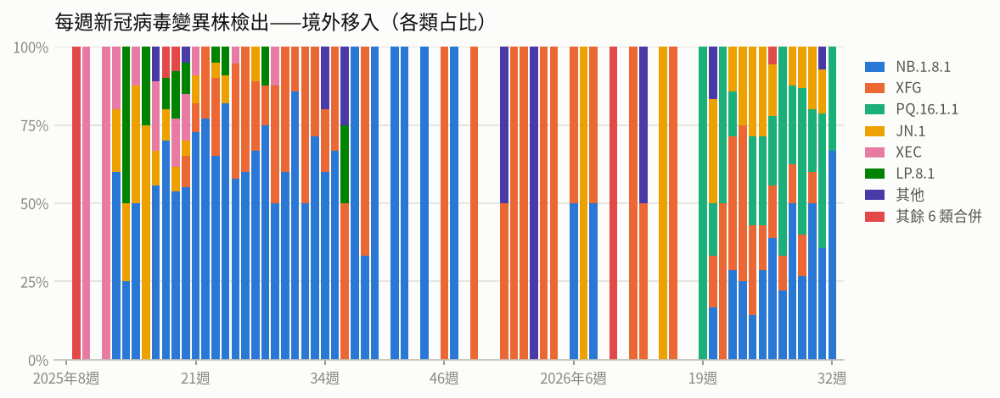

- **每週新冠病毒變異株檢出——境外移入**（2026年第32週）：共 3，較前一週 ↓ -11（-79%）

### 流感

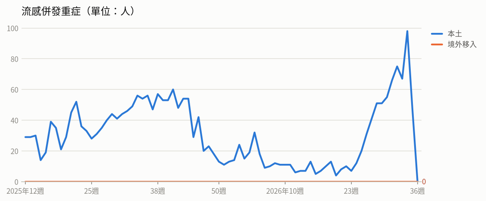

- **流感併發重症**（2026年第34週）：共 98人（本土 98、境外移入 0），較前一週 ↑ +31（+46%）
  - 統計摘要：上週累計數 47、今年累計數 891、去年總數 2290、今年累計死亡數 162

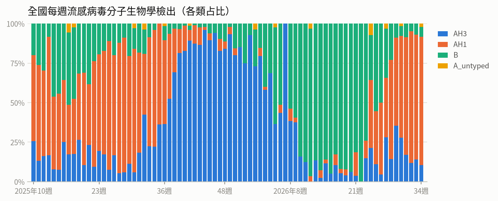

- **全國每週流感病毒分子生物學檢出**（2026年第34週）：共 48，較前一週 ↑ +5（+12%）；陽性率 16.2%

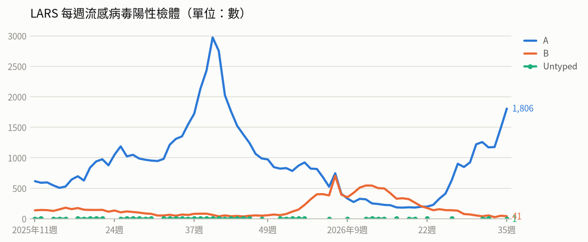

- **LARS 每週流感病毒陽性檢體**（2026年第35週）：共 1,848，較前一週 ↑ +316（+21%）

### 腸病毒

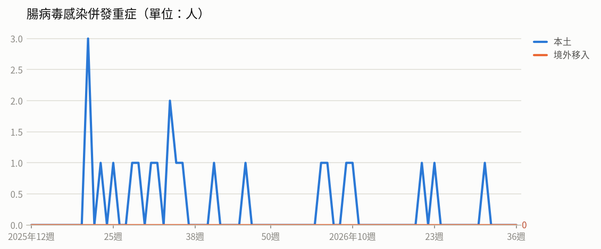

- **腸病毒感染併發重症**（2026年第31週）：共 1人（本土 1、境外移入 0）
  - 統計摘要：上週累計數 0、今年累計數 7、去年總數 19、今年累計死亡數 1

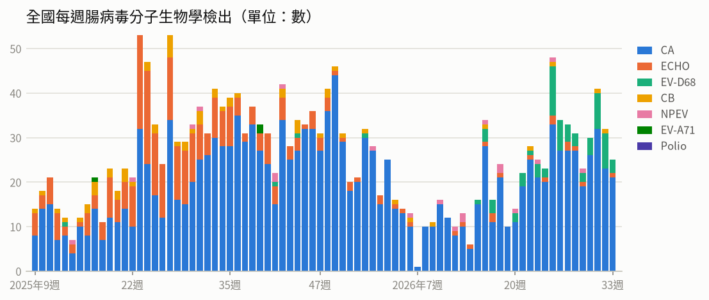

- **全國每週腸病毒分子生物學檢出**（2026年第33週）：共 25，較前一週 ↓ -7（-22%）；陽性率 7.4%

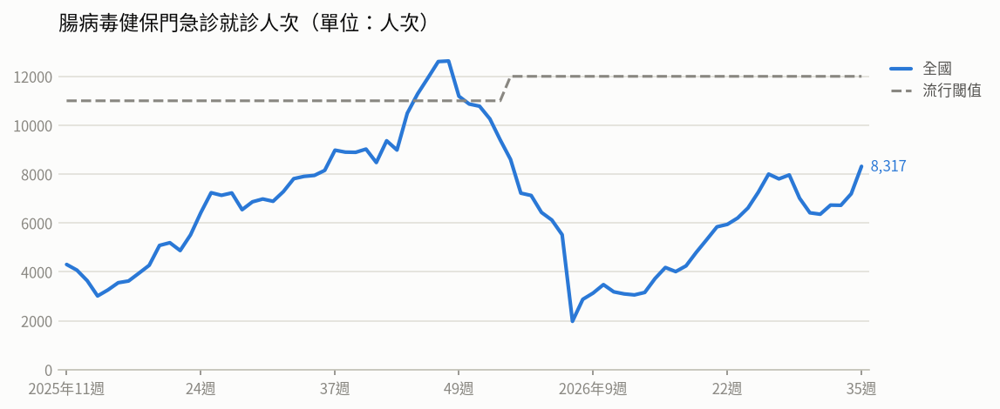

- **腸病毒健保門急診就診人次**（2026年第35週）：共 8,317人次，較前一週 ↑ +1,123（+16%）（流行閾值 12,000）

### 登革熱

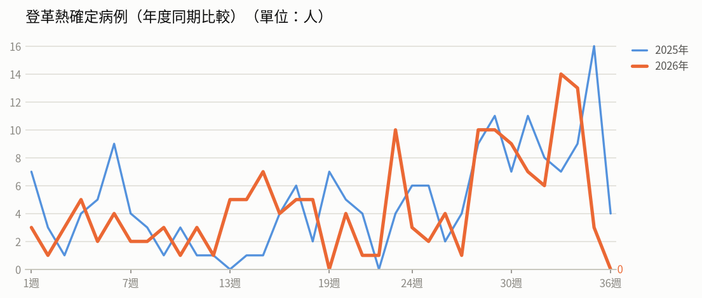

- **登革熱確定病例（年度同期比較）**（2026年第35週）：3人，2025年同期 16人
  - 統計摘要：上週累計數 3、今年累計數 159、去年總數 293、今年累計死亡數 0

> 數據取自 NIDSS（目前為 2026年第36週，統計上一完整週；定序類資料與通報有時間落後，併發重症等項目改取再前一週，以各項標示的週次為準）。最新資料可能因後續回報而變動。

## 重點速覽

- 🔴 **新北板橋診所打營養針爆C肝群聚，已累計11人確診**：疫調發現多項安全注射缺失，該診所已勒令停業並裁罰；114年7月1日起曾在該診所接受針劑注射者，將由衛生局回溯通知受檢。
- 🔴 **剛果民主共和國疫情持續延燒，致死率近五成**：疫情分布6省60個衛生區，累計6,250例確診、3,039例死亡；另烏干達Bundibugyo型疫情已於8/27宣布結束，我國旅遊疫情建議調降為無等級。
- 🔴 **美洲麻疹病例較去年同期增約4倍，南非、秘魯疫情同步升溫**：美洲17國累計逾4.8萬例確診、51例死亡，97%集中在瓜地馬拉、墨西哥、美國及加拿大；疫苗接種率不足為主因，赴流行地區前請確認麻疹疫苗接種完整。
- 🔴 **東南亞登革熱升溫，馬來西亞病例較去年同期增60%**：菲律賓宿霧、薄荷省疫情警示，薄荷省致死率已超過流行閾值；印度病例通常於9至10月達高峰，前往流行地區務必加強防蚊。
- 🟠 **開學季呼吸道疫情緩升，上週流感新增85例重症**：第34週類流感門急診逾10萬人次較前週上升5.6%，新冠雖下降13.4%但仍處高原期；流感重症以65歲以上及慢性病者為多，本季新冠疫苗接種至9月9日止。
- 🟠 **國內再添1例D68型重症，今年累計7例重症**：北部未滿5歲男童感染腸病毒D68型併發重症、已出院；社區以克沙奇A6型為多，越南疫情亦達去年同期2.5倍，開學期間應加強洗手與環境清消。

## 國際重要疫情

- **剛果民主共和國－伊波拉病毒感染**（關注程度：高）：疾管署引述DRC INSP、WHO及CIDRAP資料指出，剛果民主共和國伊波拉疫情持續新增病例，9月1日單日新增64例確定病例、25例死亡，分布於伊圖里省（39例）、北基伍省（20例）、上韋萊省（4例）及喬波省（1例）。截至9月1日累計6,250例確定病例、3,039例死亡，致死率達48.6%。現行核准的Ervebo疫苗主要針對Zaire ebola virus，對Bundibugyo ebola virus（BDBV）的保護效力尚未確定，WHO目前不支持將其作為BDBV常規防疫疫苗，僅建議在研究計畫或臨床研究架構下使用。
  - 旅遊防疫建議：疫苗不可取代接觸者追蹤、感染管制及安全埋葬等既有疫情控制措施；民眾非必要應避免前往疫情流行地區，如需前往請避免接觸疑似病例、野生動物及其生鮮肉品，返國後如有發燒等不適應主動告知檢疫人員並儘速就醫。
  - [原文連結](https://www.cdc.gov.tw/TravelEpidemic/Detail/G3PSay_dafdAwjsYNm3CCA?epidemicId=nhf7qHHvUe4-LhxOp5vd1Q)
- **南非、秘魯及美洲地區（瓜地馬拉、墨西哥、美國、加拿大等）－麻疹**（關注程度：高）：南非今年截至8/16累計3,891例麻疹確定病例，1至14歲兒童占70%，新增病例以西開普省最多，疫苗接種覆蓋率不足為主因，1歲以下未接種比例由2017年12.1%升至2026年36.3%，該國正對未完整接種兒童進行補接種。秘魯累計1,747例，以普諾地區1,264例最多，衛生部已發布流行病學警報並加強醫療機構監測與早期偵測。美洲地區截至8/8共17個國家/地區報告48,690例及51例死亡，97%病例集中於瓜地馬拉、墨西哥、美國及加拿大，因部分國家通報延遲，實際疫情恐被低估。
  - 旅遊防疫建議：計劃前往上述流行地區者，應於出發前至少2週確認並完成MMR（麻疹、腮腺炎、德國麻疹）疫苗接種；返國後如出現發燒、紅疹、咳嗽等症狀，請戴口罩儘速就醫並主動告知旅遊史。
  - [原文連結](https://www.cdc.gov.tw/TravelEpidemic/Detail/G3PSay_dafdAwjsYNm3CCA?epidemicId=lffYidjRiGEcjH1J9dxY1g)
- **菲律賓、馬來西亞、印度、歐洲（法國）－登革熱**（關注程度：高）：菲律賓宿霧省自7月進入雨季後積水增加，疫情顯著上升；鄰近薄荷省致死率1.17%已超過該國流行閾值1%，全省12個行政區連續3週逾閾值，以塔利邦、塔比拉蘭市及烏拜最嚴重，當局已宣布進入疫情警示。馬來西亞疫情快速上升，已啟動應變中心，於吉隆坡與雪蘭莪州等熱點擴大釋放沃爾巴克氏菌轉染蚊進行生物防治，並進行登革熱疫苗成本效益分析。印度7月新增1萬122例，較6月增加53%，該國病例通常於9-10月達全年高峰。研究顯示因氣候變遷，2015-24年歐洲疫情發生風險為1982-2010年的3倍。
  - 旅遊防疫建議：前往東南亞、南亞等流行地區旅遊時，應穿著淺色長袖衣褲、於裸露部位塗抹政府核可之防蚊藥劑，並選擇有紗窗、紗門或空調的住宿環境；返國後如出現發燒、頭痛、後眼窩痛、肌肉關節痛或出疹等症狀，應儘速就醫並主動告知旅遊史。
  - [原文連結](https://www.cdc.gov.tw/TravelEpidemic/Detail/G3PSay_dafdAwjsYNm3CCA?epidemicId=HMPvbd-gh0VZUXrxUt4VPA)
- **全球－新型A型流感（禽流感）**（關注程度：中）：疾管署每週更新全球新型A型流感疫情，本週新增1例人類病例，今年全球累計40例，個案發病前多有易感動物相關暴露史。依WAHIS資料，今年累計67個國家/地區通報4,100起高/低病原性禽流感動物疫情。2026年8月24日至26日期間，共有4國通報5起H5N1疫情，包括挪威2起，丹麥、英國、葡萄牙各1起。
  - 旅遊防疫建議：前往流行地區應避免接觸禽鳥、生鮮禽畜市場及動物排泄物，注意勤洗手並將禽肉蛋類徹底煮熟；返國後如出現發燒、咳嗽等症狀，應戴口罩儘速就醫並主動告知旅遊及接觸史。
  - [原文連結](https://www.cdc.gov.tw/TravelEpidemic/Detail/G3PSay_dafdAwjsYNm3CCA?epidemicId=xvRYmIamn4euv3de553p_g)
- **全球（含中國、香港、韓國）－新冠肺炎（COVID-19）併發重症**（關注程度：中）：疾管署引用WHO FluNet、WHO、中國疾控中心、香港衛生防護中心及KCDA資料（2026/8/27），全球第31週新冠陽性率為1.29%，歐洲及美洲區呈上升或微幅上升趨勢，近期流行變異株以NB.1.8.1、PQ.16.1.1、XFG及JN.1為主。中國第34週（8/17-23）門急診陽性率19.5%，為陽性率最高的呼吸道病原體，疫情下降，變異株以NB.1.8.1為主；香港第34週陽性率2.03%持續下降，污水監測顯示PQ.16（含PQ.16.1.1）占77.3%最多，其次為NB.1.8.1（16%）、JN.1（3.3%）及XFG（1.6%）。韓國疫情上升，第34週陽性率11.3%、新增61例住院，變異株以BA.3.2（50.0%）為主，其次為NB.1.8.1（22.8%）、PQ.16.1.1（18.2%）及RF.5（6.7%）。
  - 旅遊防疫建議：前往鄰近國家或歐美地區旅遊時，請留意當地疫情變化，落實勤洗手、生病戴口罩等個人衛生防護措施。符合條件者可依規定接種新冠疫苗，如出現發燒、呼吸道症狀應儘速就醫並告知旅遊史。
  - [原文連結](https://www.cdc.gov.tw/TravelEpidemic/Detail/G3PSay_dafdAwjsYNm3CCA?epidemicId=RpG5lcn4F0MLJWyLUaiGeQ)
- **印度－傷寒**（關注程度：中）：根據Times of India、Lancet Regional Health Southeast Asia 2026與Coalition Against Typhoid於2026年9月1日公布之最新研究，印度2023年估計發生490萬例傷寒病例，造成73萬例住院與7,850例死亡，以9歲以下兒童風險最高。住院病例中有82%對氟喹諾酮類（Fluoroquinolone）抗生素產生抗藥性，抗藥性菌株已成為住院與死亡的主要原因。WHO並於8月14日調整傷寒疫苗接種指引，建議加強高風險兒童的保護並施打疫苗追加劑。
  - 旅遊防疫建議：計畫前往印度者，尤其是孩童，宜於行前諮詢旅遊醫學門診評估接種傷寒疫苗；旅途中應注意飲食與飲水衛生、勤洗手，返國後如有發燒等不適應盡速就醫並告知旅遊史。
  - [原文連結](https://www.cdc.gov.tw/TravelEpidemic/Detail/G3PSay_dafdAwjsYNm3CCA?epidemicId=az6CHlipEOP5wLkL7a_vPw)
- **奧地利（東北部林茲 Linz）－退伍軍人病（嗜肺性退伍軍人桿菌感染症）**（關注程度：中）：依據Beacon 2026年8月27日資料，奧地利於8月27日通報東北部林茲(Linz)地區退伍軍人病群聚，7月20日至8月27日累積31例確定病例、3例死亡，另有4例住院治療。當地已針對檢出陽性的冷卻水塔進行清潔及消毒作業，感染源仍待釐清調查中。
  - 旅遊防疫建議：前往奧地利林茲等疫情地區之旅客應留意環境水源氣霧暴露風險，避免前往通風不良、水質維護不佳的場所；返國後如出現發燒、咳嗽、呼吸急促、肌肉痠痛等症狀，應儘速就醫並主動告知旅遊史。
  - [原文連結](https://www.cdc.gov.tw/TravelEpidemic/Detail/G3PSay_dafdAwjsYNm3CCA?epidemicId=iymtXWKxKDK0GdRYj6rd3Q)
- **巴西－茲卡病毒感染症**（關注程度：中）：依據PAHO與The Telegraph 2026/8/28資訊，巴西今年截至8/22累計1萬1,017例茲卡病毒感染症疑似病例、537例確定病例，疫情居美洲之冠。針對2015-16年大規模疫情的長期追蹤顯示，當時逾3,000名嬰兒因母子垂直感染，迄今至少444名病童死亡；現年約10歲的倖存病童正浮現第二波併發症，98%出現骨骼畸形，並伴隨小兒性早熟、自閉症及神經發育遲緩等，使該族群死亡率攀升。研究並指出10年前疫情後的群體免疫力已大幅衰退、未曾暴露的新生代增加，加上仍無疫苗及快篩工具，該國未來15至20年內恐爆發新一波疫情。
  - 旅遊防疫建議：前往巴西等茲卡病毒流行地區應全程做好防蚊措施，穿著淺色長袖衣褲並使用政府核可之防蚊藥劑；孕婦及計畫懷孕者應避免前往流行地區，返國後如有發燒、紅疹、關節痛或結膜炎等症狀請儘速就醫並主動告知旅遊史。
  - [原文連結](https://www.cdc.gov.tw/TravelEpidemic/Detail/G3PSay_dafdAwjsYNm3CCA?epidemicId=YShvUYrymavpSbLYz1HvIQ)
- **拉脫維亞－兔熱病**（關注程度：中）：依據BEACON 2026/9/1資料，拉脫維亞今年截至9月1日累計17例兔熱病確定病例，所有病患均住院治療，病例數明顯高於去年及過去10年平均。病例分布於全國5個地區，以中南部澤姆加爾（Zemgale）及里加（Riga）較多，患者以中年男性為主（占71%）。專家推測洪災頻繁使囓齒類動物及蚊、蜱等病媒增加，民眾從事戶外活動時暴露風險上升；未經治療個案致死率可達15%。
  - 旅遊防疫建議：前往拉脫維亞或從事戶外活動時，應加強個人防護，避免接觸囓齒類動物並做好防蚊、防蜱措施；返國後如出現發燒等不適，應儘速就醫並告知旅遊史。
  - [原文連結](https://www.cdc.gov.tw/TravelEpidemic/Detail/G3PSay_dafdAwjsYNm3CCA?epidemicId=Kr4I6Iy2m7ZWnQCN6LzP-g)
- **日本－流感（流感併發重症）**（關注程度：中）：日本厚生勞動省於8月28日宣布全國進入流感流行期，疫情呈上升趨勢。第34週病例數與定點醫師平均報告數皆明顯高於去年同期，住院個案亦較上週增加，並以70歲以上長者為主，占住院數五成。主要流行地區為沖繩縣（4.43）、岩手縣（2.1）及青森縣（2.08）。資料來源為厚生勞動省、JIHS及Beacon，更新至2026年8月30日。
  - 旅遊防疫建議：前往日本旅遊或當地民眾應落實勤洗手、戴口罩等基本防護措施，並依建議接種流感疫苗；長者等高風險族群若出現發燒、咳嗽等症狀應儘速就醫。
  - [原文連結](https://www.cdc.gov.tw/TravelEpidemic/Detail/G3PSay_dafdAwjsYNm3CCA?epidemicId=GHKrCYlbbo7Mxfj3DPxgMQ)
- **英國－梨形鞭毛蟲病（賈第鞭毛蟲症）**（關注程度：中）：疾管署引述Outbreak News Today（2026/8/31）報導，英國2025年梨形鞭毛蟲病通報達6,069例，高於2024年的5,450例，並創2016年以來新高，病例分布以倫敦最多（1,568例）。近年病例上升除與檢驗技術進步、敏感度提高有關外，國際旅遊復甦及氣候變遷亦被視為可能因素。當地衛生單位已提醒旅客留意飲食與飲水安全。
  - 旅遊防疫建議：前往英國旅遊時應食用充分煮熟的food，避免生食，並勿飲用未煮沸的自來水；注意手部衛生，返國後如出現腹瀉等腸胃不適症狀應就醫並告知旅遊史。
  - [原文連結](https://www.cdc.gov.tw/TravelEpidemic/Detail/G3PSay_dafdAwjsYNm3CCA?epidemicId=Wwrw6L_51EGLFcYDs-Oukg)
- **英國－沙門氏菌感染症**（關注程度：中）：依據The Guardian與英國衛生安全局（UKHSA）2026/8/28資料，英國發生3起沙門氏菌感染症群聚事件，最大規模群聚累計報告474例確定病例並有1例死亡。本次疫情呈現罕見的大規模、同一時間感染趨勢，疑似感染源為餐飲業、學校及養老院等通路使用的進口雞蛋。當局評估在供應鏈溯源確認前，病例數將持續攀升。
  - 旅遊防疫建議：前往英國旅遊或當地民眾外食時應避免food半熟或生蛋料理，注意手部衛生與食品衛生；如出現腹瀉、發燒、腹痛等症狀應盡速就醫並告知旅遊史。
  - [原文連結](https://www.cdc.gov.tw/TravelEpidemic/Detail/G3PSay_dafdAwjsYNm3CCA?epidemicId=qJsuxC3sFtQ8l_zF_ML__Q)
- **菲律賓－屈公病**（關注程度：中）：疾管署引述Outbreak News Today（2026/8/29）資訊指出，菲律賓屈公病疫情上升。今年截至8月22日累計849例疑似病例與52例確定病例，較去年同期增加36%。第八行政區疫情尤為明顯，累計405例遠高於去年同期的6例，且已超越流行閾值。
  - 旅遊防疫建議：前往菲律賓（尤其第八行政區）旅遊時，應做好防蚊措施，包括穿著淺色長袖衣褲、使用政府核可的防蚊藥劑；返國後如出現發燒、關節疼痛、紅疹等症狀，請儘速就醫並告知旅遊史。
  - [原文連結](https://www.cdc.gov.tw/TravelEpidemic/Detail/G3PSay_dafdAwjsYNm3CCA?epidemicId=E0sLB7kRICw38SZdjatn-w)
- **越南－腸病毒**（關注程度：中）：越南腸病毒疫情上升，病例多集中於南部省份與大城市。腸病毒71型占南部地區陽性檢體的56%，且今年以C1基因型為主。因適逢開學季，當局加強宣導並推動環境清消與手部衛生；越南已於今年3月核准腸病毒71型疫苗，規劃今年底前為2個月至6歲以下兒童接種。
  - 旅遊防疫建議：前往越南（尤其南部地區）時，請落實勤洗手、注意個人與環境衛生，並避免讓幼童接觸疑似病例；返國後如出現發燒、口腔潰瘍、手足起疹等症狀，應盡速就醫並告知旅遊史。
  - [原文連結](https://www.cdc.gov.tw/TravelEpidemic/Detail/G3PSay_dafdAwjsYNm3CCA?epidemicId=o4MbJHBAFH6zV9hBFDFgaA)
- **剛果民主共和國、奈及利亞、阿富汗－小兒麻痺症**（關注程度：低）：疾管署引述全球小兒麻痺根除倡議組織（GPEI）2026年8月26日資料，8月20日至26日期間cVDPV2新增2國共7例，分別為剛果民主共和國5例、奈及利亞2例。環境樣本方面，阿富汗新增WPV1陽性18件。顯示小兒麻痺病毒於部分國家仍持續傳播。
  - 旅遊防疫建議：計畫前往上述國家或小兒麻痺流行地區者，請於出國前完成小兒麻痺疫苗接種並確認接種紀錄，旅途中注意手部衛生及飲食衛生；返國後如有肢體無力等症狀應儘速就醫並告知旅遊史。
  - [原文連結](https://www.cdc.gov.tw/TravelEpidemic/Detail/G3PSay_dafdAwjsYNm3CCA?epidemicId=e_J8_jFJZ_Mywf-q9uPzmA)
- **烏干達－伊波拉病毒感染（Bundibugyo virus）**（關注程度：低）：WHO於2026/8/27正式宣布烏干達Bundibugyo型伊波拉病毒疫情結束。該國最後1例境外移入病例於7月16日出院後持續監測至8月27日，已連續42天無新增病例，期間共追蹤逾800名接觸者。我國疾管署已於8月28日將烏干達旅遊疫情建議等級調降為「無等級」。
  - 旅遊防疫建議：疫情雖已結束，前往非洲地區旅遊仍應注意手部衛生、避免接觸野生動物及生病者體液；返國後如出現發燒等不適，請儘速就醫並告知旅遊史。
  - [原文連結](https://www.cdc.gov.tw/TravelEpidemic/Detail/G3PSay_dafdAwjsYNm3CCA?epidemicId=eyQWuPfYDqHcvJN98vWFhw)
- **美國（紐約州、紐澤西州、賓夕法尼亞州、馬里蘭州）－狂犬病**（關注程度：低）：依據BEACON 2026年9月1日資訊，美國東北部紐約州、紐澤西州、賓夕法尼亞州及馬里蘭州於2026年7月底至8月下旬分別通報蝙蝠、土撥鼠、郊狼及浣熊等4件動物狂犬病案例。各事件地理上彼此分散，無流行病學關聯。當地已完成動物處置、接觸者調查及暴露後預防接種措施，未報告續發的人類感染事件。
  - 旅遊防疫建議：前往當地旅遊時避免接觸野生動物及不明來源的犬貓；若遭動物抓傷或咬傷，應立即以肥皂與清水沖洗傷口並儘速就醫評估是否需接種狂犬病疫苗。
  - [原文連結](https://www.cdc.gov.tw/TravelEpidemic/Detail/G3PSay_dafdAwjsYNm3CCA?epidemicId=dFMj7vj2uLjNHpNAdcZ_kg)
- **義大利（歐洲）－白喉**（關注程度：低）：依ECDC資料，義大利西西里島巴勒摩1名4歲未接種疫苗兒童於8月10至11日出現發燒、食慾不振、嘔吐，8月15日高燒及呼吸困難住院，8月20日死亡；該國衛生研究院（ISS）於8月25日檢出白喉棒狀桿菌。其後通報第2例疑似病例，為指標病例的4歲表親，症狀較輕並已住院治療。ECDC評估歐盟整體疫苗覆蓋率高，傳播風險低，但疫苗接種率低的弱勢族群仍可能出現散發病例，將持續監測並追蹤接觸者。
  - 旅遊防疫建議：前往歐洲前應確認白喉相關疫苗（如白喉、破傷風、百日咳）接種完整，尤其嬰幼兒應依時程完成公費疫苗接種；返國後如出現發燒、喉嚨痛或呼吸困難等症狀，應盡速就醫並告知旅遊史。
  - [原文連結](https://www.cdc.gov.tw/TravelEpidemic/Detail/G3PSay_dafdAwjsYNm3CCA?epidemicId=ZiNMNeFBb-mdO5yNtRxdyA)

## 本週國內公告摘要

### 腸病毒

#### 國內新增1例腸病毒感染併發重症病例 適逢開學季腸病毒傳播風險升高 籲請家長及教托育機構留意孩童健康 落實手部衛生與環境清潔

- **來源／關注程度／地區**：衛生福利部疾病管制署／中／全國
- **病例概況**：新增1例腸病毒D68型併發重症（北部未滿5歲男童，已出院），今年累計7例重症（含1例死亡）；第34週門急診就診7,058人次，較前一週上升5.5%，疫情呈緩升趨勢。
- **摘要**：疾管署公布國內新增1例腸病毒感染併發重症病例，為北部未滿5歲男童，感染腸病毒D68型，曾因肺炎住院，出院後出現全身無力、食慾及活動力下降再度住院，目前已出院返家休養。近四週社區監測以克沙奇A6型為多，其次為腸病毒D68型及克沙奇A16型；今年累計7例重症（D68型5例、克沙奇A4型及A16型各1例，含1例死亡）。腸病毒D68型以發燒、流鼻水、咳嗽為主要症狀，與疱疹性咽峽炎或手足口病不同，少數可能併發肺炎、腦炎、肢體麻痺，目前無疫苗或藥物可預防及治療。適逢開學季，學童互動增加使傳播風險升高。
- **防疫建議**：請家長與教托育機構落實「濕、搓、沖、捧、擦」正確勤洗手，並以500 ppm含氯漂白水（10公升清水加100毫升家用漂白水）清潔孩童常接觸物品與玩具，酒精對腸病毒效果有限；孩童經診斷感染應在家休息避免接觸其他嬰幼兒，若出現嗜睡、意識不清、活力不佳、手腳無力、肌抽躍、持續嘔吐、呼吸急促或心跳加快等重症前兆，應盡速送大醫院治療。
- **原文連結**：https://www.cdc.gov.tw/Bulletin/Detail/Br-LopqJBlq5577Y98ogfQ?typeId=9

### 急性病毒性C型肝炎

#### 國內診所發生急性病毒性C型肝炎群聚事件 疾管署和衛生局已擴大調查並將回溯通知114年7月起曾至該診所接受注射行為的民眾安排檢驗追蹤治療，新北市政府已依法勒令該診所停業並裁罰30萬元

- **來源／關注程度／地區**：衛生福利部疾病管制署／高／新北市
- **病例概況**：新北市板橋區「安泰淞鶴診所」相關急性C型肝炎群聚累計11名確診病例（男7女4，40多歲至70多歲），發病日介於今年1月29日至8月18日，其中9名個案病毒核酸序列相似度達99.7%-100%，具高度同源親緣性。
- **摘要**：疾管署於115年8月12日接獲新北市板橋區同一家人2例急性C肝通報，疫調發現個案多次至「安泰淞鶴診所」施打營養針，後續擴大比對114-115年新北市150名急性C肝確診者，累計11名個案具該診所注射暴露史。8月20日及8月26日兩次感染管制查核發現多項缺失，包括未落實手部衛生、針頭留置藥瓶重複取藥、無尖銳物品收集桶、針帽雙手回套、預先填充藥品針筒、藥品與血液檢體共用冰箱、滅菌程序不完全等，初步研判為多環節未遵守安全注射行為所致。新北市政府已於8月27日暫停該診所注射業務並依法裁罰30萬元，9月1日勒令即日起停止所有業務至複查合格為止。衛生局將回溯通知114年7月1日起曾至該診所接受針劑注射的民眾接受檢驗。
- **防疫建議**：曾於114年7月1日後至該診所接受針劑注射者，請配合衛生單位通知至新北市各衛生所抽血檢驗（含愛滋、B肝、C肝、肝功能、梅毒），今年4至8月接受注射者需於6個月後再追蹤一次；急性與慢性C肝均有健保給付口服抗病毒藥物且治癒率極佳，如有疑慮可主動撥打新北市防疫專線02-2258-6923或0911-183-353。
- **原文連結**：https://www.cdc.gov.tw/Bulletin/Detail/oyHltiYvWT0gsGvRdEgTQg?typeId=9

### 愛滋病（HIV感染）

#### 響應9/4世界性健康日，疾管署推出限時2週愛滋自我篩檢「買一送一」活動

- **來源／關注程度／地區**：衛生福利部疾病管制署／中／全國
- **病例概況**：2026年截至7月底新增通報HIV感染537人，較去年同期512人上升5%，其中80%為44歲以下青壯年，20%為45歲以上中壯年。
- **摘要**：疾管署響應9月4日世界性健康日（今年主題「Every Body」），自2026年9月4日起至9月18日止推出為期2週的愛滋自我篩檢試劑「買一送一」限時優惠，民眾於官方網站選擇「網路訂購超商取貨」，僅需支付245元（1組試劑費用及物流費）即可獲得2組試劑（贈品隨機提供），完成篩檢並上網登錄結果還可再獲免費試劑電子兌換券1張。國內愛滋疫情整體雖呈下降趨勢，但今年通報數較去年同期上升5%，主要感染源仍為不安全性行為；我國2025年感染者知曉自身感染狀況比率為93%，仍有約7%（2千多位）尚未篩檢或確診。活動期間原有校園等免費試劑電子兌換券照常運作，但不得與買一送一優惠併用。
- **防疫建議**：請全程正確使用保險套並搭配水性潤滑液落實安全性行為；曾有性行為者建議至少篩檢1次，有不安全性行為者每年至少1次，具感染風險行為者每3至6個月篩檢1次，自我篩檢初步陽性應儘速至愛滋指定醫療院所確認檢驗。
- **原文連結**：https://www.cdc.gov.tw/Bulletin/Detail/pV1lMPPtP6_G0CP4qTqMIA?typeId=9

### 流感、COVID-19（新冠肺炎）

#### 流感及新冠疫情持續 呼籲民眾留意個人衛生習慣 出現重症危險徵兆應儘速就醫治療

- **來源／關注程度／地區**：衛生福利部疾病管制署／中／全國
- **病例概況**：第34週（8/23-8/29）類流感門急診101,628人次較前週上升5.6%呈緩升趨勢，上週新增85例流感併發重症與14例死亡；新冠門急診21,969人次較前週下降13.4%但仍處高原期，上週新增69例本土重症及18例死亡。
- **摘要**：疾管署表示，隨各級學校陸續開學、師生互動頻繁，流感及新冠等呼吸道疾病在校園與家庭的傳播風險可能提升。社區流行流感病毒以A型為主，其中A型H1N1占74.1%；本流感季累計1,224例重症、234例死亡，重症以65歲以上長者（64.6%）及有慢性病史者（82.8%）為多，69.4%未接種本季流感疫苗。新冠自2025年10月起累計549例本土重症、91例死亡，近4週本土病例變異株以PQ.16.1.1為主；本季新冠疫苗接種至2026年9月9日止，全國尚餘約11萬劑。
- **防疫建議**：請加強手部衛生與呼吸道禮節、維持環境清潔與教室通風，出現發燒或呼吸道症狀應戴口罩儘速就醫並在家休息；長者及具重症風險因子者請把握9月9日前接種新冠疫苗，若出現呼吸困難、發紺、胸痛、意識改變或高燒持續72小時等危險徵兆應立即就醫。
- **原文連結**：https://www.cdc.gov.tw/Bulletin/Detail/GWRkQ03fZuKKWwdv191UyQ?typeId=9
