# 疫情週報 2026-W37

涵蓋期間：2026-09-07 ~ 2026-09-13

> 本報告由 AI 自動產生，內容以疾管署原文為準。

## 監測數據

### 呼吸道病原體（整體）

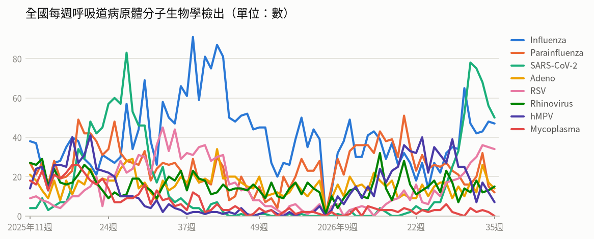

- **全國每週呼吸道病原體分子生物學檢出**（2026年第35週）：共 179，較前一週 ↓ -19（-10%）；陽性率 65.8%

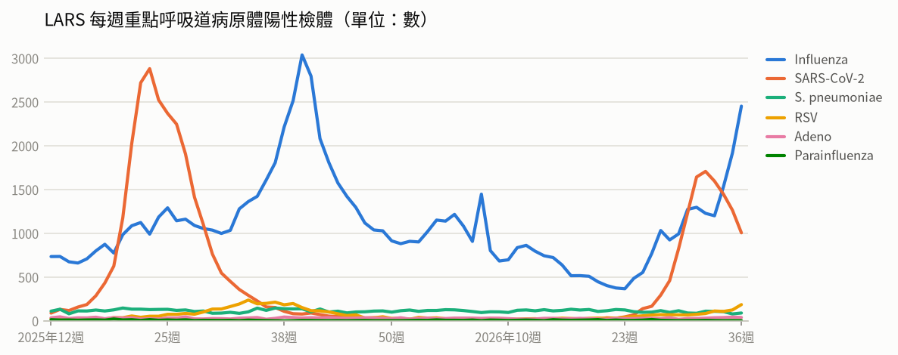

- **LARS 每週重點呼吸道病原體陽性檢體**（2026年第36週）：共 3,772，較前一週 ↑ +344（+10%）

### 新冠（COVID-19）

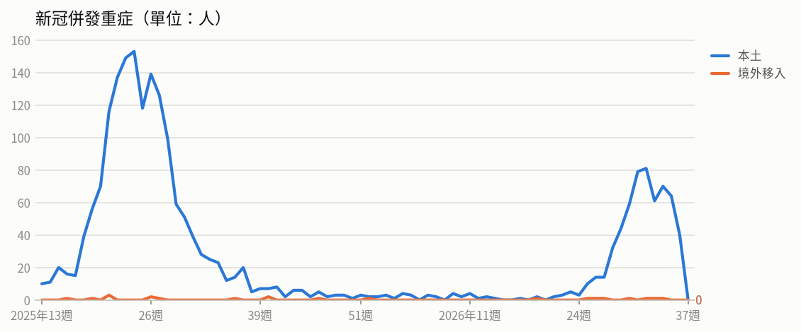

- **新冠併發重症**（2026年第35週）：共 64人（本土 64、境外移入 0），較前一週 ↓ -7（-10%）
  - 統計摘要：上週累計數 40、今年累計數 624、去年總數 1718、今年累計死亡數 118

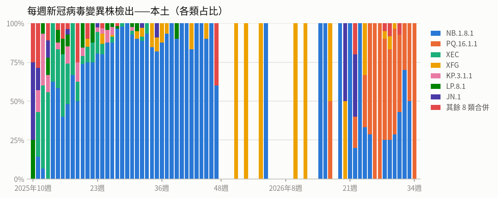

- **每週新冠病毒變異株檢出——本土**（2026年第34週）：共 1，較前一週 ↓ -1（-50%）

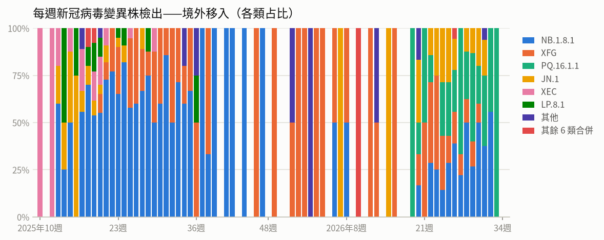

- **每週新冠病毒變異株檢出——境外移入**（2026年第33週）：共 3，較前一週 ↓ -15（-83%）

### 流感

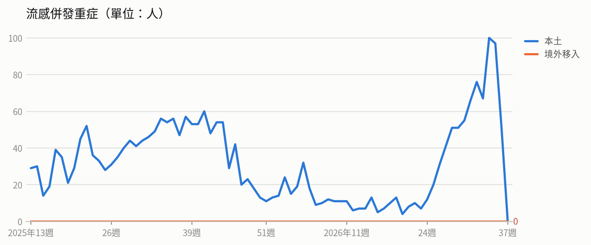

- **流感併發重症**（2026年第35週）：共 97人（本土 97、境外移入 0），較前一週 ↓ -3（-3%）
  - 統計摘要：上週累計數 51、今年累計數 995、去年總數 2290、今年累計死亡數 186

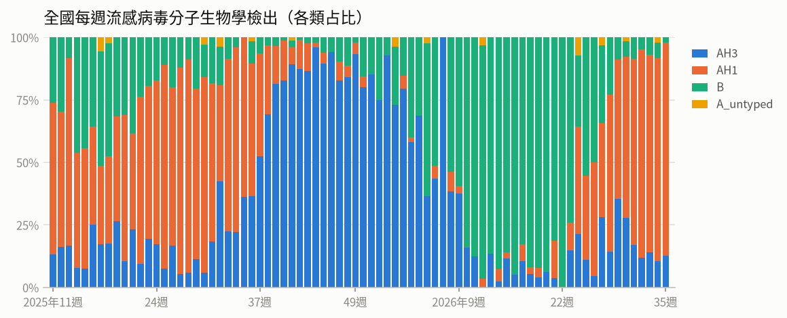

- **全國每週流感病毒分子生物學檢出**（2026年第35週）：共 47，較前一週 ↓ -1（-2%）；陽性率 17.3%

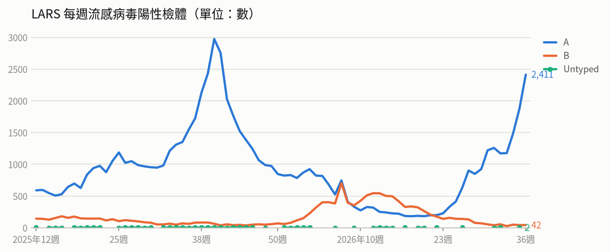

- **LARS 每週流感病毒陽性檢體**（2026年第36週）：共 2,453，較前一週 ↑ +536（+28%）

### 腸病毒

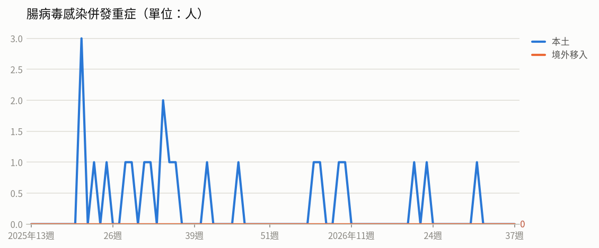

- **腸病毒感染併發重症**（2026年第31週）：共 1人（本土 1、境外移入 0）
  - 統計摘要：上週累計數 0、今年累計數 7、去年總數 19、今年累計死亡數 1

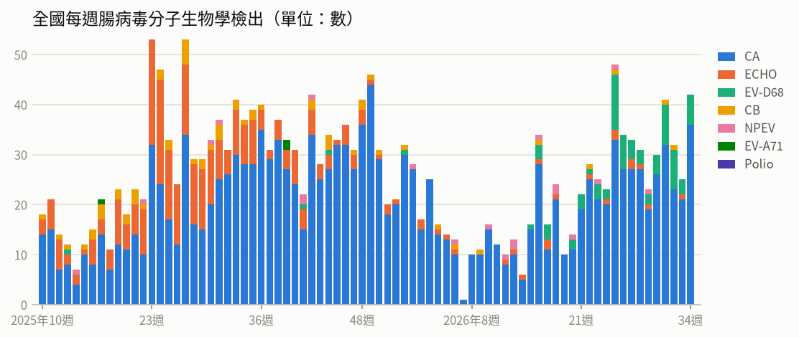

- **全國每週腸病毒分子生物學檢出**（2026年第34週）：共 42，較前一週 ↑ +17（+68%）；陽性率 13.5%

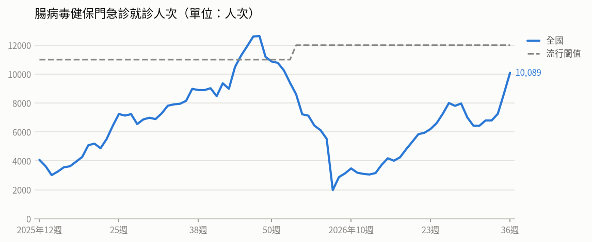

- **腸病毒健保門急診就診人次**（2026年第36週）：共 10,089人次，較前一週 ↑ +1,453（+17%）（流行閾值 12,000）

### 登革熱

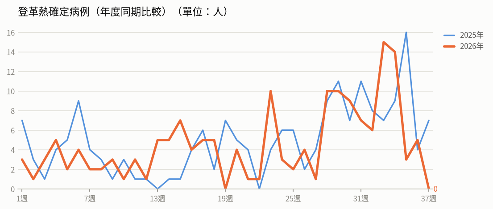

- **登革熱確定病例（年度同期比較）**（2026年第36週）：5人，2025年同期 4人
  - 統計摘要：上週累計數 5、今年累計數 166、去年總數 293、今年累計死亡數 0

> 數據取自 NIDSS（目前為 2026年第37週，統計上一完整週；定序類資料與通報有時間落後，併發重症等項目改取再前一週，以各項標示的週次為準）。最新資料可能因後續回報而變動。

## 重點速覽

- 🔴 **國內流感進入流行期，急診就診率突破流行閾值**：社區以A型H1N1為主，重症多為65歲以上長者與慢性病患，且近七成未接種本季疫苗，建議高風險族群儘速接種。
- 🔴 **剛果伊波拉疫情持續擴大，致死率近五成**：疫情已蔓延至6省61個衛生區，累計逾6,800例確診、3,310例死亡，前往當地應避免接觸病人與野生動物。
- 🔴 **孟加拉與美洲麻疹大流行，孟國近千名幼童死亡**：孟加拉自3月中旬累計逾16.3萬例疑似病例；美洲17國今年累計逾5萬例確診，較去年同期增約4.6倍，出國前請確認MMR疫苗接種史。
- 🔴 **孟加拉登革熱單日新增創今年新高，佛州本土疫情升溫**：孟加拉今年累計逾4.2萬例住院、117例死亡並擴散至全國64區；美國佛州坦帕灣地區本土病例累計73例，以第2型血清型為主。
- 🟠 **國內境外移入M痘增為去年同期約2倍，Ib型持續現蹤**：今年累計30例確診，境外移入以泰國最多；今年5月起已有10例Ib型，籲高風險族群完成2劑疫苗接種（國內仍約29%未打第2劑）。
- 🟠 **國內腸病毒就診人次連續上升，開學後須留意**：近四週流行型別以克沙奇A6型為多，今年累計7例重症含1例死亡；5歲以下幼兒為重症高危險群，出現重症前兆病徵應立即就醫。

## 國際重要疫情

- **剛果民主共和國－伊波拉病毒感染**（關注程度：高）：依剛果民主共和國國家公共衛生研究所（DRC INSP）2026/9/8資料，該國伊波拉疫情持續新增病例，9/8單日新增86例確定病例，其中43例死亡，分布於伊圖里省（55例）、北基伍省（27例）、上韋萊省（2例）及喬波省（2例）。累計確定病例達6,843例，死亡3,310例，康復1,611例，致死率48.4%。疫情已擴散至6個省份、61個衛生區。
  - 旅遊防疫建議：非必要應避免前往剛果民主共和國疫情流行地區；如須前往，請避免接觸病人血液或體液、野生動物及其生食，返國後如有發燒等不適症狀，應主動告知檢疫人員或就醫時告知旅遊史。
  - [原文連結](https://www.cdc.gov.tw/TravelEpidemic/Detail/G3PSay_dafdAwjsYNm3CCA?epidemicId=vrk1a9WOaMByOER4SfBNEw)
- **孟加拉－麻疹**（關注程度：高）：疾管署引述中央社、Dhaka Tribune、孟加拉衛生服務總局（DGHS）及孟加拉國家通訊社2026年9月6日消息，指出孟加拉持續發生大規模麻疹疫情。自今年3月中旬起累計疑似病例逾16.3萬例、確定病例1.9萬例，並造成至少991名幼童染疫死亡。當地已啟動大規模疫苗接種，但病例數仍持續上升，每日新增約800至1,100例疑似病例。
  - 旅遊防疫建議：計畫前往孟加拉者，出發前應確認自身及幼童麻疹相關疫苗（如MMR）接種是否完整，必要時可諮詢旅遊醫學門診；返國後如出現發燒、出疹等症狀，應戴口罩儘速就醫並告知旅遊史。
  - [原文連結](https://www.cdc.gov.tw/TravelEpidemic/Detail/G3PSay_dafdAwjsYNm3CCA?epidemicId=wjhpbjHU_XWySmMUf2wu6A)
- **孟加拉、美國（佛羅里達州）－登革熱**（關注程度：高）：孟加拉登革熱疫情持續上升並已擴散至全國64個行政區，各地醫院病床不堪負荷，當局警告9月單月住院病例恐突破3萬例、疫情可能延燒至10月，同時該國今年另有麻疹疫情造成近千名兒童死亡，醫療與公衛壓力遽增。美國佛羅里達州本土疫情升溫，新增病例主要集中於坦帕灣地區，以第2型血清型（DENV-2）為多，當局已啟動空中與地面聯合噴藥，進行成蚊撲滅及孑孓（蚊子幼蟲）防治。
  - 旅遊防疫建議：前往孟加拉、美國佛州等登革熱流行地區應全程做好防蚊措施，穿著淺色長袖衣褲並使用政府核可的防蚊藥劑；返國後如出現發燒、頭痛、肌肉關節痛或出疹等症狀，應儘速就醫並主動告知旅遊史。
  - [原文連結](https://www.cdc.gov.tw/TravelEpidemic/Detail/G3PSay_dafdAwjsYNm3CCA?epidemicId=Y4E-BQz4OUIQU10UFCSlrg)
- **美洲（瓜地馬拉、墨西哥、美國、加拿大等17個國家/地區）－麻疹**（關注程度：高）：依據泛美衛生組織（PAHO）資料，美洲地區麻疹疫情持續擴大，今年截至第33週已累計51,027例確診、55例死亡，致死率0.10%。病例數較去年同期增加約4.6倍，其中96%集中於瓜地馬拉（32,566例）、墨西哥（12,607例）、美國（2,777例）及加拿大（1,117例）。
  - 旅遊防疫建議：計劃前往美洲地區者，建議出發前確認是否完成麻疹疫苗（MMR）接種，必要時可諮詢旅遊醫學門診；返國後如出現發燒、出疹等症狀，應戴口罩儘速就醫並主動告知旅遊史。
  - [原文連結](https://www.cdc.gov.tw/TravelEpidemic/Detail/G3PSay_dafdAwjsYNm3CCA?epidemicId=QkWx_T6ZifDX1nNOfpTTGw)
- **中國－亞洲長角血蜱正內羅病毒（ALTNV）感染**（關注程度：中）：據NEJM 2026/9/2報導，中國研究人員在3,163名有蜱叮咬史的患者中發現新的蜱媒病毒—亞洲長角血蜱正內羅病毒（ALTNV），約10.4%個案檢出其核酸或IgM抗體。感染者常見發燒、倦怠、腸胃道不適、血小板減少及肝功能異常，臨床表現與發熱伴血小板減少綜合徵（SFTS）相似。該病毒亦自長角血蜱（H. longicornis）檢出，部分患者並與SFTS病毒共同感染，其中38例共同感染者有7例死亡。
  - 旅遊防疫建議：前往流行地區從事戶外、草叢或山林活動時，應穿著淺色長袖衣褲並使用政府核可之防蚊蜱藥劑，返家後檢查身上是否有蜱附著；若曾遭蜱叮咬後出現發燒、倦怠或腸胃不適等症狀，應儘速就醫並告知相關暴露史。
  - [原文連結](https://www.cdc.gov.tw/TravelEpidemic/Detail/G3PSay_dafdAwjsYNm3CCA?epidemicId=9xAeGHOJfzumw0CK2bK83g)
- **以色列－福氏內格里阿米巴腦膜腦炎（原發性阿米巴腦膜腦炎）**（關注程度：中）：依據BEACON 2026/9/7資料，以色列報告1例福氏內格里阿米巴腦膜腦炎，個案為9歲男童，8月底在加利利海庫爾西海灘游泳，約1週後發病確診，目前仍在加護病房插管治療。該國近年前2例均發生於2024年，與加利利海周邊水上樂園有關，其中1例死亡、1例重症。此病原通常經受污染的溫暖淡水進入鼻腔後侵入腦部，不會透過飲水或人際接觸傳播；因病程發展迅速且致死率達97%以上，即時辨識病人將影響後續療程。
  - 旅遊防疫建議：於溫暖淡水水域（如湖泊、溫泉、river或戲水設施）活動時應避免嗆水或讓水沖入鼻腔，可使用鼻夾並避免攪動底部沉積物；若曾在淡水戲水後出現發燒、劇烈頭痛、頸部僵硬、噁心嘔吐等症狀，應盡速就醫並主動告知接觸史。
  - [原文連結](https://www.cdc.gov.tw/TravelEpidemic/Detail/G3PSay_dafdAwjsYNm3CCA?epidemicId=ZpLo28nUUzvIG9KZjxzTLw)
- **全球（以非洲地區為主，含馬達加斯加、安哥拉、中國、剛果民主共和國、肯亞等）－M痘（猴痘）**（關注程度：中）：依WHO資料，今年7月全球M痘病例以馬達加斯加703例最多，其次為安哥拉138例、中國88例、剛果民主共和國55例及肯亞55例，74.8%病例來自非洲地區；東南亞區及東地中海區無通報病例。全球已有68個國家/地區曾檢出Clade Ib確定病例，近6週（7/6-8/16）共22國報告病例，其中15國出現本土社區傳播，分布於非洲6國（馬達加斯加、安哥拉、肯亞、剛果民主共和國、南蘇丹、蒲隆地）及歐洲9國（葡萄牙、德國、法國、英國、愛爾蘭、荷蘭、義大利、瑞士、捷克）。馬達加斯加自2025年12月起爆發全球最大規模Ib型疫情。
  - 旅遊防疫建議：前往流行地區應避免與不明histor對象發生性接觸或親密接觸，並落實手部衛生；符合接種條件者建議完成M痘疫苗接種，返國後如出現發燒、皮疹等症狀應儘速就醫並告知旅遊接觸史。
  - [原文連結](https://www.cdc.gov.tw/TravelEpidemic/Detail/G3PSay_dafdAwjsYNm3CCA?epidemicId=_O23ZrgT4z3_SBc_TIlw-Q)
- **全球（含臺灣、智利、美國、荷蘭、丹麥、保加利亞、南非、挪威、法國、紐西蘭、墨西哥）－新型A型流感（禽流感）**（關注程度：中）：疾管署每週更新全球新型A型流感疫情，本週人類疫情無新增病例，今年累計40例，個案發病前多有易感動物相關暴露史。禽鳥及動物疫情方面，今年已有67個國家/地區報告4,115起高/低病原性禽流感疫情。2026/8/28-9/3期間共10國報告14起H5N1疫情，其中智利3起、美國與荷蘭各2起，丹麥、保加利亞、南非、挪威、法國、紐西蘭及臺灣各1起；另墨西哥於8/27報告1起H7N3疫情。
  - 旅遊防疫建議：民眾前往流行地區應避免接觸禽鳥、活禽市場及禽畜糞便，落實勤洗手，食用禽肉與蛋類須徹底煮熟。返國後如出現發燒、咳嗽等呼吸道症狀，應戴口罩儘速就醫並主動告知旅遊及禽畜接觸史。
  - [原文連結](https://www.cdc.gov.tw/TravelEpidemic/Detail/G3PSay_dafdAwjsYNm3CCA?epidemicId=pCGtCiCnsZaxzj6-A8LWWA)
- **哥斯大黎加－急性病毒性A型肝炎**（關注程度：中）：疾管署引述BEACON（2026/9/7）資料指出，哥斯大黎加A型肝炎疫情升溫，今年截至第32週累計772例確定病例，超過去年全年報告數（373例）的兩倍。疫情主要集中於聖荷西省（San José），占全國病例73%，病患以20-64歲族群為主，部分區域以男性居多。調查尚未發現單一共同感染源，懷疑為人傳人或水質不良所致，當局已加強衛卻教宣導。
  - 旅遊防疫建議：前往當地民眾應注意飲食與飲水衛生，飲用煮沸過的水並勤洗手；建議行前諮詢旅遊醫學門診評估接種A型肝炎疫苗。
  - [原文連結](https://www.cdc.gov.tw/TravelEpidemic/Detail/G3PSay_dafdAwjsYNm3CCA?epidemicId=kSPwMnbJgjQliamvY9cOlQ)
- **尼泊爾－大腸桿菌感染症等災後腸道傳染病**（關注程度：中）：疾管署引述BEACON（2026/9/5）資訊指出，尼泊爾拉蘇瓦（Rasuwa）地區於8月26日發生災難性山洪，造成數千人罹難及失蹤；努瓦科縣（Nuwakot）避難中心已報告腹瀉與發燒病例，且5處飲用水源檢出大腸桿菌汙染。當局警告受汙染飲用水極易引發霍亂、傷寒及A型／E型肝炎等腸道傳染病疫情，規劃為10萬名民眾接種霍亂疫苗、7.5萬名兒童接種麻疹及德國麻疹疫苗。WHO並緊急提供登革熱、瘧疾、恙蟲病、流感及鉤端螺旋體病等快篩試劑，以加強疫情監測。
  - 旅遊防疫建議：前往尼泊爾災區者應避免飲用未經處理的生水、落實勤洗手並注意飲食衛生，必要時可先諮詢旅遊醫學門診評估疫苗接種。
  - [原文連結](https://www.cdc.gov.tw/TravelEpidemic/Detail/G3PSay_dafdAwjsYNm3CCA?epidemicId=ua3I0YsyPZq0ug3w3Cf1qg)
- **日本、韓國－流感併發重症**（關注程度：中）：日本流感疫情上升，第35週住院213例中70歲以上占50.7%(108例)，以沖繩縣(8.5)、岩手縣(4.33)及新潟縣(3.58)較高，全國47個都道府縣中有39個病例數較前一週增加。韓國疫情微幅上升，流行型別以A(H1N1)pdm09為主，當局於9月4日呼籲團體活動(包括兒童與學生)遵守個人健康準則。資料來源為日本厚生勞動省、JIHS及韓國KDCA，資料日期2026/9/4。
  - 旅遊防疫建議：前往日本、韓國旅遊時應勤洗手、佩戴口罩並落實呼吸道衛生，並建議依規定接種流感疫苗；長者等高風險族群如出現發燒、咳嗽等症狀應及早就醫並告知旅遊史。
  - [原文連結](https://www.cdc.gov.tw/TravelEpidemic/Detail/G3PSay_dafdAwjsYNm3CCA?epidemicId=BAaH0svth5bz8cMjEeaSfA)
- **法國（東南部薩瓦省 Savoie）－退伍軍人病（軍團病）**（關注程度：中）：依據Beacon 2026年9月3日資料，法國東南部薩瓦省爆發退伍軍人病疫情，6/1至8/21累計48例確定病例，46例住院、2例死亡。調查發現其中30例與尚貝里（Chambéry）一家餐廳的噴霧系統（misting system）有關。法國要求關閉該設施後，迄今未再新增相關病例。
  - 旅遊防疫建議：前往當地旅遊時應留意水霧噴霧設備、冷卻水塔等可能產生氣霧的環境，長者、吸菸者及免疫低下者尤須注意；返國後如出現發燒、咳嗽、呼吸困難或肺炎症狀，應盡速就醫並告知旅遊史。
  - [原文連結](https://www.cdc.gov.tw/TravelEpidemic/Detail/G3PSay_dafdAwjsYNm3CCA?epidemicId=7yMN-jOd35iTXdFWUmiaMw)
- **法國（相關產品亦銷往盧森堡）－沙門桿菌感染症**（關注程度：中）：依BEACON 2026年9月5日資料，法國自2026年5月3日至8月12日累計81例沙門桿菌感染症確定病例，6例住院，分布於10個行政區，且所有病例基因型檢測結果相同。調查顯示感染源為洛特加龍省（Lot-et-Garonne）一處加工廠生產的南瓜子產品，相關產品亦銷往盧森堡。當局已將該等產品下架。
  - 旅遊防疫建議：前往法國、盧森堡等地旅遊時，請避免食用來源不明或已公告下架之南瓜子等即食產品，並落實勤洗手與food安全處理；返國後如出現腹瀉、發燒、腹痛等症狀，應儘速就醫並告知旅遊史。
  - [原文連結](https://www.cdc.gov.tw/TravelEpidemic/Detail/G3PSay_dafdAwjsYNm3CCA?epidemicId=wSD_nn6ZbqArLd50cMPytA)
- **泰國－腸病毒**（關注程度：中）：依據Outbreak News Today 2026年9月7日報導，泰國今年截至9月1日累計53,362例腸病毒病例，含住院5,408例與死亡1例，整體疫情低於去年同期，患者以14歲以下學齡前與學童為主。因適逢雨季與開學季，學校及托嬰中心出現群聚疫情，當局已發布警報。防治措施包括學童發病應在家休養5天，同一班級一週內出現2例以上個案時停課清消1天，並於後續一週加強班級疫情監測。
  - 旅遊防疫建議：前往泰國時應加強手部衛生、避免讓幼童出入人潮擁擠場所；家中幼童如出現發燒、口腔潰瘍或手足皮疹等症狀應儘速就醫並在家休息，避免再傳染他人。
  - [原文連結](https://www.cdc.gov.tw/TravelEpidemic/Detail/G3PSay_dafdAwjsYNm3CCA?epidemicId=_GZaZMttbdb5rHkT_udkZw)
- **烏克蘭、安哥拉－M痘（猴痘）**（關注程度：中）：疾管署引述BEACON、UA NEWS及Deutsche Welle資料指出，烏克蘭文尼察州出現1例Ib型M痘成年男性病例，具歐洲旅遊史，症狀輕微，已隔離並對接觸者進行21天健康監測，迄今無新增病例，該國尚無本土傳播，但仍須防範其他歐洲國家的境外移入風險。安哥拉卡賓達省疫情已由2024-25年零星病例轉為持續社區傳播，目前爆發Ib型疫情；個案以20-29歲（52%）及女性（66%）為主，多無旅遊史，主要經身體接觸與性接觸傳播。當局已調撥3萬劑疫苗，優先為醫護人員與高風險地區民眾緊急接種。
  - 旅遊防疫建議：前往安哥拉等M痘流行地區應避免與不明健康狀況者發生親密或性接觸，勤洗手並留意個人衛生；返國後如出現發燒、皮疹等症狀，應戴口罩儘速就醫並主動告知旅遊接觸史。
  - [原文連結](https://www.cdc.gov.tw/TravelEpidemic/Detail/G3PSay_dafdAwjsYNm3CCA?epidemicId=97ggNQ2Zg923CL4wNf6COg)
- **菲律賓－鉤端螺旋體病**（關注程度：中）：菲律賓因洪災導致鉤端螺旋體病疫情上升，今年截至8月29日累計6,253例確定病例及378例死亡，致死率約6%，雖較去年同期減少12%，惟考量潛伏期，預估洪災衍生病例仍會持續增加，目前部分醫院已超額收治。當局已提供120萬顆Doxycycline抗生素進行預防性投藥，並呼籲涉水後出現發燒的民眾儘速就醫。
  - 旅遊防疫建議：前往菲律賓應避免涉入洪水或不明水域，皮膚有傷口時更須加強防護；若涉水後出現發燒等不適，應儘速就醫並主動告知旅遊與涉水史。
  - [原文連結](https://www.cdc.gov.tw/TravelEpidemic/Detail/G3PSay_dafdAwjsYNm3CCA?epidemicId=238OUg77XvIu1IqF8ETrxQ)
- **葉門－霍亂**（關注程度：中）：依據BEACON於2026年9月8日資料，葉門南部貝達地區(Al-Bayda)於今年8月通報逾1,000例霍亂疑似病例，並有6例死亡。媒體報導疫情蔓延與水質受污染及監管不當有關。當地面臨快篩試劑與藥物短缺，推估實際疫情可能遭低估。
  - 旅遊防疫建議：前往葉門等霍亂流行地區應注意飲食與飲水衛生，只飲用煮沸或密封包裝的水、食物充分煮熟，並勤洗手；返國後如出現嚴重腹瀉等症狀應盡速就醫並告知旅遊史。
  - [原文連結](https://www.cdc.gov.tw/TravelEpidemic/Detail/G3PSay_dafdAwjsYNm3CCA?epidemicId=IZsSj8HZN75li16hnRULWA)
- **全球（南蘇丹、剛果民主共和國、馬利、奈及利亞、巴基斯坦）－小兒麻痺症（脊髓灰質炎）**（關注程度：低）：全球小兒麻痺根除倡議組織（GPEI）公布8/27至9/2期間疫情，cVDPV1新增南蘇丹1例；cVDPV2新增3國共12例，分別為剛果民主共和國8例、南蘇丹3例、馬利1例；cVDPV3新增奈及利亞2例。環境樣本部分，巴基斯坦新增WPV1陽性6件。資料來源為GPEI，發布日期2026/9/2，疾管署於2026/9/10更新。
  - 旅遊防疫建議：前往南蘇丹、剛果民主共和國、馬利、奈及利亞、巴基斯坦等流行地區前，應確認小兒麻痺疫苗接種是否完整並視需要追加；家長請依時程完成幼兒公費疫苗接種。
  - [原文連結](https://www.cdc.gov.tw/TravelEpidemic/Detail/G3PSay_dafdAwjsYNm3CCA?epidemicId=0D0a0Xks_etsZoVfRFRQLw)
- **全球（含中國、香港、韓國）－COVID-19（新冠肺炎／新冠併發重症）**（關注程度：低）：疾管署每週更新全球新冠疫情監測（資料來源WHO FluNet、WHO、中國疾控中心、香港衛生防護中心、KCDA）。全球流行變異株以NB.1.8.1、PQ.16.1.1、XFG及JN.1為主。中國第35週門急診陽性率15.8%，以0-4歲及15-59歲族群陽性率較高，變異株以NB.1.8.1為主；香港第35週陽性率1.06%，污水監測以PQ.16.1.1占97.6%為主；韓國第35週陽性率11.3%，變異株以BA.3.2占50.0%最多，其次為NB.1.8.1、PQ.16.1.1及RF.5。
  - 旅遊防疫建議：計畫前往疫情上升地區（如歐洲、美洲及韓國）的民眾，建議出發前完成建議之新冠疫苗接種，旅途中落實勤洗手、於人潮擁擠或密閉場所配戴口罩；返國後如有發燒、呼吸道症狀應儘速就醫並告知旅遊史。
  - [原文連結](https://www.cdc.gov.tw/TravelEpidemic/Detail/G3PSay_dafdAwjsYNm3CCA?epidemicId=LVVl-jPbZNLNaQuFQXkfuw)
- **蒙古－鼠疫**（關注程度：低）：依BEACON 2026/9/6資料，蒙古2026年於北部庫蘇古爾省進行監測，確認當地為鼠疫自然疫源地；另在鄰接中國邊境的科布多省發現1例腺鼠疫確定病例，該病例與處理來自巴彥烏列蓋省已知疫源區的旱獺有關。目前尚無證據顯示有人際間傳播，惟獵捕旱獺為主要傳播途徑，且偏遠地區就醫診療不易。
  - 旅遊防疫建議：前往蒙古等鼠疫疫源地區時，請勿接觸、獵捕或食用野生旱獺等囓齒動物；返國後如出現發燒、淋巴結腫痛等症狀，應儘速就醫並告知旅遊接觸史。
  - [原文連結](https://www.cdc.gov.tw/TravelEpidemic/Detail/G3PSay_dafdAwjsYNm3CCA?epidemicId=8idOITmT_BJiRhpkM540RA)

## 本週國內公告摘要

### 腸病毒

#### 國內腸病毒疫情上升 呼籲民眾不可掉以輕心 應落實個人及環境衛生 降低疾病傳播風險

- **來源／關注程度／地區**：衛生福利部疾病管制署／中／全國
- **病例概況**：第35週（8月30日至9月5日）腸病毒門急診就診8,475人次，較前一週7,199人次上升17.7%，今年累計7例併發重症確定病例（含1例死亡）。
- **摘要**：疾管署表示國內腸病毒疫情呈上升趨勢，第35週門急診就診8,475人次，較前週上升17.7%。近四週社區流行型別以克沙奇A6型為多，其次為腸病毒D68型及克沙奇A16型。今年累計7例併發重症病例（含1例死亡），其中感染腸病毒D68型5例、克沙奇A4型及克沙奇A16型各1例。5歲以下嬰幼兒為重症高危險群，且重症病程發展快速。
- **防疫建議**：請大人小孩以肥皂或洗手乳落實「濕、搓、沖、捧、擦」勤洗手，幼兒感染應在家休息避免接觸其他孩童，並以500 ppm含氯漂白水清潔消毒常接觸物品與玩具；一旦出現嗜睡、意識不清、活力不佳、手腳無力、肌抽躍、持續嘔吐或呼吸急促、心跳加快等重症前兆病徵，應儘速送大醫院治療。
- **原文連結**：https://www.cdc.gov.tw/Bulletin/Detail/DhYHJ_ADrxLmj217Q0dMtw?typeId=9

### M痘（猴痘）

#### 今年Ｍ痘境外移入個案已10例 為去年同期2倍 其中6例來自泰國 請前往流行地區或國內風險場域民眾應落實自我防護 符合公費接種資格者儘速完成2劑接種

- **來源／關注程度／地區**：衛生福利部疾病管制署／中／全國
- **病例概況**：今年截至9月7日國內新增30例M痘確定病例（20例本土、10例境外移入），境外移入為去年同期5例的約2倍，以泰國6例最多；今年5月起累計10例Ib型感染（7例境外移入、3例本土）。
- **摘要**：疾管署表示，今年M痘境外移入病例明顯增加，來源國以泰國最多，其餘為越南、印度、香港、柬埔寨各1例，個案皆為20至50歲青壯年男性。近期新增2例，包括1例本土Ib型（40多歲男性，曾有不安全性行為）及1例境外移入II型（30多歲男性，曾赴柬埔寨旅遊），2人均未接種疫苗。Ib型與II型症狀及致死率相近，但Ib型皮疹分布較廣、較易在家戶內傳播，現行疫苗與抗病毒藥物Tecovirimat對Ib型同樣有效。國內至8月底已有111,908人接種至少1劑，仍有約31,875人（29%）尚未完成第2劑。
- **防疫建議**：前往流行地區或國內風險場域應落實自我防護，避免與不特定人士親密接觸；符合公費資格者請儘速至318家合作院所完成2劑疫苗接種，若出現皮疹、水泡、發燒、淋巴結腫大等症狀應戴口罩儘速就醫並告知旅遊及接觸史。
- **原文連結**：https://www.cdc.gov.tw/Bulletin/Detail/8TLKEpCU8z7SHUO56U2BHQ?typeId=9

### 一般公告

#### 我國啟動「國家級防疫一體抗生素抗藥性管理行動計畫外部評核」，強化跨部門治理與核心能力

- **來源／關注程度／地區**：衛生福利部疾病管制署／不適用／全國
- **病例概況**：本則新聞為抗生素抗藥性(AMR)管理政策之外部評核作業公告，未涉及病例數或疫情趨勢數據。
- **摘要**：疾管署表示，我國於2026年9月8日至11日辦理為期4天的「國家級防疫一體抗生素抗藥性管理行動計畫外部評核」，以落實行政院第3961次院會決議、導入國際評核工具，並響應聯合國2024抗生素抗藥性高階會議倡議。本次評核邀請瑞士、日本、義大利、美國等5位跨領域國際專家來臺實地評核，與衛生福利部、農業部、環境部及臺大醫院抗生素抗藥性防治中心共同檢視我國抗藥性防治作為。評核範疇涵蓋跨部門合作、人類健康、動物健康、食品安全、農業及環境等領域，聚焦「認知與教育」、「抗生素使用與抗藥性監測」、「感染預防與控制」、「抗生素管理與合理使用」及「持續性投資、政策與治理」等5大面向，採文件審查、評核會議、跨部會綜合討論及醫療機構與動物實驗室實地參訪等方式進行。
- **防疫建議**：民眾應遵照醫囑正確使用抗生素，不自行購買、不隨意停藥或分享藥品；醫療人員則應落實感染管制與抗生素合理使用，共同減緩抗藥性威脅。
- **原文連結**：https://www.cdc.gov.tw/Bulletin/Detail/W70xBVcVMlduu5t2M1dOiA?typeId=9

### 梅毒

#### 梅毒疫情持續，請醫界落實通報、及時診斷及治療，共同防治梅毒傳播(疾病管制署致醫界通函第615號)

- **來源／關注程度／地區**：衛生福利部疾病管制署／中／全國
- **病例概況**：2026年1至8月國內梅毒新增6,900例，較2025年同期6,702例增加3%，其中女性1,538例、15-24歲族群1,340例皆增加4%，先天性梅毒通報68例雖低於2025年同期79例，仍高於2023、2024年同期。
- **摘要**：疾管署致醫界通函第615號指出，國內梅毒疫情持續，確診個案以男性（78%）及15-44歲（70%）為主，年輕族群與女性通報數上升，先天性梅毒防治仍須強化。梅毒為可治癒性傳染病，長效型盤尼西林（benzathine penicillin G）為第一線用藥，也是預防母子垂直感染唯一有效藥物，因全球供應吃緊，已有2家廠商經食藥署專案核准輸入，籲請醫療院所妥適備藥。自115年1月1日起推動「產檢梅毒陽性免過卡接續確認檢驗申報方式」，孕婦RPR或VDRL陽性可利用同管血液接續執行TPPA或TPHA確認檢驗並申報健保。
- **防疫建議**：民眾如有不安全性行為或疑似症狀應儘早就醫檢驗，孕婦務必接受產前梅毒篩檢並於初篩陽性時儘速完成確認檢驗及治療；醫師發現符合通報病例定義者應依《傳染病防治法》通報，並登錄懷孕情形與妊娠週數。
- **原文連結**：https://www.cdc.gov.tw/Bulletin/Detail/egRYQ6riquLMkRfhvcQ71A?typeId=48

### 流感（併新冠肺炎）

#### 流感及新冠仍有傳播風險 呼籲民眾出現症狀戴口罩就醫並在家休息 且留意重症危險徵兆

- **來源／關注程度／地區**：衛生福利部疾病管制署／高／全國
- **病例概況**：第35週(8/30-9/5)類流感門急診115,136人次、較前週上升11.0%，急診就診百分比11.2%突破流行閾值進入流行期；上週新增105例流感併發重症、19例死亡；新冠門急診20,199人次、下降9.7%，新增73例本土重症及15例死亡。
- **摘要**：疾管署表示國內流感已於上週進入流行期，社區流行病毒以A型為主，其中A型H1N1占79.4%；本(114-115)流感季累計1,329例重症、253例死亡，重症以65歲以上長者(65.1%)及具慢性病史者(82.8%)為多，68.6%未接種本季流感疫苗。新冠疫情雖下降但仍處流行期，自2025年10月起累計622例本土併發重症、106例死亡，重症亦以長者及慢性病患為主，84.9%未接種本季新冠疫苗，近4週變異株以PQ.16.1.1為主。
- **防疫建議**：請落實勤洗手與呼吸道禮節，出現發燒、咳嗽、流鼻涕、喉嚨痛等症狀應戴口罩儘速就醫並在家休息，可先以新冠家用快篩自我檢測並告知醫師結果。若出現呼吸困難、呼吸急促、發紺、血痰或痰液變濃、胸痛、意識改變、低血壓或高燒持續72小時等危險徵兆，應立即就醫。
- **原文連結**：https://www.cdc.gov.tw/Bulletin/Detail/5gJTj70wu9L3psY5kQLUuA?typeId=9
