# 疫情週報 2026-W38

涵蓋期間：2026-09-14 ~ 2026-09-20

> 本報告由 AI 自動產生，內容以疾管署原文為準。

## 監測數據

### 呼吸道病原體（整體）

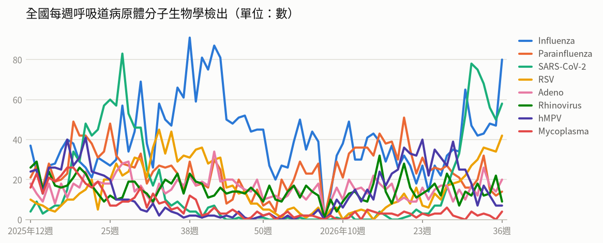

- **全國每週呼吸道病原體分子生物學檢出**（2026年第36週）：共 234，較前一週 ↑ +48（+26%）；陽性率 68%

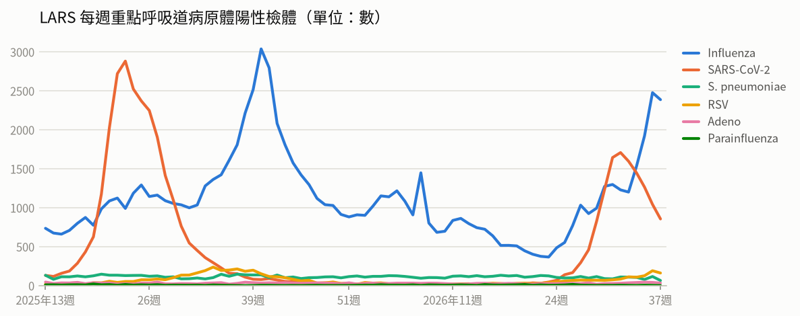

- **LARS 每週重點呼吸道病原體陽性檢體**（2026年第37週）：共 3,499，較前一週 ↓ -368（-10%）

### 新冠（COVID-19）

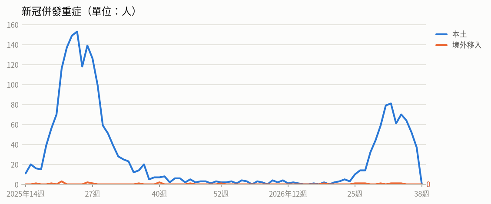

- **新冠併發重症**（2026年第36週）：共 52人（本土 52、境外移入 0），較前一週 ↓ -12（-19%）
  - 統計摘要：上週累計數 37、今年累計數 673、去年總數 1718、今年累計死亡數 124

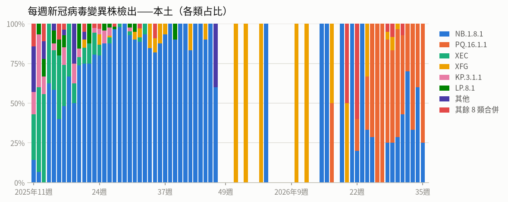

- **每週新冠病毒變異株檢出——本土**（2026年第35週）：共 4，較前一週 ↓ -1（-20%）

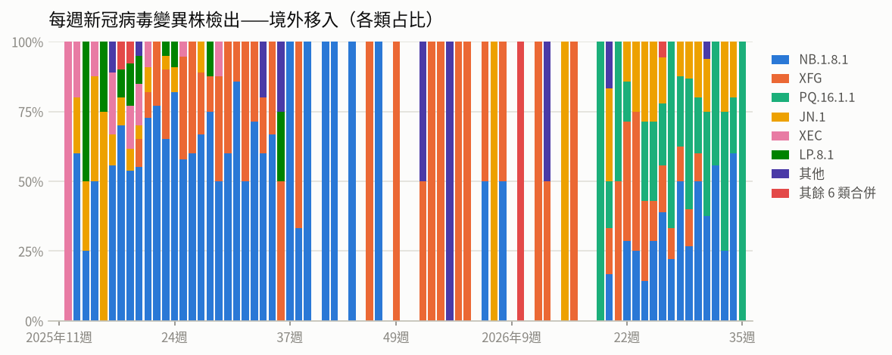

- **每週新冠病毒變異株檢出——境外移入**（2026年第35週）：共 1，較前一週 ↓ -4（-80%）

### 流感

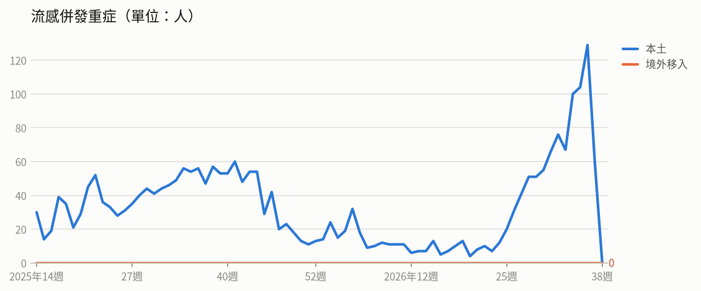

- **流感併發重症**（2026年第36週）：共 129人（本土 129、境外移入 0），較前一週 ↑ +25（+24%）
  - 統計摘要：上週累計數 59、今年累計數 1139、去年總數 2290、今年累計死亡數 214

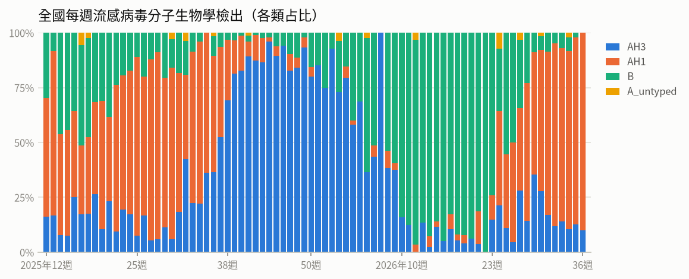

- **全國每週流感病毒分子生物學檢出**（2026年第36週）：共 80，較前一週 ↑ +33（+70%）；陽性率 23.3%

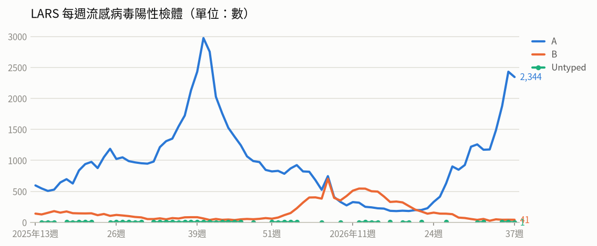

- **LARS 每週流感病毒陽性檢體**（2026年第37週）：共 2,386，較前一週 ↓ -90（-4%）

### 腸病毒

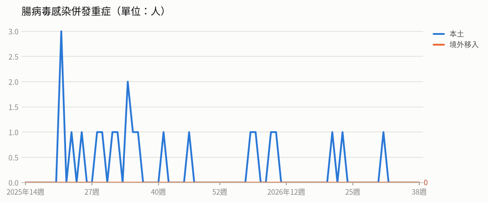

- **腸病毒感染併發重症**（2026年第31週）：共 1人（本土 1、境外移入 0）
  - 統計摘要：上週累計數 0、今年累計數 7、去年總數 19、今年累計死亡數 1

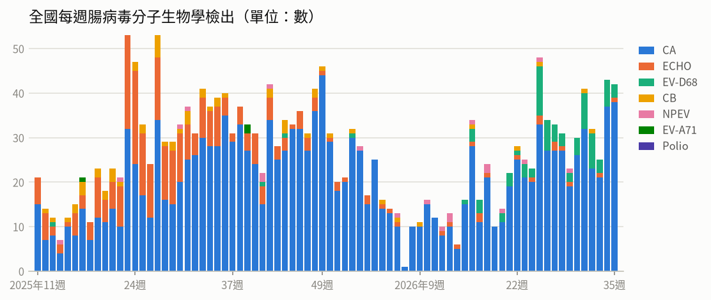

- **全國每週腸病毒分子生物學檢出**（2026年第35週）：共 42，較前一週 ↓ -1（-2%）；陽性率 13.9%

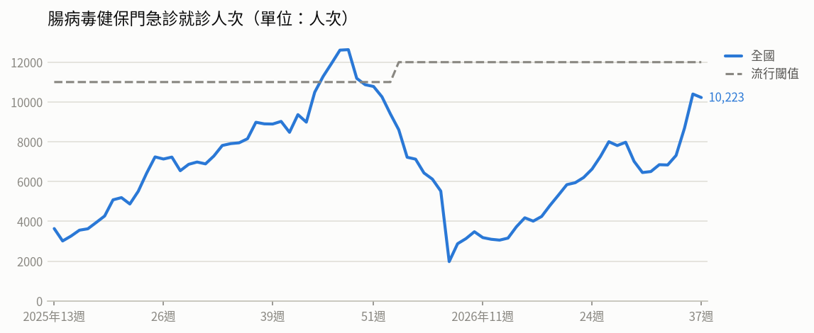

- **腸病毒健保門急診就診人次**（2026年第37週）：共 10,223人次，較前一週 ↓ -176（-2%）（流行閾值 12,000）

### 登革熱

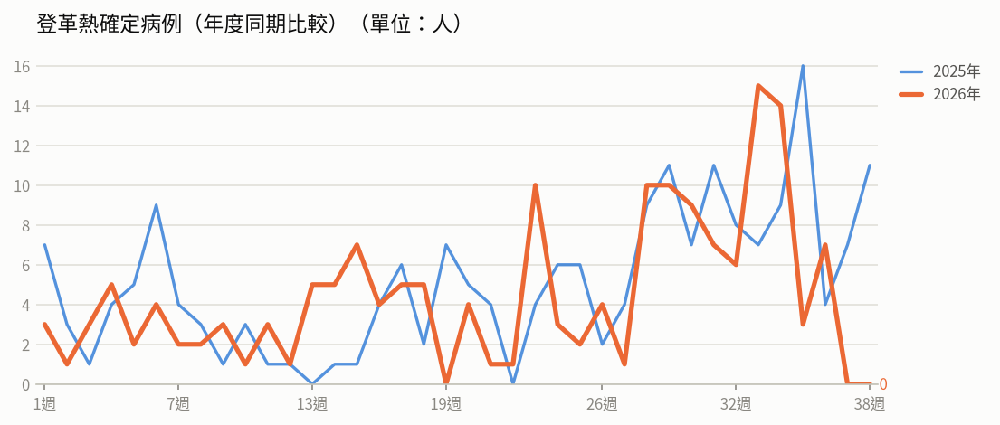

- **登革熱確定病例（年度同期比較）**（2026年第37週）：0人，2025年同期 7人
  - 統計摘要：上週累計數 0、今年累計數 168、去年總數 293、今年累計死亡數 0

> 數據取自 NIDSS（目前為 2026年第38週，統計上一完整週；定序類資料與通報有時間落後，併發重症等項目改取再前一週，以各項標示的週次為準）。最新資料可能因後續回報而變動。

## 重點速覽

- 🔴 **國內流感、新冠雙雙處流行期，類流感就診再升逾一成**：第36週類流感門急診13萬餘人次、較前週上升16.5%，新冠門急診雖下降仍在流行期；重症以65歲以上及慢性病患為主，且多數未接種本季疫苗，疾管署並延長公費抗病毒藥劑擴大用藥至10月31日。
- 🔴 **國內睽違20年再現本國籍境外移入諾氏瘧**：個案為50多歲女性，7月赴馬來西亞熱帶雨林旅遊遭蚊蟲叮咬且未服用預防用藥，返國後發燒就醫確診；今年累計6例境外移入瘧疾，赴東南亞雨林或非洲前應諮詢旅遊醫學門診。
- 🔴 **剛果民主共和國伊波拉持續擴散，致死率近五成**：截至9/12累計逾7,200例確診、3,475例死亡，疫情遍及7省62個衛生區，北基伍省近3週新增病例上升；WHO維持其為國際關注公共衛生緊急事件（PHEIC）。
- 🔴 **孟加拉麻疹疫情延燒，確定病例逾2萬例**：自3月中旬至9/14累計通報逾17萬例、確定病例20,124例、100例死亡，以首都達卡最嚴重；當地已啟動大規模接種但病例仍攀升，前往該國前應確認MMR疫苗接種史。
- 🟠 **彰化市新增1例本土登革熱，感染源待釐清**：個案為30多歲男性、感染登革病毒第一型，無國外旅遊史，衛生單位已展開緊急化學防治與病媒蚊密度調查；今年全國本土病例累計11例，請民眾落實孳生源清除。
- 🟠 **開學後腸病毒就診人次上升近兩成**：第36週門急診10,203人次、較前週上升18.1%，社區以克沙奇A6型為主，其次為腸病毒D68型；今年累計7例重症含1例死亡，5歲以下幼兒為高危險群，應加強洗手並留意重症前兆病徵。

## 國際重要疫情

- **剛果民主共和國－伊波拉病毒感染**（關注程度：高）：剛果民主共和國（DRC）伊波拉疫情持續擴大，9/10新增80例確定病例（49例死亡），分布於伊圖里省30例、北基伍省43例、上韋萊省6例及南烏班吉省1例，南烏班吉省並新增1個受影響衛生區（Bulu）。疫情已影響全國7省（共26省）62個衛生區，其中51個衛生區於過去21天內仍有病例；增幅部分可能來自監測、檢驗與診斷能力提升及未通報資料校正，但病例與死亡持續增加亦反映社區傳播延續與地理擴張。WHO於8/14評估DRC境內風險為「極高」、接壤鄰國為「高」、非洲其他地區及全球為「低」，並不建議對受影響國家實施旅行或貿易限制。WHO指出Ervebo疫苗對本次病毒的人體效益仍未知，僅建議於研究計畫中使用，截至9/6已有2,007名醫護及第一線人員接種。
  - 旅遊防疫建議：近期避免非必要前往剛果民主共和國及鄰近受影響地區，如需前往應避免接觸病患、野生動物及其體液，並落實手部衛生；自流行地區返國後如出現發燒、腹瀉、出血等症狀，請主動告知醫師旅遊史並儘速就醫。
  - [原文連結](https://www.cdc.gov.tw/TravelEpidemic/Detail/G3PSay_dafdAwjsYNm3CCA?epidemicId=9u_kD0dhcYkoEoBa0xIZWw)
- **剛果民主共和國－伊波拉病毒感染**（關注程度：高）：剛果民主共和國伊波拉疫情持續擴散，疫情分布於7個省份、62個衛生區，以伊圖里省最為嚴峻，占全國78%病例數。近3週（8/24-9/13）伊圖里省新增病例下降25%，但北基伍省新增病例上升76.1%；目前女性病例占多數，且高達68%死亡病例發生於社區。WHO評估仍需5,000名醫衛人員進駐支援，並維持該疫情為「國際關注公共衛生緊急事件」（PHEIC）。
  - 旅遊防疫建議：民眾應避免非必要前往剛果民主共和國疫區，如須前往請避免接觸疑似病患、其血液或體液及野生動物；返國入境時如有發燒等不適症狀應主動告知機場檢疫人員，返國21天內出現疑似症狀請立即就醫並告知旅遊史。
  - [原文連結](https://www.cdc.gov.tw/TravelEpidemic/Detail/G3PSay_dafdAwjsYNm3CCA?epidemicId=Aa78Szc_xOu9_A7y8rWKIw)
- **孟加拉－麻疹**（關注程度：高）：孟加拉麻疹疫情持續擴大，以首都達卡最為嚴重，累計12,410例確定病例（占61.6%）、63例死亡，其次為吉大港2,711例確定病例。當局雖已啟動大規模疫苗接種，惟病例數仍持續攀升。該國同時面臨登革熱疫情，醫療體系負荷沉重。（資料來源：DGHS、Beacon，2026/9/10）
  - 旅遊防疫建議：計劃前往孟加拉的民眾，出發前應確認已完成麻疹（MMR）疫苗接種，並可提前至旅遊醫學門診諮詢；返國後如出現發燒、紅疹等症狀，應戴口罩儘速就醫並主動告知旅遊史。
  - [原文連結](https://www.cdc.gov.tw/TravelEpidemic/Detail/G3PSay_dafdAwjsYNm3CCA?epidemicId=yJt6amxeRZIX2j9dFz75DA)
- **斐濟－人類免疫缺乏病毒（愛滋病毒）感染**（關注程度：高）：疾管署引述外電報導，斐濟愛滋病毒疫情嚴峻，2025年新增2,016例感染，成年人感染比例達每60人即有1人，主要透過靜脈注射毒品共用針頭及不安全性行為傳播。疫情惡化主因包括保險套使用率低、篩檢不足、多重性伴侶及污名化導致不敢就醫，另有2%孕婦感染，母嬰垂直感染風險高。斐濟當局已於9月15日宣布疫情進入國家緊急狀態，將擴大篩檢、推動暴露前預防性投藥（PrEP）並實施針具交換計畫。
  - 旅遊防疫建議：前往斐濟等疫情流行地區應避免不安全性行為，全程正確使用保險套，切勿共用針具；有感染風險者可諮詢醫師評估暴露前預防性投藥（PrEP）並定期接受篩檢。
  - [原文連結](https://www.cdc.gov.tw/TravelEpidemic/Detail/G3PSay_dafdAwjsYNm3CCA?epidemicId=Z3CDVLBOgCwhmH0ZoYQQKw)
- **全國（境外移入，感染地為馬來西亞）－瘧疾（諾氏瘧）**（關注程度：中）：疾管署公布1例境外移入諾氏瘧確診個案，該名50多歲本國籍女性今年7月下旬赴馬來西亞熱帶雨林旅遊，自述曾遭蚊蟲叮咬且未服用瘧疾預防用藥，8月中旬返國後出現發燒、畏寒、上腹痛等症狀，9月1日確認感染，為國內自2005年後再次出現本國籍境外移入諾氏瘧病例。近10年（2017-2026年）國內累計71例瘧疾病例均為境外移入，以非洲國家感染、惡性瘧為主。馬來西亞為東南亞諾氏瘧疫情最高國家，近年每年約報告2,000至3,000例，今年截至第12週累計490例，疫情較去年同期增加，病例主要分布於婆羅洲沙巴及砂拉越。
  - 旅遊防疫建議：前往非洲、東南亞、大洋洲及中南美洲等瘧疾流行地區，請至少於出國前一個月至旅遊醫學門診諮詢，並依醫囑於出國前、期間及返國後持續服用預防藥物；當地應穿著淺色長袖長褲、使用核可防蚊藥劑並住宿於有紗門紗窗的房舍。返國後若出現發燒等疑似症狀，應儘速就醫並主動告知旅遊史與服藥情形。
  - [原文連結](https://www.cdc.gov.tw/Subscription/EpaperPreview?epaperId=103093&typeid=5)
- **全球（中國、香港、韓國）－COVID-19（新冠併發重症）**（關注程度：中）：疾管署彙整WHO FluNet、WHO、中國疾控中心、香港衛生防護中心及KCDA資料指出，全球新冠陽性率於第33週為2.33%，歐洲、美洲與東南亞區上升，流行變異株以PQ.16.1.1、NB.1.8.1、XFG及JN.1為主。中國第36週門急診陽性率14%、疫情下降，以0-4歲及15-59歲族群陽性率較高，變異株以NB.1.8.1為主。香港第36週陽性率1.12%，污水監測以PQ.16.1.1占97.6%為主；韓國疫情上升，第36週陽性率16.3%、新增193例住院，變異株以PQ.16.1.1(53.9%)為主。
  - 旅遊防疫建議：前往鄰近國家或疫情上升地區旅遊時，請留意個人衛生、勤洗手，於人潮擁擠或通風不良場所配戴口罩；符合條件者應依規定接種新冠疫苗，出現發燒、呼吸道症狀應儘速就醫並告知旅遊史。
  - [原文連結](https://www.cdc.gov.tw/TravelEpidemic/Detail/G3PSay_dafdAwjsYNm3CCA?epidemicId=a4aZxtvR4nf9XY3uC7aeig)
- **全球（智利、匈牙利、歐洲多國）－M痘（猴痘）**（關注程度：中）：WHO指出，7月全球32國新增通報M痘確診1,370例、死亡7例。智利及匈牙利近期首次通報Clade Ib基因型境外移入確定病例，個案發病前均有歐洲國家旅遊史，顯示歐洲多國存在Clade Ib社區傳播。WHO已啟動新的疫苗國際協調機制（ICG），並將常規建議延長至2027年8月；雖評估疫情未達「國際關注公共衛生緊急事件（PHEIC）」標準，仍要求各締約國維持公衛監測、風險溝通及防治應變機制，整體風險評估為中等。
  - 旅遊防疫建議：計畫前往歐洲或其他M痘流行地區者，請避免與不特定人士發生親密接觸，符合資格者建議提前完成疫苗接種；返國後如出現發燒、皮疹等疑似症狀，應戴口罩儘速就醫並主動告知旅遊接觸史。
  - [原文連結](https://www.cdc.gov.tw/TravelEpidemic/Detail/G3PSay_dafdAwjsYNm3CCA?epidemicId=mirHTm2T4qYv2kXJY5zaEw)
- **全球（本週人類病例分布未列明；動物疫情包括冰島、秘魯、美國、挪威、智利、法國）－新型A型流感（H5N1、H9N2等禽流感）**（關注程度：中）：依WAHIS資料，全球今年累計報告42例人類新型A型流感病例，本週新增2例，個案發病前多有易感動物相關暴露史。動物疫情方面，2026/9/11有冰島報告2起H5（N未定型）疫情；2026/9/7至9/11期間共5國報告19起H5N1疫情，包括秘魯8起、美國4起、挪威3起、智利與法國各2起。
  - 旅遊防疫建議：前往有禽流感疫情國家時，避免接觸禽鳥、活禽市場及其排泄物，禽蛋肉類應澈底煮熟並勤洗手；返國後如出現發燒、咳嗽等呼吸道症狀，應戴口罩儘速就醫並主動告知旅遊與禽鳥接觸史。
  - [原文連結](https://www.cdc.gov.tw/TravelEpidemic/Detail/G3PSay_dafdAwjsYNm3CCA?epidemicId=B4SFoNS4pCWJvBzAufW9UA)
- **塞內加爾、奈及利亞－白喉**（關注程度：中）：塞內加爾白喉疫情持續，當局呼籲家長確認孩童接種情形、依期程完成疫苗接種，出現症狀應即時就醫。奈及利亞疫情因免疫缺口而持續不斷，其中高原州疫情擴大，8/24-30報告48例確定病例、4例死亡，自9/7起暫時關閉所有中小學以降低傳播風險，並加強疾病監測、接觸者追蹤及疫苗接種等防治措施。
  - 旅遊防疫建議：前往塞內加爾、奈及利亞等疫情流行地區前，應確認白喉相關疫苗（如含白喉成分之疫苗）接種完整，並可諮詢旅遊醫學門診；返國後如出現發燒、喉嚨痛等症狀，應儘速就醫並告知旅遊史。
  - [原文連結](https://www.cdc.gov.tw/TravelEpidemic/Detail/G3PSay_dafdAwjsYNm3CCA?epidemicId=j_x2zPRkh8cOf741DvK8rA)
- **尚比亞－炭疽病**（關注程度：中）：依據Beacon、DMMU與APA news 2026/9/11資料，尚比亞東北部姆欽加省(Muchinga Province)三個縣近期爆發疑似炭疽疫情，造成約40頭動物異常暴斃，並有11名疑似個案，尚無死亡。由於炭疽芽孢可長期存活於土壤，加上偏遠農村檢測與醫療資源有限，當局已派員啟動現場調查以防堵疫情擴大。該國2023年曾發生涵蓋9個省份的全國性大流行，累計684例疑似病例及4例死亡；2011年亦曾因接觸死亡河馬肉導致逾500人感染。
  - 旅遊防疫建議：前往尚比亞等疫區時，避免接觸、宰殺、食用或販售來源不明及暴斃的動物肉品，肉類應徹底煮熟；返國後如出現皮膚潰瘍、發燒、腹瀉或呼吸道症狀，請盡速就醫並告知旅遊接觸史。
  - [原文連結](https://www.cdc.gov.tw/TravelEpidemic/Detail/G3PSay_dafdAwjsYNm3CCA?epidemicId=TdykG3EA33FC2dl-P1a4wg)
- **歐洲（義大利、希臘、西班牙、荷蘭等15國）－西尼羅熱**（關注程度：中）：依ECDC 2026/9/9資料，歐洲今年截至9/3共15國報告1,086例西尼羅熱本土病例，其中61例死亡（致死率6%），高於過去10年同期平均（736例）。病例以義大利516例、希臘284例及西班牙88例為多，荷蘭則為2020年以來首次報告人類病例。當地亦持續報告鳥類及馬科動物群聚疫情，雖尚無跡象顯示疾病嚴重度增加，惟當局評估目前氣候條件有利病媒蚊傳播，預期未來數週病例數仍將持續上升。
  - 旅遊防疫建議：前往歐洲流行地區旅遊時，請做好防蚊措施，穿著淺色長袖衣褲並使用政府核可的防蚊藥劑；返國後如出現發燒、頭痛等疑似症狀，應儘速就醫並主動告知旅遊史。
  - [原文連結](https://www.cdc.gov.tw/TravelEpidemic/Detail/G3PSay_dafdAwjsYNm3CCA?epidemicId=iw1z7K0j7F6qPHRAhx-a2A)
- **歐洲（英國、荷蘭、比利時等）－沙門氏菌感染症**（關注程度：中）：據Euronews 2026年9月7日報導，歐洲自2025年5月至2026年8月累計報告341例沙門氏菌感染症確定病例，近半數疫情發生於今年5月以後，患者以4歲以下嬰幼兒居多；報告病例以英國（474例）及荷蘭（106例）較多，比利時近期因雞蛋污染影響報告逾300例。歐洲食品安全局（EFSA）統計全歐每年約報告9.1萬例，估計每年醫療與生產力損失等經濟負擔達30億歐元。
  - 旅遊防疫建議：前往歐洲旅遊或外食時，應避免food食用未煮熟的肉類、雞蛋及未經加熱消毒的乳製品，並注意手部衛生與飲食清潔，嬰幼兒等高風險族群更應加強留意。
  - [原文連結](https://www.cdc.gov.tw/TravelEpidemic/Detail/G3PSay_dafdAwjsYNm3CCA?epidemicId=h5BWyHp6unSxLoPpskILog)
- **泰國－腸病毒**（關注程度：中）：依泰國疾管局2026年9月16日資料，泰國腸病毒疫情持續上升，今年累計報告6萬5,108例、死亡1例，第37週單週即報告5,472例。病例以4歲以下幼童為多，地區分布以素林府（Surin）通報病例最多。
  - 旅遊防疫建議：前往泰國旅遊時應勤洗手、避免與病患接觸，並留意幼童健康狀況；返國後如出現發燒、口腔潰瘍、手足皮疹等症狀，應盡速就醫並告知旅遊史。
  - [原文連結](https://www.cdc.gov.tw/TravelEpidemic/Detail/G3PSay_dafdAwjsYNm3CCA?epidemicId=GJ2pmGbe40GTkGuB9yUZ_w)
- **澳洲－流感**（關注程度：中）：依據Australian CDC與Beacon 2026/9/9資料，澳洲流感疫情持續，最近兩週（8/24-9/6）新增31,650例確定病例，較前2週增加27.2%，陽性率上升至8.4%。病毒型別以A(H3N2)為主（占71.1%），疫苗覆蓋率30.2%，整體活動度仍低於去年同期。推估疫情尚未達高峰，將持續升溫，近期兒童及高齡族群住院數亦增加。
  - 旅遊防疫建議：計劃前往澳洲的民眾，尤其是兒童與長者等高風險族群，建議行前接種流感疫苗，並於旅途中落實勤洗手、戴口罩等個人衛生措施；返國後如有發燒、咳嗽等症狀應盡速就醫並告知旅遊史。
  - [原文連結](https://www.cdc.gov.tw/TravelEpidemic/Detail/G3PSay_dafdAwjsYNm3CCA?epidemicId=9PNGBxUuMmUlyoPgohS5KA)
- **美國、不丹－狂犬病**（關注程度：中）：美國自2026年7月以來多個地區人類狂犬病暴露風險呈增加趨勢，美國CDC於7-8月接獲相關諮詢較去年同期增17%，至少8州反映暴露後預防（PEP）使用增加或施打錯誤；截至9月2日，疫苗與免疫球蛋白使用量分別較去年同期增加約33%及76%，但目前無藥品供應短缺。暴露事件多見於夏季，與戶外活動及接觸野生動物機會增加有關；美國50州中僅夏威夷州為非狂犬病疫區。WHO於9月4日宣布不丹成功消除犬隻傳播的人類狂犬病，為東南亞區首個達成國家，該國自2023年6月起未再發生犬傳人死亡病例。
  - 旅遊防疫建議：前往狂犬病疫區旅遊時，請勿接觸、餵食或逗弄野生動物及流浪犬貓，必要時可於出國前諮詢旅遊醫學門診評估接種疫苗。一旦被動物抓咬傷，應立即以肥皂和大量清水沖洗傷口並儘速就醫評估暴露後預防處置。
  - [原文連結](https://www.cdc.gov.tw/TravelEpidemic/Detail/G3PSay_dafdAwjsYNm3CCA?epidemicId=V_taC8E7Ipo9TmVFVGAKNA)
- **美國（紐約市南布朗克斯區）－退伍軍人病（軍團病）**（關注程度：中）：依據NYC Health等資料來源（2026/9/13），美國紐約市南布朗克斯區（South Bronx）發生退伍軍人病群聚事件，截至9月14日累計11例確定病例，包含3例住院及1例死亡。當地衛生當局已啟動疫情調查，並針對受影響區域的冷卻水塔進行實驗室檢測與清潔消毒作業。
  - 旅遊防疫建議：前往當地旅遊或居住者應留意發燒、咳嗽、呼吸急促等肺炎症狀，尤其年長者、吸菸者及免疫功能低下者更應提高警覺；如有疑似症狀應儘速就醫並主動告知旅遊史。
  - [原文連結](https://www.cdc.gov.tw/TravelEpidemic/Detail/G3PSay_dafdAwjsYNm3CCA?epidemicId=xDTyh6KXKhAKngDhlHrBsg)
- **越南（胡志明市）－登革熱**（關注程度：中）：疾管署引述DTINEWS 2026年9月10日報導，越南胡志明市登革熱疫情持續升溫，今年截至9月6日累計3萬1,032例病例，且連續5週單週新增逾1,000例。當地高溫多雨及高人口密度提供埃及斑蚊極佳繁殖環境，當局呼籲民眾徹底清除孳生源。
  - 旅遊防疫建議：前往越南等登革熱流行地區應做好防蚊措施，穿著淺色長袖衣褲並使用政府核可的防蚊藥劑；返國後如出現發燒等疑似症狀，應儘速就醫並主動告知旅遊史。
  - [原文連結](https://www.cdc.gov.tw/TravelEpidemic/Detail/G3PSay_dafdAwjsYNm3CCA?epidemicId=ScZAGFPo_ySS-pBfp9W2cw)
- **韓國－流感（流感併發重症）**（關注程度：中）：依據韓國疾病管理廳（KDCA）2026年9月11日資料，該國流感疫情上升並發布流行預警。第36週定點醫療機構通報數達每千人25.3例，高於基線值12.9例與去年同期6.6例；病毒陽性率升至16.3%，住院個案300例，流行型別以A(H1N1)pdm09為主。韓國當局呼籲高風險族群若出現發燒等呼吸道症狀應儘早就醫治療。
  - 旅遊防疫建議：前往韓國旅遊或當地民眾應落實勤洗手、佩戴口罩等呼吸道防護措施，並依建議接種流感疫苗；若出現發燒等呼吸道症狀，尤其為高風險族群，請儘早就醫治療。
  - [原文連結](https://www.cdc.gov.tw/TravelEpidemic/Detail/G3PSay_dafdAwjsYNm3CCA?epidemicId=M1TmZZyze8xsupBqN9S2cA)
- **全球（阿富汗、巴基斯坦、剛果民主共和國、奈及利亞、馬達加斯加、索馬利亞）－小兒麻痺症（脊髓灰質炎）**（關注程度：低）：依據全球小兒麻痺根除倡議組織（GPEI）2026年9月9日公布資料，9月3日至9日期間阿富汗新增4例WPV1病例；cVDPV2則新增2國共6例，分別為剛果民主共和國5例、奈及利亞1例。環境樣本方面，巴基斯坦新增WPV1陽性檢體3件、馬達加斯加新增cVDPV1陽性檢體1件、索馬利亞新增cVDPV2陽性檢體1件。
  - 旅遊防疫建議：計劃前往阿富汗、巴基斯坦、剛果民主共和國、奈及利亞等小兒麻痺流行地區者，出國前應確認小兒麻痺疫苗接種史是否完整，必要時可至旅遊醫學門診諮詢並依建議追加接種。
  - [原文連結](https://www.cdc.gov.tw/TravelEpidemic/Detail/G3PSay_dafdAwjsYNm3CCA?epidemicId=7rQ64Xuf1U5Sfk5fb55s6Q)
- **南韓－日本腦炎**（關注程度：低）：據Outbreak News Today 2026年9月12日報導，南韓通報今年首例本土日本腦炎確定病例，個案為60多歲女性，無疫苗接種紀錄並曾遭蚊子叮咬。南韓疫情主要發生於9至10月，且以50歲以上族群為主要受影響對象。由於病媒三斑家蚊仍持續活躍，當地衛生當局呼籲民眾加強防範。
  - 旅遊防疫建議：前往或居住南韓者從事戶外活動時應落實防蚊措施，如穿著淺色長袖衣褲、使用政府核可之防蚊藥劑；居住於稻田或養豬場附近的民眾應依建議接種日本腦炎疫苗。
  - [原文連結](https://www.cdc.gov.tw/TravelEpidemic/Detail/G3PSay_dafdAwjsYNm3CCA?epidemicId=kWabf47cUMKQRR4M7JSgUg)
- **印度－瘧疾**（關注程度：低）：疾管署引述MSN、Outlook India（2026/8/31）報導，印度近年瘧疾疫情顯著下降，2015至2025年間病例數與死亡數皆減少約8成，高疾病負擔行政區從155個降至33個，並有160個區域在2022至2025年間未報告本土病例。印度當局表示將持續強化疫情監測、檢驗、治療與個案追蹤，目標於2030年達成消除瘧疾。
  - 旅遊防疫建議：前往印度等瘧疾流行地區前，建議先至旅遊醫學門診諮詢並依醫囑服用瘧疾預防藥物，旅途中做好防蚊措施；返國後如出現發燒等不適，應盡速就醫並主動告知旅遊史。
  - [原文連結](https://www.cdc.gov.tw/TravelEpidemic/Detail/G3PSay_dafdAwjsYNm3CCA?epidemicId=YPNDKRsWCW3Z5DghDGQCZQ)
- **美國－環孢子蟲病**（關注程度：低）：依據BEACON 2026/9/13資料，美國此波環孢子蟲病疫情累計1萬2,883例確定病例，含570例住院及2例死亡，疫情波及31個州，規模明顯高於去年同期的1,180例。最後一例發病日為8/17，美方已於9/11宣布疫情結束。疫情主要感染來源研判為墨西哥生產的結球萵苣，相關單位仍持續在加工廠採樣調查。
  - 旅遊防疫建議：前往美洲地區旅遊或食用進口生鮮蔬果時，應注意飲食衛生，生菜沙拉等生食務必充分清洗；如出現持續腹瀉、腹脹、噁心、食慾不振等症狀，請就醫並告知旅遊及飲食史。
  - [原文連結](https://www.cdc.gov.tw/TravelEpidemic/Detail/G3PSay_dafdAwjsYNm3CCA?epidemicId=Izt40JwE0k2ay1DjeH1l9g)
- **阿根廷－漢他病毒症候群**（關注程度：低）：依據Beacon 2026/9/6資訊，阿根廷內烏肯省(Neuquén Province)今年截至9月3日累計2例漢他病毒症候群確定病例。指標個案為26歲男性，出現發燒、肌肉疼痛、呼吸困難等症狀，8月15日住院、8月18日死亡，其居住區有嚙齒類動物出沒紀錄；第2例為指標個案的密切接觸者，目前病情穩定。阿根廷已啟動接觸者追蹤與監測，並發布公共衛生防疫等預防建議。
  - 旅遊防疫建議：前往阿根廷內烏肯省等疫區應避免接觸嚙齒類動物及其排泄物、勿進入鼠類可能出沒的閒置建物或草叢，並注意環境與個人衛生；返國後如出現發燒、肌肉疼痛或呼吸困難等症狀，應盡速就醫並告知旅遊史。
  - [原文連結](https://www.cdc.gov.tw/TravelEpidemic/Detail/G3PSay_dafdAwjsYNm3CCA?epidemicId=qG0UNyp69sqlCZM1_AtArQ)

## 本週國內公告摘要

### 登革熱

#### 國內新增1例本土登革熱病例 籲請民眾落實孳生源清除 醫療院所提高通報警覺

- **來源／關注程度／地區**：衛生福利部疾病管制署／中／彰化縣
- **病例概況**：新增1例彰化市本土登革熱病例（登革病毒第一型），今年全國累計168例確定病例，其中本土11例（高雄市10例、彰化縣1例）、境外移入157例，低於2025年同期173例。
- **摘要**：疾管署9月18日公布新增1例本土登革熱病例，為居住彰化縣彰化市30多歲男性，9月上旬發燒就醫、症狀未改善再次急診，9月17日確診感染登革病毒第一型，目前住院治療中，密切接觸者均無疑似症狀。個案無國外旅遊史，潛伏期活動地為彰化縣住家及工作地並有鄰近縣市活動史，研判為本土病例，感染源待釐清，衛生單位已展開緊急化學防治、病媒蚊密度調查與環境風險評估。境外移入感染地以越南38例、印尼28例、菲律賓20例為主；全球今年截至8月累計逾222萬例，越南逾10萬例、馬來西亞約7萬例、斯里蘭卡近10萬例，疫情多高於去年同期。
- **防疫建議**：請民眾落實「巡、倒、清、刷」清除家戶內外孳生源，戶外活動穿著淺色長袖衣褲並使用含DEET、Picaridin或IR-3535之核可防蚊藥劑；若出現發燒、頭痛、後眼窩痛、肌肉關節痛、出疹等症狀應儘速就醫並告知旅遊活動史，醫療院所應加強詢問TOCC並善用NS1快篩及早通報。
- **原文連結**：https://www.cdc.gov.tw/Bulletin/Detail/bjV3MF1Ho9pMYHmyJ2DVLg?typeId=9

### 流感

#### 目前流感疫情持續上升 公費流感抗病毒藥劑擴大用藥條件將延長至今(115)年10月31日止

- **來源／關注程度／地區**：衛生福利部疾病管制署／中／全國
- **病例概況**：依流感監測資料，近期流感疫情已進入流行期且持續上升。
- **摘要**：疾管署2026年9月18日表示，流感疫情已進入流行期並持續上升，因此將公費流感抗病毒藥劑擴大用藥條件「有類流感症狀且屬流感高傳播族群」之適用期限延長至115年10月31日止。適用對象包括醫事單位防疫相關人員、安養及長照機構受照顧者與工作人員、托育人員、幼兒園至高中職及五專1至3年級學生、與流感重症高風險族群同住或其照顧者、禽畜養殖等相關從業人員，以及軍營等人口密集機構人員。公費藥劑（克流感、易剋冒）配置於全國約4千家合約醫療機構，符合條件者不需流感快篩即可開立。
- **防疫建議**：請落實勤洗手、咳嗽禮節，有呼吸道症狀時佩戴口罩並就近就醫、充分休息，待痊癒後再上學；若出現呼吸急促、呼吸困難、發紺、血痰、胸痛、意識改變或低血壓等危險徵兆應儘速就醫。
- **原文連結**：https://www.cdc.gov.tw/Bulletin/Detail/-EYGFSc-mTOTTawYvm91GA?typeId=9

#### 疾病管制署延長擴大公費流感抗病毒藥劑使用對象「有類流感症狀，且具下列身分之流感高傳播族群」之適用期限至115年10月31日止，籲請醫師善用公費藥劑，共同防治流感。(疾病管制署致醫界通函第616號)

- **來源／關注程度／地區**：衛生福利部疾病管制署／中／全國
- **病例概況**：依疫情監測資料，近期流感疫情已進入流行期且持續上升，惟本通函未提供具體病例數。
- **摘要**：疾管署於115年9月18日發布致醫界通函第616號，因流感疫情進入流行期且持續上升，將擴大公費流感抗病毒藥劑使用對象「有類流感症狀，且具流感高傳播族群身分者」的適用期限延長至115年10月31日止。適用對象包括醫事單位防疫相關人員、安養及長照機構受照顧者與工作人員、托育人員、幼兒園至高中職及五專1至3年級學生、與流感重症高風險族群同住或其照顧者、禽畜養殖等相關行業人員，以及軍營等人口密集機構易群聚人員。全國約4千家合約醫療機構配置克流感及易剋冒，符合條件者不需流感快篩即可開立公費藥劑，並請於用藥後至SMIS系統回報。
- **防疫建議**：如出現類流感症狀且符合公費用藥身分，請儘速至合約醫療機構就醫評估用藥；平時落實勤洗手、戴口罩、咳嗽禮節與生病在家休息，避免出入人潮擁擠、空氣不流通場所。若出現呼吸急促、呼吸困難、發紺、血痰、胸痛、意識改變或低血壓等危險徵兆，應立即就醫。
- **原文連結**：https://www.cdc.gov.tw/Bulletin/Detail/3OyyJUUS0GduEm9t52Fnow?typeId=48

### 腸病毒

#### 開學後腸病毒疫情升溫 籲請家長及教托育機構持續落實腸病毒防治措施

- **來源／關注程度／地區**：衛生福利部疾病管制署／中／全國
- **病例概況**：第36週（9月6日至9月12日）腸病毒門急診就診10,203人次，較前一週8,641人次上升18.1%，今年累計7例重症確定病例（含1例死亡）。
- **摘要**：疾管署表示國內腸病毒疫情持續上升，開學後學童互動密切，增加校園、家庭及社區傳播風險。近四週社區流行以克沙奇A6型為多，其次為腸病毒D68型及克沙奇A16型；今年7例重症中，腸病毒D68型5例、克沙奇A4型及克沙奇A16型各1例。5歲以下嬰幼兒為重症高危險群，且重症病程發展快速。
- **防疫建議**：請以肥皂正確勤洗手、外出返家先更衣、摟抱或餵食嬰幼兒前先洗手，並落實環境與玩具清消（一般環境用500 ppm、受分泌物污染處用1,000 ppm含氯漂白水，酒精效果有限），生病在家休息。嬰幼兒若出現嗜睡、意識不清、活力不佳、手腳無力或麻痺、肌抽躍、持續嘔吐、呼吸急促或心跳加快等重症前兆，應儘速送大醫院治療。
- **原文連結**：https://www.cdc.gov.tw/Bulletin/Detail/hEYL0CXuxNxYRGoHMfuqOg?typeId=9

### 多重抗藥性結核病（MDR-TB）

#### 抗藥性結核病醫療照護團隊成立20年，守護病人完成治療，疾管署感恩夥伴攜手傳承

- **來源／關注程度／地區**：衛生福利部疾病管制署／低／全國
- **病例概況**：我國管理中的多重抗藥性結核病人由2007年的482人逐年下降至2025年的41人，治療成功率由59%提升至87%，優於全球平均的71%。
- **摘要**：疾管署於9月15日舉辦多重抗藥性結核病醫療照護團隊（TMTC團隊）成立20週年感恩分享會。該團隊整合醫療、公衛、檢驗、藥事、護理等資源，公費提供治療藥品並由都治關懷員執行進階都治（DOTS-Plus），每日送藥、關懷服藥及評估副作用；團隊由最初五區擴展為2022年的六區，服務對象亦由MDR-TB病人擴及其他抗藥性與困難治療結核病病人，並向前延伸至接觸者的潛伏結核感染治療。2026年起推動外籍抗藥性及困難診治結核病人可留臺接受照護，並導入全口服短程治療，療程由原本2年大幅縮短至6個月。六區團隊各具特色，包括藥物血中濃度檢測、跨科別全人照護、專屬車隊送藥、培育診療人才、家庭與社區潛伏感染衛教及偏鄉到宅服務。
- **防疫建議**：多重抗藥性結核病屬第二類法定傳染病，治療複雜且須長期監測療效與副作用，病人應配合醫療團隊與都治關懷員按時服藥、不可自行中斷療程；曾與MDR-TB病人接觸者亦應接受潛伏結核感染評估與治療，以降低日後發病及社區傳播風險。
- **原文連結**：https://www.cdc.gov.tw/Bulletin/Detail/hd4_ix90nJCRgCxoaz4gaw?typeId=9

### 流感、新冠(COVID-19)

#### 流感及新冠疫情均處流行期且流感疫情持續上升 呼籲民眾落實勤洗手 戴口罩等自我防護措施 並留意重症危險徵兆

- **來源／關注程度／地區**：衛生福利部疾病管制署／高／全國
- **病例概況**：第36週(9/6-9/12)類流感門急診136,796人次較前週上升16.5%，上週新增92例流感併發重症與21例死亡；新冠門急診17,847人次下降13.3%，新增53例本土重症及18例死亡，兩者均處流行期。
- **摘要**：疾管署指出國內流感疫情持續上升且處流行期，社區流行病毒以A型為主，其中A型H1N1占82.2%；本流感季累計1,421例重症與274例死亡。新冠疫情雖下降但仍處流行期，2025年10月起累計675例本土重症、124例死亡，近4週變異株以NB.1.8.1及PQ.16.1.1為主。兩種疾病重症個案均以65歲以上長者及具慢性病史者為多，且多數未接種本季疫苗(流感68.3%、新冠83.6%未接種)。
- **防疫建議**：請落實勤洗手、咳嗽禮節，出入人潮多或通風不良場所自主佩戴口罩，有症狀應戴口罩就醫並在家休息；65歲以上長者、嬰幼兒、慢性病人及孕婦等高危險群如出現呼吸急促、呼吸困難、發紺、血痰、胸痛、意識改變或低血壓等危險徵兆，應儘速就醫評估公費抗病毒藥劑使用。
- **原文連結**：https://www.cdc.gov.tw/Bulletin/Detail/CqW5UAMFqpDkwJWfWG-WGw?typeId=9

### 瘧疾（諾氏瘧）

#### 國內新增1例境外移入諾氏瘧病例 民眾赴瘧疾流行地區前請至旅遊醫學門診諮詢並於當地做好防蚊措施

- **來源／關注程度／地區**：衛生福利部疾病管制署／中／全國（境外移入，感染地為馬來西亞）
- **病例概況**：新增1例境外移入諾氏瘧病例，為2005年以來國內再次出現的本國籍境外移入諾氏瘧個案；今年截至9月14日累計6例境外移入瘧疾病例。
- **摘要**：疾管署9月15日公布1例境外移入諾氏瘧，個案為50多歲本國籍女性，今年7月下旬赴馬來西亞熱帶雨林旅遊，自述曾遭蚊蟲叮咬且未服用瘧疾預防用藥，8月中旬返國後出現發燒、畏寒、上腹痛等症狀就醫，9月1日確認感染諾氏瘧，衛生單位持續追蹤其健康狀況。今年累計6例境外移入病例，感染國家為衣索比亞2例，巴基斯坦、奈及利亞、馬來西亞及其他（具多國旅遊史）各1例，型別為間日瘧4例、惡性瘧及諾氏瘧各1例；近10年（2017-2026年）累計71例均為境外移入，以非洲國家感染、惡性瘧為主。諾氏瘧流行於東南亞獼猴間並經瘧蚊傳人，馬來西亞為東南亞疫情最高國家，今年截至第12週累計490例，較去年同期增加，病例主要分布於沙巴及砂拉越。
- **防疫建議**：前往非洲、東南亞、大洋洲及中南美洲等瘧疾流行地區，建議至少於出國前1個月至旅遊醫學門診諮詢，並依醫囑於出國前、期間及返國後持續服用預防藥物；旅遊期間穿著淺色長袖長褲、使用核可防蚊藥劑並住宿有紗門紗窗房舍，返國後如有疑似症狀應速就醫並主動告知旅遊史與用藥情形。
- **原文連結**：https://www.cdc.gov.tw/Bulletin/Detail/Hb-AhIWAncyiYLvJ0Lpadg?typeId=9
