# 疫情週報 2026-W39

涵蓋期間：2026-09-21 ~ 2026-09-27

> 本報告由 AI 自動產生，內容以疾管署原文為準。

## 監測數據

### 呼吸道病原體（整體）

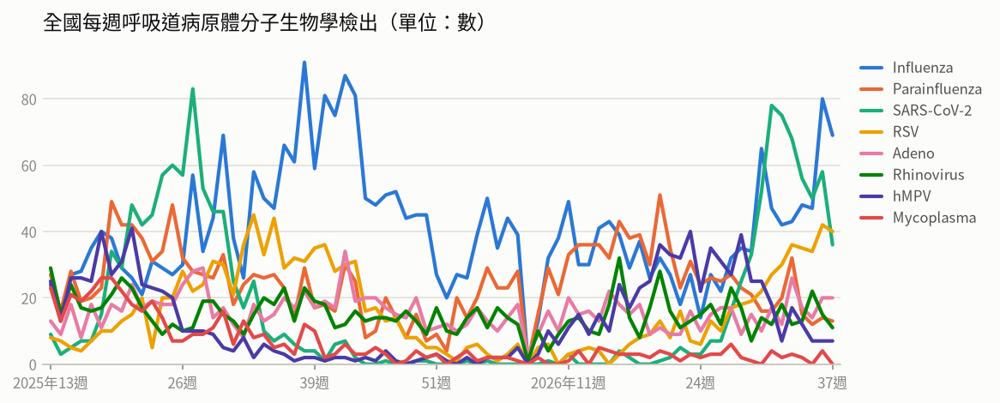

- **全國每週呼吸道病原體分子生物學檢出**（2026年第37週）：共 196，較前一週 ↓ -44（-18%）；陽性率 71.8%

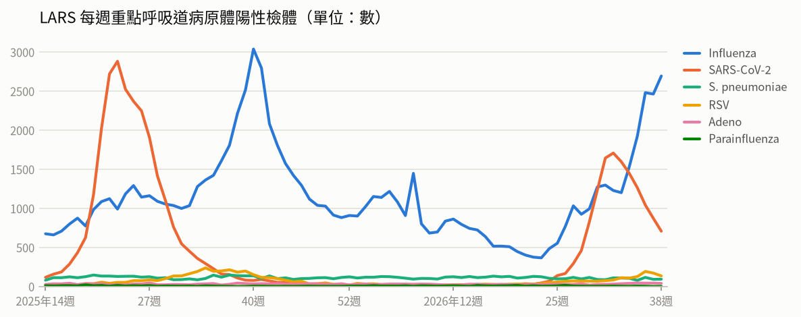

- **LARS 每週重點呼吸道病原體陽性檢體**（2026年第38週）：共 3,668，較前一週 ↑ +29（+1%）

### 新冠（COVID-19）

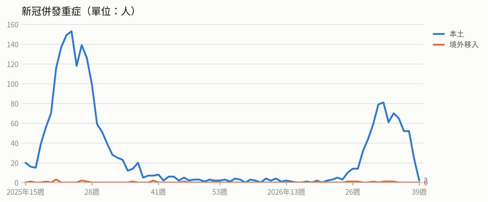

- **新冠併發重症**（2026年第37週）：共 52人（本土 52、境外移入 0），較前一週 → +0（+0%）
  - 統計摘要：上週累計數 24、今年累計數 715、去年總數 1718、今年累計死亡數 140

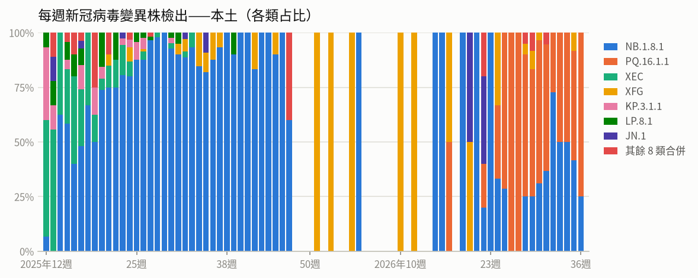

- **每週新冠病毒變異株檢出——本土**（2026年第36週）：共 4，較前一週 ↓ -8（-67%）

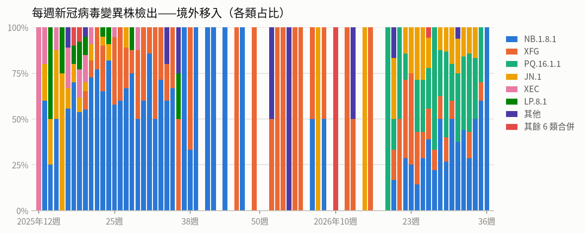

- **每週新冠病毒變異株檢出——境外移入**（2026年第36週）：共 1，較前一週 ↓ -9（-90%）

### 流感

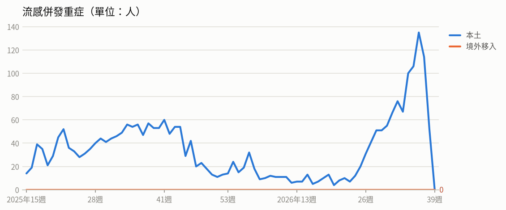

- **流感併發重症**（2026年第37週）：共 114人（本土 114、境外移入 0），較前一週 ↓ -21（-16%）
  - 統計摘要：上週累計數 52、今年累計數 1254、去年總數 2290、今年累計死亡數 245

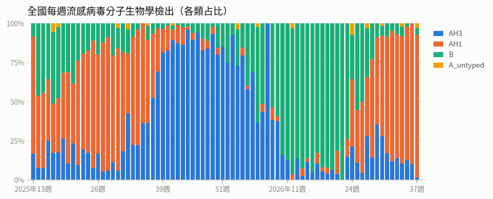

- **全國每週流感病毒分子生物學檢出**（2026年第37週）：共 69，較前一週 ↓ -11（-14%）；陽性率 25.3%

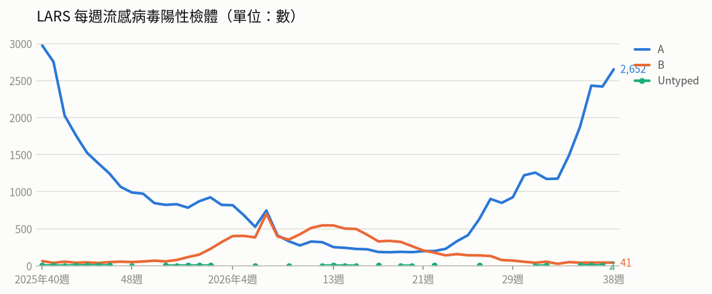

- **LARS 每週流感病毒陽性檢體**（2026年第38週）：共 2,693，較前一週 ↑ +231（+9%）

### 腸病毒

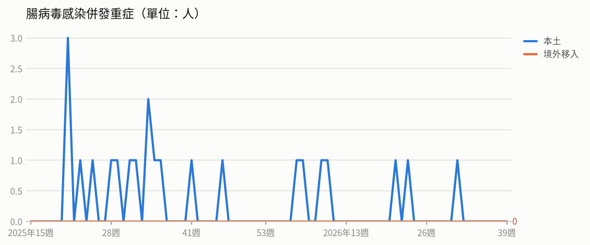

- **腸病毒感染併發重症**（2026年第31週）：共 1人（本土 1、境外移入 0）
  - 統計摘要：上週累計數 0、今年累計數 7、去年總數 19、今年累計死亡數 1

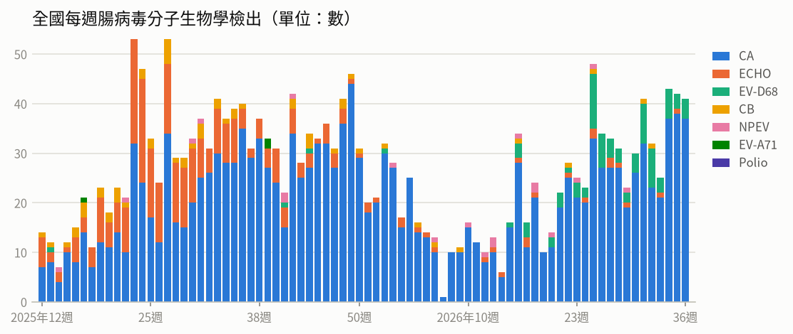

- **全國每週腸病毒分子生物學檢出**（2026年第36週）：共 41，較前一週 ↓ -1（-2%）；陽性率 11.1%

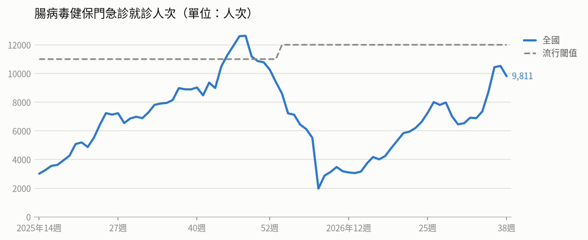

- **腸病毒健保門急診就診人次**（2026年第38週）：共 9,811人次，較前一週 ↓ -716（-7%）（流行閾值 12,000）

### 登革熱

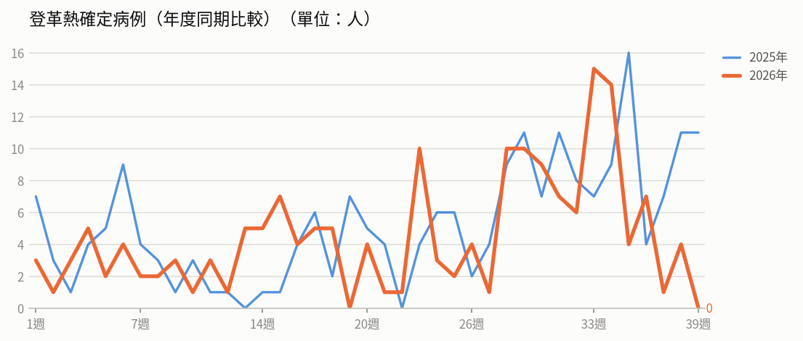

- **登革熱確定病例（年度同期比較）**（2026年第38週）：4人，2025年同期 11人
  - 統計摘要：上週累計數 4、今年累計數 174、去年總數 293、今年累計死亡數 0

> 數據取自 NIDSS（目前為 2026年第39週，統計上一完整週；定序類資料與通報有時間落後，併發重症等項目改取再前一週，以各項標示的週次為準）。最新資料可能因後續回報而變動。

## 重點速覽

- 🔴 **國內流感疫情略升仍在流行期，中秋連假須留意**：第37週類流感門急診較前週微升，新冠就診數下降但同樣處流行期；流感重症以65歲以上長者及慢性病患為多，多數未接種本季疫苗，公費抗病毒藥劑擴大使用已延長至10月31日。
- 🔴 **剛果民主共和國疫情擴及7省，致死率近5成**：累計逾7,600例確診、3,676例死亡，上韋萊省再新增受影響衛生區，地理範圍持續擴大，前往當地者應避免接觸病人、野生動物及生肉。
- 🔴 **孟加拉9月病例與死亡創今年新高，美國佛州也出現死亡**：孟加拉今年累計逾6萬例、184例死亡，已啟動3個月全國防疫計畫；美國佛羅里達州本土病例集中希爾斯波羅郡並以第2型為多，赴疫區應加強防蚊。
- 🔴 **美洲疫情較去年同期增約3.8倍，歐盟多國持續有病例**：美洲今年累計逾5萬2千例確診、61例死亡，病例集中瓜地馬拉、墨西哥、美國、秘魯與加拿大；歐盟以保加利亞、義大利較多，出國前應確認MMR疫苗接種完整。
- 🔴 **剛果民主共和國霍亂與伊波拉疫情並行，救援壓力加倍**：今年截至8月累計逾3萬9千例疑似病例、1,173例死亡，疫情集中東部北基伍與南基伍省，與局勢不穩、人口流動及缺乏安全飲水有關。
- 🟠 **中秋烤肉聚餐當心諾羅病毒，近四週70起腹瀉群聚**：第37週腹瀉門急診與前週持平，群聚以餐飲旅宿業最多，檢驗陽性案件近九成為諾羅病毒；食材應徹底洗淨煮熟、勤洗手並避免生熟食交叉污染。

## 國際重要疫情

- **剛果民主共和國－伊波拉病毒感染**（關注程度：高）：依據剛果民主共和國國家公共衛生研究所（DRC INSP）2026/9/18資料，該國伊波拉病毒感染疫情持續新增病例，單日新增73例確定病例、37例死亡，分布於伊圖里省（46例）、北基伍省（18例）、上韋萊省（6例）及喬波省（3例）。累計確診7,614例，其中3,676例死亡、1,864例康復，致死率達48.3%。疫情已擴及7個省份、63個衛生區，上韋萊省新增一個受影響衛生區（Dungu），地理範圍持續擴大。
  - 旅遊防疫建議：非必要應避免前往疫情流行地區；如需前往，請避免接觸病人血液或體液、野生動物及其生肉，返國時如有發燒等不適應主動告知機場檢疫人員，並於就醫時告知旅遊史。
  - [原文連結](https://www.cdc.gov.tw/TravelEpidemic/Detail/G3PSay_dafdAwjsYNm3CCA?epidemicId=HefhdoFebEJxnvTPJklPoA)
- **剛果民主共和國－霍亂**（關注程度：高）：疾管署引述The Star（2026/9/17）報導，剛果民主共和國今年截至8月霍亂疑似病例累計逾39,400例、死亡1,173例，以東部北基伍省（North Kivu）與南基伍省（South Kivu）疫情最為嚴重。當地局勢不穩、人口流動頻繁及缺乏安全飲水設施為疫情上升主因。由於當地同時面臨伊波拉病毒感染疫情，醫療與人道救援體系承受雙重壓力。
  - 旅遊防疫建議：計劃前往剛果民主共和國者應注意飲食與飲水衛生，僅飲用煮沸或包裝水、食物徹底煮熟並勤洗手；返國後如出現嚴重水瀉等症狀應儘速就醫並告知旅遊史。
  - [原文連結](https://www.cdc.gov.tw/TravelEpidemic/Detail/G3PSay_dafdAwjsYNm3CCA?epidemicId=0MvKFXu1kyWbQ2xf8thXcw)
- **孟加拉、美國（佛羅里達州）－登革熱**（關注程度：高）：依China Daily與BEACON（2026/9/21）資料，孟加拉登革熱疫情嚴峻，9月單月病例與死亡數均創今年最高，該國已於9月初啟動為期3個月的全國防疫計畫，加強病媒蚊孳生源清除與衛教宣導。美國佛羅里達州本土疫情持續擴大，病例多集中於希爾斯波羅郡（Hillsborough County），血清型以第2型（DENV-2）為多，並於9/18報告1例死亡。當地已擴大病媒蚊噴藥與孳生源清除，並加強重症監測。
  - 旅遊防疫建議：前往孟加拉、美國佛州等登革熱流行地區應落實防蚊措施，穿著淺色長袖衣褲、使用政府核可的防蚊藥劑；返國後如出現發燒、頭痛、肌肉痠痛或出疹等症狀，應儘速就醫並主動告知旅遊史。
  - [原文連結](https://www.cdc.gov.tw/TravelEpidemic/Detail/G3PSay_dafdAwjsYNm3CCA?epidemicId=j4iuKXFIJjwREzU4OchdxQ)
- **歐盟／美洲地區（保加利亞、義大利、西班牙、波蘭、比利時、瓜地馬拉、墨西哥、美國、秘魯、加拿大等）－麻疹**（關注程度：高）：依ECDC、PAHO及Beacon於2026/9/17資料，歐盟今年7月共13國報告118例麻疹確定病例，以保加利亞61例最多，其次為義大利29例、西班牙及波蘭各7例、比利時4例；近12個月（2025/8/1-2026/7/31）30國累計2,339例，其中2,012例（86.0%）經實驗室確診，個案以15歲以上為主（51.2%）。ECDC評估疫情主因為部分國家疫苗覆蓋率不足及境外移入，呼籲各國將疫苗覆蓋率提升至95%以上。美洲地區疫情擴大，99.5%病例集中於瓜地馬拉（33,334例）、墨西哥（12,848例）、美國（3,134例）、秘魯（1,997例）及加拿大（1,119例），PAHO預計今年11月評估墨西哥的消除麻疹認證。
  - 旅遊防疫建議：計劃前往歐洲或美洲流行國家者，建議出發前至少2週確認麻疹疫苗接種史，必要時諮詢旅遊醫學門診評估接種；返國後如出現發燒、紅疹等症狀，應戴口罩儘速就醫並主動告知旅遊史。
  - [原文連結](https://www.cdc.gov.tw/TravelEpidemic/Detail/G3PSay_dafdAwjsYNm3CCA?epidemicId=d14HJLgUrMu7aAlZBkLaUA)
- **中國（廣東省）－屈公病**（關注程度：中）：疾管署引述中國廣東疾控中心2026年9月21日資料，廣東省今年4至8月共報告736例屈公病病例，以8月的496例最多，7月為171例，呈現逐月上升趨勢。不過相較去(2025)年廣東省全年累計逾2萬例，今年疫情規模仍遠低於去年同期。
  - 旅遊防疫建議：前往中國廣東等屈公病流行地區時，請落實防蚊措施，如使用政府核可的防蚊藥劑、穿著淺色長袖衣褲；返國入境時如有發燒、關節痛、紅疹等症狀應主動告知機場檢疫人員，返國後21天內若出現疑似症狀請盡速就醫並告知旅遊史。
  - [原文連結](https://www.cdc.gov.tw/TravelEpidemic/Detail/G3PSay_dafdAwjsYNm3CCA?epidemicId=Y1rWSPKbWxuqS0UWdvP1XA)
- **喬治亞（首都提比里斯 Tbilisi）－病毒性腸胃炎（諾羅病毒）**（關注程度：中）：依據The Star 2026年9月21日報導，喬治亞首都提比里斯在9月17日至21日累計通報超過100例住院病例，病患分布於20所幼兒園，多件檢體檢出諾羅病毒。當局指出多所幼兒園同時爆發疫情，可能與集中供應的餐點受污染有關。目前病患多已逐漸恢復，感染源仍在調查中。
  - 旅遊防疫建議：前往當地旅遊或於團膳機構（如幼兒園）活動時，應注意飲食衛生、食用充分煮熟的食物並飲用安全水源；落實勤洗手（以肥皂搓洗，酒精對諾羅病毒效果有限），如出現嘔吐、腹瀉等症狀應儘速就醫並避免處理食物。
  - [原文連結](https://www.cdc.gov.tw/TravelEpidemic/Detail/G3PSay_dafdAwjsYNm3CCA?epidemicId=jOkzESsmwIgQuN7OXjbyaQ)
- **德國－瘧疾**（關注程度：中）：德國於9/17新增報告2例惡性瘧原蟲感染確定病例，均住院治療，其中1例死亡。2例個案皆無流行地區旅遊史，也未在機場工作，居住於緊鄰法蘭克福機場周邊約五公里範圍內施萬海姆區（Schwanheim）的不同住所。該機場及周邊地區今年截至9/18累計8例確定病例、3例死亡，上次報告機場瘧疾病例為2023年；當局已提醒醫師對無旅遊史之不明原因發燒患者應考慮瘧疾可能性。
  - 旅遊防疫建議：前往瘧疾流行地區前應諮詢旅遊醫學門診並做好防蚊措施與瘧疾預防用藥；返國後如出現不明原因發燒，應儘速就醫並主動告知旅遊史。
  - [原文連結](https://www.cdc.gov.tw/TravelEpidemic/Detail/G3PSay_dafdAwjsYNm3CCA?epidemicId=x71z5bkUYAvBjn_WDGlGPA)
- **泰國－發熱伴血小板減少綜合症（SFTS）**（關注程度：中）：疾管署引述BEACON（2026/9/20）資料指出，泰國今年截至9/16累計3例SFTS確定病例，其中2例死亡；自2019年監測以來共10例、5例死亡，病患多為50歲以上。感染途徑與飼養寵物、接觸貓狗、遭蜱蟲叮咬或徒手觸碰蜱蟲有關，當地犬隻SFTS病毒血清陽性率達16.6%，顯示存在廣泛天然宿主。泰國已於9/18將SFTS正式列入法定傳染病強制通報。
  - 旅遊防疫建議：前往泰國或接觸貓狗等動物時，應避免遭蜱蟲叮咬、切勿徒手觸碰蜱蟲；接觸動物後如出現不明原因發燒，應儘速就醫並告知接觸史與旅遊史。
  - [原文連結](https://www.cdc.gov.tw/TravelEpidemic/Detail/G3PSay_dafdAwjsYNm3CCA?epidemicId=KWa4JGmWbq2uVRtozoAMYg)
- **越南－腸病毒**（關注程度：中）：據越南媒體SAIGON 2026年9月21日報導，越南今年全國腸病毒累計報告病例已逾113,000例，高於去年同期；河內市迄今報告近5,000例，胡志明市近期重症病例數亦上升。因適逢開學季，疫情在幼兒園與小學快速擴散。當局規劃相關疫苗於今年10月上市，以提供進一步保護。
  - 旅遊防疫建議：前往越南旅遊或探親應加強手部衛生、勤用肥皂洗手，避免帶幼童出入人多擁擠場所；返國後如幼童出現發燒、口腔潰瘍、手足皮疹或嗜睡、嘔吐等重症前兆，應儘速就醫並告知旅遊史。
  - [原文連結](https://www.cdc.gov.tw/TravelEpidemic/Detail/G3PSay_dafdAwjsYNm3CCA?epidemicId=Gzg-DJv5NkZ9ozYHBjINHQ)
- **非洲（奈及利亞、查德、尼日、幾內亞等8國）－白喉**（關注程度：中）：WHO於2026年9月16日發布風險評估報告，非洲地區白喉疫情持續，區域風險評估為中等（Moderate）、全球風險為低（Low）。除奈及利亞外，查德（1,251例疑似病例、5例死亡）、尼日（818例疑似病例、27例死亡）及幾內亞（600例確定病例、49例死亡）亦有疫情。疫苗覆蓋率下降、實驗室確診率偏低、抗生素及白喉抗毒素等即時治療供應不穩定，加上人群跨境移動，均阻礙疫情控制。
  - 旅遊防疫建議：計劃前往非洲疫區者，應於出國前確認白喉相關疫苗接種是否完整，必要時洽旅遊醫學門診諮詢；返國後如出現發燒、喉嚨痛等症狀，應儘速就醫並告知旅遊史。
  - [原文連結](https://www.cdc.gov.tw/TravelEpidemic/Detail/G3PSay_dafdAwjsYNm3CCA?epidemicId=iTifhSV3YPdPp3P4VQcmgg)
- **全球－新型A型流感（禽流感，含H9N2、H5N1等）**（關注程度：低）：疾管署引用WAHIS資料指出，本週全球無新增新型A型流感人類病例，今年累計報告42例，個案發病前多有易感動物相關暴露史。禽鳥及動物疫情方面，今年已有67個國家/地區報告4,150起高/低病原性禽流感疫情。2026/9/15-18期間，菲律賓報告1起H5（N型別未定）疫情；另有美國、英國各3起，保加利亞、加拿大、挪威、瑞典、菲律賓各1起，共7國11起H5N1疫情。
  - 旅遊防疫建議：前往有禽流感疫情的國家或地區時，請避免接觸禽鳥、進出活禽市場或農場，food 禽肉與蛋類應徹底煮熟，並落實勤洗手；如返國後出現發燒、咳嗽等症狀，請戴口罩儘速就醫並主動告知旅遊及接觸史。
  - [原文連結](https://www.cdc.gov.tw/TravelEpidemic/Detail/G3PSay_dafdAwjsYNm3CCA?epidemicId=52a5DA39mJv_7ng_kfl-mw)
- **全球（含中國、香港、韓國）－COVID-19（新冠肺炎／新冠併發重症）**（關注程度：低）：疾管署引用WHO FluNet、WHO、中國疾控中心、香港衛生防護中心及韓國KCDA資料（2026/9/21）指出，全球第34週新冠陽性率為2.69%，其中歐洲、美洲、非洲及東地中海區呈上升趨勢，近期流行變異株以XFG、NB.1.8.1、JN.1及PQ.16.1.1為主。中國疫情下降，第37週門急診陽性率12.5%，以5-14歲族群檢測陽性率較高；香港疫情降至低點，陽性率0.81%，汙水監測變異株以PQ.16.1.1占97.4%為主，其次為NB.1.8.1(2.2%)及XFG(0.1%)。韓國單週下降，陽性率14.2%，新增287例住院，變異株以PQ.16.1.1(53.9%)為主，其次為NB.1.8.1(19.7%)、BA.3.2(15.8%)及RF.5(5.3%)。
  - 旅遊防疫建議：計劃前往疫情上升地區（如歐洲、美洲、非洲及東地中海區）者，出發前可評估接種新冠疫苗，旅途中落實勤洗手、於人潮擁擠或密閉場所佩戴口罩。返國後如出現發燒、呼吸道症狀，應盡速就醫並告知旅遊史。
  - [原文連結](https://www.cdc.gov.tw/TravelEpidemic/Detail/G3PSay_dafdAwjsYNm3CCA?epidemicId=1uS7eMtPWYzJ7_YScRfZ9w)
- **美國－流行性腮腺炎**（關注程度：低）：疾管署引述Beacon及county news center（2026/9/20）資訊指出，美國加州聖地牙哥州立大學（SDSU）於9月18日報告3例流行性腮腺炎確定病例與2例可能病例，感染者均為同校學生。當地已啟動接觸者追蹤，並進行症狀篩檢及提供疫苗接種。全美今年截至9月10日累計31州通報157例確定病例。
  - 旅遊防疫建議：計畫前往美國者應確認麻疹腮腺炎德國麻疹（MMR）疫苗接種是否完整，並於旅途中落實勤洗手及咳嗽禮節；返國後如出現發燒或耳下腺腫脹等症狀，應戴口罩儘速就醫並告知旅遊史。
  - [原文連結](https://www.cdc.gov.tw/TravelEpidemic/Detail/G3PSay_dafdAwjsYNm3CCA?epidemicId=l5eaNCYVnh2c6_RbaX5JSQ)
- **阿富汗、巴基斯坦、剛果民主共和國、馬利、奈及利亞、索馬利亞－小兒麻痺症（脊髓灰質炎）**（關注程度：低）：疾管署引用全球小兒麻痺根除倡議組織（GPEI）2026/9/16資料，公布9/10-16期間全球新增WPV1病例2國共3例，分別為阿富汗2例、巴基斯坦1例；cVDPV2病例3國共4例，分別為剛果民主共和國2例、馬利與奈及利亞各1例。環境樣本方面，WPV1於巴基斯坦新增1件，cVDPV2於索馬利亞新增2件。
  - 旅遊防疫建議：計劃前往阿富汗、巴基斯坦、剛果民主共和國、馬利、奈及利亞、索馬利亞等疫情流行地區者，建議出國前確認小兒麻痺疫苗接種史並依旅遊醫學門診建議完成追加接種；返國後如出現肢體無力等症狀應儘速就醫並告知旅遊史。
  - [原文連結](https://www.cdc.gov.tw/TravelEpidemic/Detail/G3PSay_dafdAwjsYNm3CCA?epidemicId=4S8ZzNn3n5OnS1vzzA2WdA)

## 本週國內公告摘要

### 腸病毒

#### 國內腸病毒疫情持續 籲請家長及教托育機構提高警覺 落實手部衛生及環境清潔消毒

- **來源／關注程度／地區**：衛生福利部疾病管制署／中／全國
- **病例概況**：第37週（9/13-9/19）腸病毒門急診就診10,359人次，與前一週10,400人次相當，今年累計7例重症確定病例（含1例死亡）。
- **摘要**：疾管署2026年9月22日表示國內腸病毒疫情持續，第37週門急診就診計10,359人次，與前一週相當，仍須觀察連續假期後疫情變化。近四週社區流行以克沙奇A6型為多，其次為腸病毒D68型及克沙奇A16型；今年累計7例重症（D68型5例、克沙奇A4型及A16型各1例），其中1例死亡。腸病毒易在校園、安親班、托嬰中心及室內兒童遊戲場等人口密集場所傳播，籲請家長及教托育機構提高警覺。
- **防疫建議**：請以肥皂正確勤洗手（酒精對腸病毒效果有限），環境可用500 ppm漂白水消毒、受口鼻分泌物或排泄物污染處用1,000 ppm消毒，擦拭後靜待10分鐘再以清水擦拭；5歲以下幼兒若出現嗜睡、意識不清、活力不佳、手腳無力、肌抽躍、持續嘔吐、呼吸急促或心跳加快等重症前兆，應儘速送大醫院治療。
- **原文連結**：https://www.cdc.gov.tw/Bulletin/Detail/ALZLA0KRpqy-ZSTxtiUSlg?typeId=9

### 流感（併新冠肺炎）

#### 流感及新冠於仍處流行期且流感疫情持續上升 呼籲民眾連假期間加強自主防疫 出現重症危險徵兆儘速就醫

- **來源／關注程度／地區**：衛生福利部疾病管制署／高／全國
- **病例概況**：第37週（9/13-9/19）類流感門急診就診141,375人次較前週升1.4%，上週新增165例流感併發重症及30例死亡；新冠門急診14,462人次下降20.6%，新增48例本土重症及9例死亡，兩者均仍處流行期。
- **摘要**：疾管署表示國內流感疫情略升且處流行期，社區流行病毒以A型H1N1為主（占84.9%）；本流感季累計1,586例重症、304例死亡，重症以65歲以上長者（65.8%）及具慢性病史者（83.2%）居多，67.8%未接種本季流感疫苗。新冠疫情雖下降但仍在流行期，自2025年10月起累計723例本土重症、133例死亡，近4週變異株以NB.1.8.1及PQ.16.1.1為主。因應中秋連假人際交流頻繁，疾管署已延長公費流感抗病毒藥劑擴大使用期限至10月31日。
- **防疫建議**：連假期間請落實勤洗手、咳嗽禮節，有發燒咳嗽等症狀時戴口罩、在家休息並及早就醫；65歲以上長者、嬰幼兒、慢性病人及孕婦等高危險群若出現呼吸急促、呼吸困難、發紺、血痰、胸痛、意識改變等危險徵兆，應立即就醫評估用藥。
- **原文連結**：https://www.cdc.gov.tw/Bulletin/Detail/Tj9G4dJj3yMmEE0URl49CA?typeId=9

### 腸道傳染病（腹瀉、諾羅病毒）

#### 中秋賞月慶團圓 請民眾注意飲食安全與個人衛生 勿讓腸道傳染病找上門

- **來源／關注程度／地區**：衛生福利部疾病管制署／中／全國
- **病例概況**：第37週（9/13-9/19）腹瀉門急診就診126,419人次，與前一週128,026人次持平；近四週接獲70起腹瀉群聚通報。
- **摘要**：疾管署2026年9月22日提醒，中秋佳節烤肉聚餐應注意飲食安全。監測顯示第37週腹瀉門急診就診126,419人次，與前一週持平；近四週（第34至37週）共70起腹瀉群聚通報，以餐飲旅宿業最多，28起檢驗陽性案件中病毒類占89.3%（25起）均為諾羅病毒，細菌類占10.7%（金黃色葡萄球菌2起、沙門氏桿菌1起）。8月諾羅病毒分型以GII.17為主要流行型別，約占34.2%。
- **防疫建議**：聚餐烤肉時請確保食材新鮮並澈底加熱，生熟食器具分開避免交叉污染，避免生食生飲；如廁後及進食或準備食物前以肥皂勤洗手，有疑似症狀者勿處理食材，應儘速就醫、在家休息並補充水分與電解質，需外出時務必戴口罩。
- **原文連結**：https://www.cdc.gov.tw/Bulletin/Detail/IMM1D3m7alowJ-zPY7kS_g?typeId=9
