# 疫情週報 2026-W40

涵蓋期間：2026-09-28 ~ 2026-10-04

> 本報告由 AI 自動產生，內容以疾管署原文為準。

## 監測數據

### 呼吸道病原體（整體）

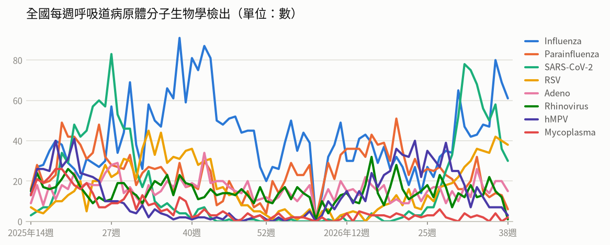

- **全國每週呼吸道病原體分子生物學檢出**（2026年第38週）：共 156，較前一週 ↓ -41（-21%）；陽性率 61.2%

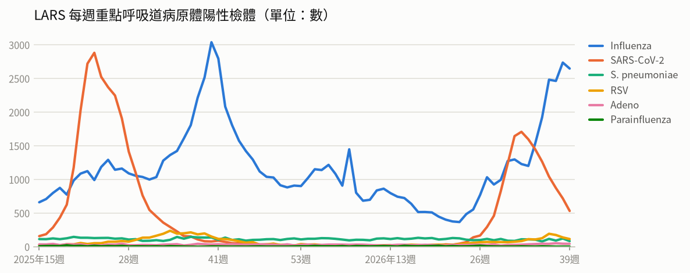

- **LARS 每週重點呼吸道病原體陽性檢體**（2026年第39週）：共 3,419，較前一週 ↓ -340（-9%）

### 新冠（COVID-19）

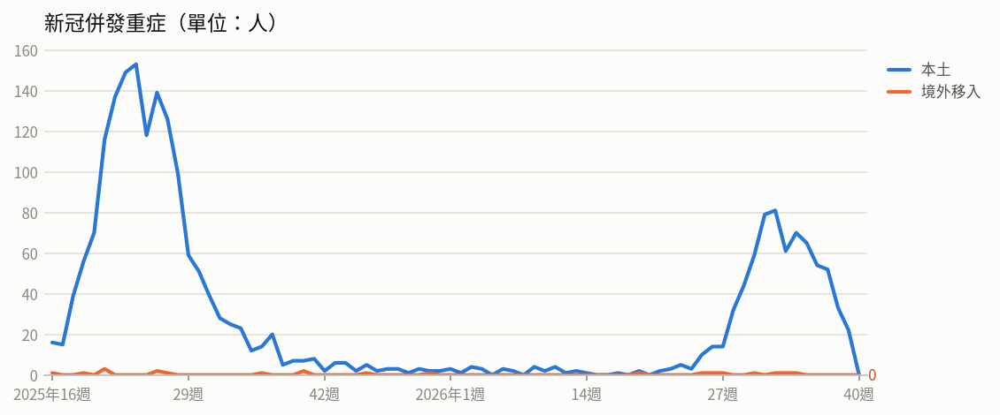

- **新冠併發重症**（2026年第38週）：共 33人（本土 33、境外移入 0），較前一週 ↓ -19（-37%）
  - 統計摘要：上週累計數 22、今年累計數 746、去年總數 1718、今年累計死亡數 156

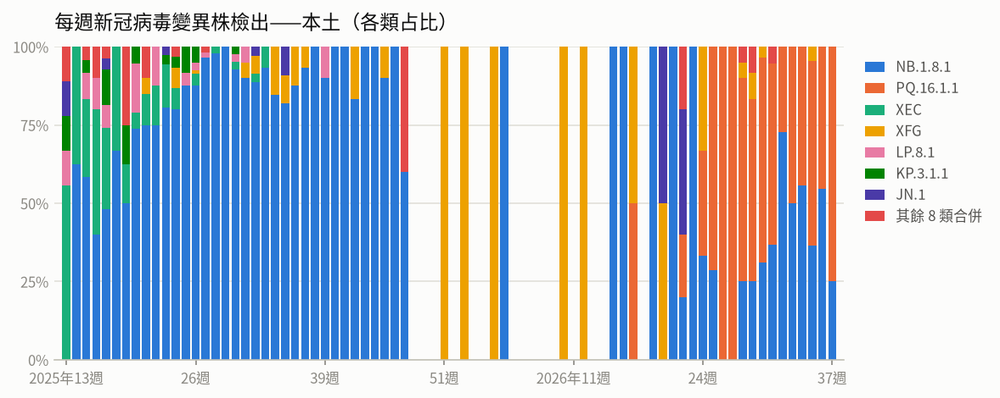

- **每週新冠病毒變異株檢出——本土**（2026年第37週）：共 4，較前一週 ↓ -7（-64%）

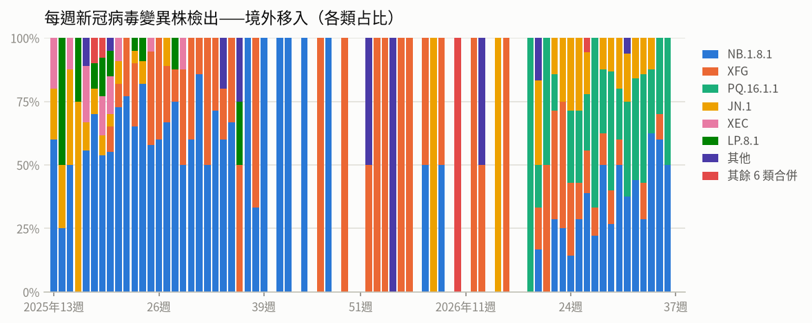

- **每週新冠病毒變異株檢出——境外移入**（2026年第36週）：共 4，較前一週 ↓ -6（-60%）

### 流感

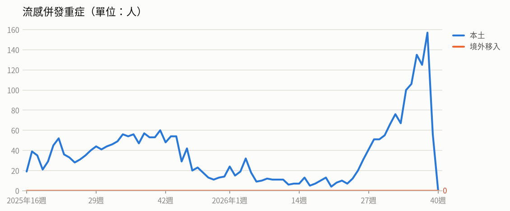

- **流感併發重症**（2026年第38週）：共 157人（本土 157、境外移入 0），較前一週 ↑ +32（+26%）
  - 統計摘要：上週累計數 56、今年累計數 1426、去年總數 2290、今年累計死亡數 290

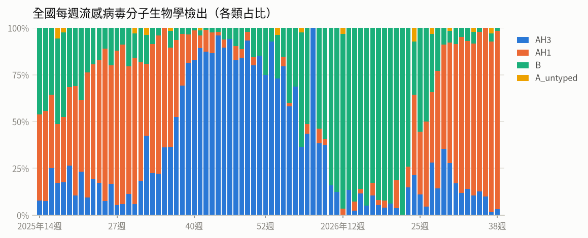

- **全國每週流感病毒分子生物學檢出**（2026年第38週）：共 61，較前一週 ↓ -8（-12%）；陽性率 23.9%

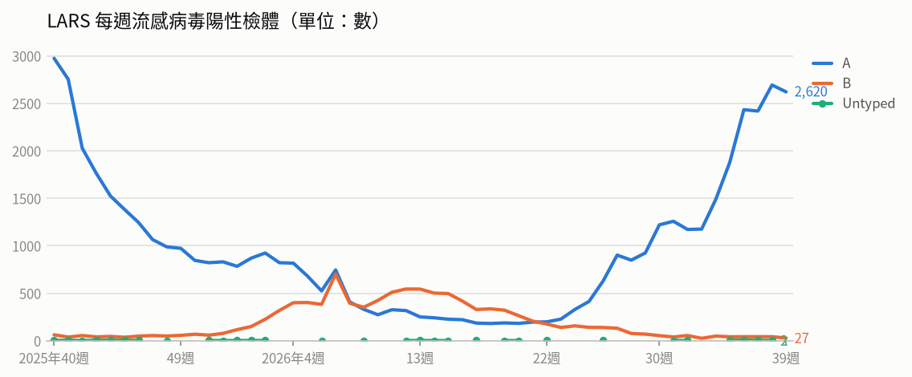

- **LARS 每週流感病毒陽性檢體**（2026年第39週）：共 2,647，較前一週 ↓ -89（-3%）

### 腸病毒

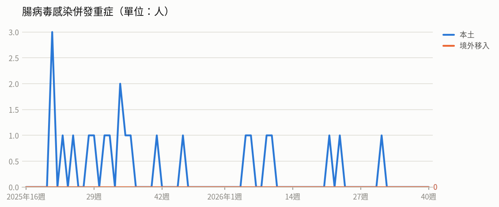

- **腸病毒感染併發重症**（2026年第31週）：共 1人（本土 1、境外移入 0）
  - 統計摘要：上週累計數 0、今年累計數 7、去年總數 19、今年累計死亡數 1

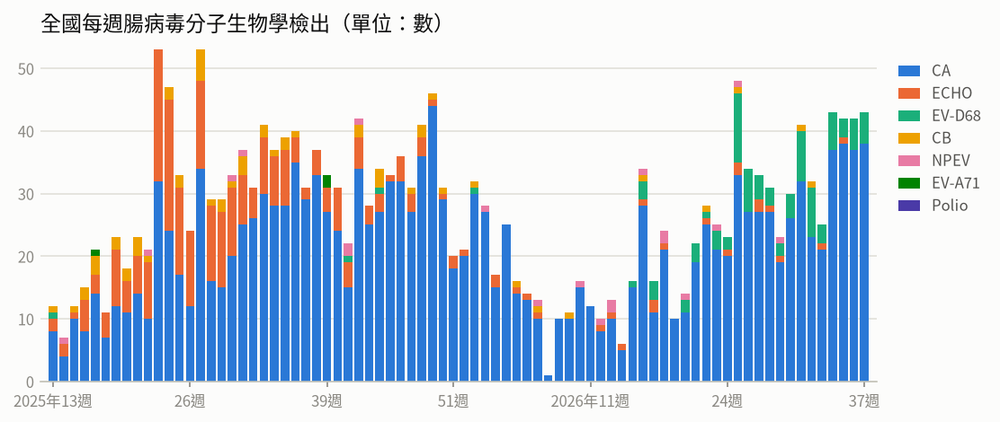

- **全國每週腸病毒分子生物學檢出**（2026年第37週）：共 43，較前一週 ↑ +1（+2%）；陽性率 14.5%

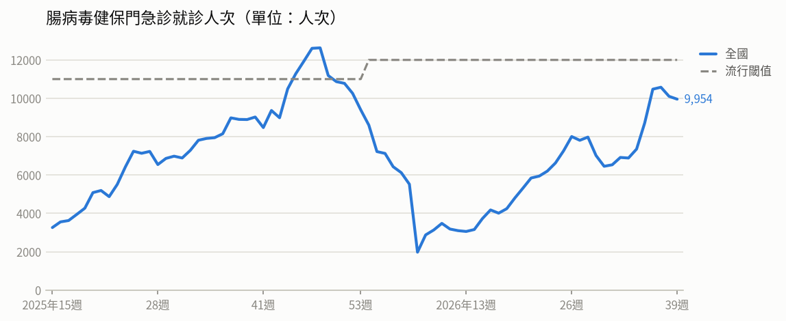

- **腸病毒健保門急診就診人次**（2026年第39週）：共 9,954人次，較前一週 ↓ -147（-1%）（流行閾值 12,000）

### 登革熱

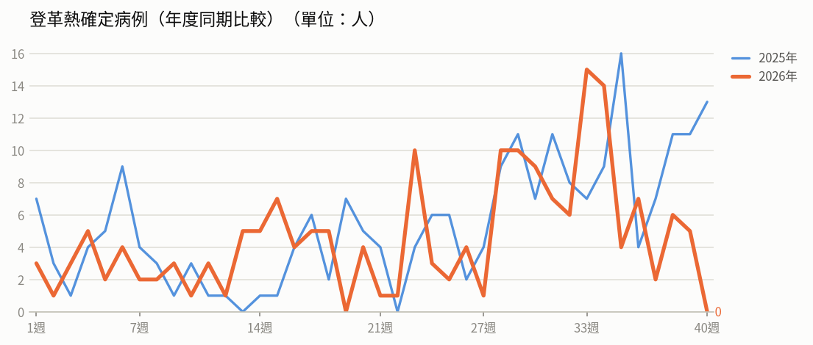

- **登革熱確定病例（年度同期比較）**（2026年第39週）：5人，2025年同期 11人
  - 統計摘要：上週累計數 5、今年累計數 182、去年總數 293、今年累計死亡數 0

> 數據取自 NIDSS（目前為 2026年第40週，統計上一完整週；定序類資料與通報有時間落後，併發重症等項目改取再前一週，以各項標示的週次為準）。最新資料可能因後續回報而變動。

## 重點速覽

- 🔴 **彰化再添1例本土登革熱，研判為社區群聚**：新增個案與9月18日首例住處僅距約110公尺，為彰化2023年以來首起本土群聚；全國今年累計178例（本土12例）。東南亞方面，越南胡志明市今年已逾3.4萬例，赴疫區應加強防蚊。
- 🔴 **公費流感與新冠疫苗10月1日同步開打**：第一階段涵蓋65歲以上長者、幼兒、孕婦、機構住民與醫事人員等對象，11月2日起開放50歲以上無高風險慢性病成人；國內類流感與新冠門急診雖下降，仍處流行期，上週流感併發重症87例、新冠本土重症33例。
- 🔴 **剛果伊波拉疫情未歇，致死率逼近五成**：截至9月27日累計8,116例確定病例、3,924例死亡，致死率48.3%，單日仍新增49例；疫情擴及7省63個衛生區，以伊圖里省最嚴峻（占76.2%）。
- 🔴 **美洲麻疹疫情持續，墨西哥病例數破1.3萬**：美國今年累計3,659例、2例死亡，95%個案未接種或接種史不明；墨西哥13,484例、22例死亡，秘魯2,438例、1例死亡。前往上述地區前應確認MMR疫苗接種史。
- 🔴 **WHO：2025年全球霍亂死亡人數增3成，創近年新高**：2025年全球47國累計45萬1,499例、7,870例死亡，為1999年以來單年死亡最高；疫情集中於安哥拉、蘇丹、葉門等7國，逾五分之一死亡發生在醫療機構外，顯示延誤就醫問題嚴重。
- 🟠 **馬來西亞吉打州出現28年來首例人類狂犬病死亡**：31歲男性8月遭流浪狗咬傷後就醫但未接受暴露後預防處置（PEP），不幸死亡；另WHO已認證智利消除犬隻傳播之人類狂犬病。國人在外若遭動物抓咬傷，務必立即就醫評估PEP。

## 國際重要疫情

- **全球（疫情集中於安哥拉、孟加拉、剛果民主共和國、奈及利亞、南蘇丹、蘇丹及葉門等7國）－霍亂**（關注程度：高）：WHO於2026年9月29日報告，2025年全球霍亂病例數雖較前一年下降，死亡人數卻增加30%，創1999年以來單年新高。疫情集中於安哥拉、孟加拉、剛果民主共和國、奈及利亞、南蘇丹、蘇丹及葉門等7國，約占全球病例數與死亡數的9成，且非洲病例數與死亡數皆上升。WHO今年重啟預防接種計畫，口服疫苗年產量已提升至8,000萬劑，但逾五分之一死亡個案發生在醫療機構之外，凸顯延誤就醫問題嚴重，並呼籲各國加速投資安全水質與衛生設施。
  - 旅遊防疫建議：前往上述流行地區旅遊或工作前，建議先至旅遊醫學門診諮詢並評估接種霍亂疫苗；當地應落實勤洗手、飲用煮沸或瓶裝水、食物充分煮熟，若出現嚴重水瀉等症狀應立即就醫並告知旅遊史。
  - [原文連結](https://www.cdc.gov.tw/TravelEpidemic/Detail/G3PSay_dafdAwjsYNm3CCA?epidemicId=hwxNPIlYE0lMcqSs78p8eQ)
- **剛果民主共和國－伊波拉病毒感染**（關注程度：高）：依據剛果民主共和國國家公共衛生研究所（DRC INSP）2026/9/27資料，該國伊波拉疫情持續新增病例，9/25新增43例確定病例，其中19例死亡，分布於伊圖里省31例、北基伍省9例、上韋萊省3例。截至9/25累計7,989例確定病例，其中3,852例死亡、2,033例康復，致死率達48.2%。疫情已擴及7個省份、63個衛生區，以伊圖里省最為嚴峻，占全國病例數76.3%。
  - 旅遊防疫建議：民眾應避免前往疫情流行地區，如必須前往請避免接觸疑似病患、其血液或體液及野生動物（如蝙蝠、靈長類）；返國後如出現發燒、嘔吐、腹瀉、出血等症狀，請主動告知機場檢疫人員或就醫時說明旅遊史。
  - [原文連結](https://www.cdc.gov.tw/TravelEpidemic/Detail/G3PSay_dafdAwjsYNm3CCA?epidemicId=iED63-vUv7KNn5hzPSKZ4w)
- **剛果民主共和國－伊波拉病毒感染**（關注程度：高）：依據剛果民主共和國INSP及WHO疫情通報（2026/9/27），該國伊波拉疫情持續新增病例，9月27日新增49例確定病例，其中23例死亡，分布於伊圖里省（27例）、北基伍省（18例）及上韋萊省（4例）。迄9月27日累計8,116例確定病例，含3,924例死亡、2,088例康復，致死率達48.3%。疫情已擴及7個省份、63個衛生區，其中伊圖里省最為嚴峻，占全國病例數的76.2%。
  - 旅遊防疫建議：計畫前往剛果民主共和國者應審慎評估行程必要性，當地期間避免接觸疑似病患、其體液及野生動物，並落實手部衛生；返國後如出現發燒等不適，應主動告知機場檢疫人員或儘速就醫並說明旅遊史。
  - [原文連結](https://www.cdc.gov.tw/TravelEpidemic/Detail/G3PSay_dafdAwjsYNm3CCA?epidemicId=pJcqAZS5vsPtIZYEssagKQ)
- **美國、墨西哥、秘魯－麻疹**（關注程度：高）：疾管署引述美國CDC、墨西哥衛生部、秘魯衛生部等資料指出，美國麻疹疫情持續上升，今年截至9/28已有47個州/地區報告3,659例確定病例及2例死亡，95%病例未接種疫苗或接種史不明，以5-19歲（1,577例，佔43%）為多，主要集中於賓州（850例）、南卡羅萊納州（670例）及猶他州（535例）。墨西哥截至9/28累計13,484例確定病例、22例死亡，以哈利斯科州7,266例最多，其次為墨西哥城1,033例；年齡以1-4歲（2,692例）為多。秘魯截至9/25累計2,438例確定病例、1例死亡，死者為洛雷托大區16歲未接種疫苗男孩，因麻疹併發肺炎等併發症死亡，該區因地理偏遠、交通不便，疫苗接種、病例追蹤與醫療服務面臨挑戰。
  - 旅遊防疫建議：計劃前往美國、墨西哥、秘魯等麻疹流行地區者，建議出國前確認麻疹疫苗接種史，必要時提前諮詢旅遊醫學門診並完成接種；返國後如出現發燒、紅疹等症狀，應戴口罩儘速就醫並主動告知旅遊史。
  - [原文連結](https://www.cdc.gov.tw/TravelEpidemic/Detail/G3PSay_dafdAwjsYNm3CCA?epidemicId=ifynwbcjkqJ-AGIl9IpV6w)
- **全球（本週人類病例為中國；禽類疫情含美國、秘魯、挪威、丹麥、奈及利亞、瑞典）－新型A型流感（禽流感）**（關注程度：中）：疾管署依WAHIS資料更新全球新型A型流感疫情：本週人類病例新增中國2例A(H9N2)，全球今年累計44例，個案發病前多具易感動物相關暴露史。動物疫情方面，今年累計67個國家/地區通報4,168起高/低病原性禽流感疫情；2026/9/21-25期間共6國報告18起H5N1疫情，以美國8起最多，其次為秘魯5起、挪威2起，丹麥、奈及利亞、瑞典各1起。
  - 旅遊防疫建議：前往流行地區應避免接觸禽鳥、進出活禽市場或生鮮市場，不生食禽類及蛋品，並落實勤洗手；返國後如出現發燒、咳嗽等症狀，應戴口罩就醫並主動告知旅遊與接觸史。
  - [原文連結](https://www.cdc.gov.tw/TravelEpidemic/Detail/G3PSay_dafdAwjsYNm3CCA?epidemicId=IUfr-X-q7QH4MZOcAp4cUg)
- **奈及利亞－拉薩熱**（關注程度：中）：依Beacon、NCDC等資料來源（2026/9/23），奈及利亞拉薩熱疫情呈下降趨勢，第36週新增12例確定病例，低於第35週的18例。今年累計1,086例確定病例、259例死亡，致死率23.9%，高於去年同期的18.6%。病例分布於24州（118個區），其中87%集中於包奇州、翁多州、塔拉巴州、貝努埃州及埃多州等5州，患者以21至30歲族群為主。當局呼籲持續防範鼠類傳播風險。
  - 旅遊防疫建議：前往奈及利亞等流行地區應避免接觸鼠類及其排泄物污染的食物與環境，食物需妥善存放並煮熟；返國後如出現發燒等不適，應儘速就醫並告知旅遊史。
  - [原文連結](https://www.cdc.gov.tw/TravelEpidemic/Detail/G3PSay_dafdAwjsYNm3CCA?epidemicId=yuLXJ8H3-kvzJjJ26Or4aw)
- **孟加拉、尚比亞－炭疽病**（關注程度：中）：疾管署引述Beacon（2026/9/25）資料指出，孟加拉朗布爾專區疫情與屠宰病牛後將牛肉分送約100戶食用有關，牛肉檢體已驗出陽性菌，部分病例曾參與屠宰或處理牛肉，當局已啟動疫情調查並持續於受影響地區推動疫苗接種。尚比亞穆欽加省21例確定病例病情穩定，另有59頭野生動物死亡，當局已展開大規模家畜疫苗接種，並呼籲民眾勿食用野生動物肉品以降低人畜共通傳播風險。
  - 旅遊防疫建議：前往上述疫情地區應避免接觸或屠宰病死動物、不食用來源不明的牛肉及野生動物肉品，肉類應充分煮熟；返國後如出現皮膚潰瘍焦痂、發燒或腸胃道、呼吸道症狀，請盡速就醫並主動告知旅遊及動物接觸史。
  - [原文連結](https://www.cdc.gov.tw/TravelEpidemic/Detail/G3PSay_dafdAwjsYNm3CCA?epidemicId=lQu-5iNul8z5h5Up_56VCQ)
- **德國－沙門氏菌感染症**（關注程度：中）：依Food Safety News 2026/9/28報導，德國沙門氏菌疫情呈跨年性長期流行，今年6月以來新增39例，前一流行季累計116例、至少24例住院。全基因組定序顯示本次流行菌株與2011至2024年間歐洲17國疫情（逾600例）及奧地利2025年檢出之菌株相似。疑似感染源為義大利進口番茄，懷疑係灌溉用水遭污染所致，且受污染番茄已流入多個歐洲國家。
  - 旅遊防疫建議：前往歐洲旅遊或當地生活時，生鮮蔬果應充分清洗並儘量避免生食，注意飲食及手部衛生；如出現發燒、腹瀉、腹痛等症狀，應儘速就醫並告知旅遊史。
  - [原文連結](https://www.cdc.gov.tw/TravelEpidemic/Detail/G3PSay_dafdAwjsYNm3CCA?epidemicId=0cESbNbpYyJtuodHwEBVqA)
- **美國－腸道出血性大腸桿菌感染症**（關注程度：中）：依據US CDC與BEACON（2026/9/28）資料，美國通報13例腸道出血性大腸桿菌（O26:H11）感染病例，分布於加州等9個州，超過一半病例為5歲以下幼童。病例中8例住院、3例併發溶血性尿毒症候群。當局調查發現病患皆曾食用某生產商製造之生乳起司，已要求產品下架並進行溯源調查。
  - 旅遊防疫建議：赴美旅遊或日常飲食應避免食用生乳及未經殺菌處理的乳製品，尤其幼童等高風險族群；食物應徹底煮熟、注意手部衛生，若出現腹瀉、血便等症狀應儘速就醫並告知旅遊及飲食史。
  - [原文連結](https://www.cdc.gov.tw/TravelEpidemic/Detail/G3PSay_dafdAwjsYNm3CCA?epidemicId=Vr0SYNlkLZUapzZA_Ghn6w)
- **越南－登革熱**（關注程度：中）：疾管署引述越南胡志明市衛生單位（HCDC）2026年9月24日資料指出，該市今年截至第38週累計登革熱病例達34,161例。第38週單週新增1,462例，較近4週平均上升3.2%，疫情高於去年同期水準，病例主要集中於崑島特區及平慶社等行政區。
  - 旅遊防疫建議：計畫前往越南（尤其胡志明市）者，應全程做好防蚊措施，穿著淺色長袖衣褲並使用政府核可的防蚊藥劑；返國時如有發燒、頭痛、關節痛或出疹等症狀，請主動告知機場檢疫人員，並於就醫時告知旅遊史。
  - [原文連結](https://www.cdc.gov.tw/TravelEpidemic/Detail/G3PSay_dafdAwjsYNm3CCA?epidemicId=DAqX4O2HjsfzJesbSDg7Jw)
- **阿富汗、巴基斯坦、剛果民主共和國、查德－小兒麻痺症（脊髓灰質炎）**（關注程度：中）：依全球小兒麻痺根除倡議組織（GPEI）2026/9/23資料，9月17至23日期間阿富汗新增7例野生型脊髓灰質炎病毒第一型（WPV1）病例，剛果民主共和國與查德則分別新增3例及1例疫苗衍生株cVDPV2病例，巴基斯坦另檢出1件WPV1環境樣本。巴基斯坦於9月29日通報新增1例WPV1病例，個案為居住於西北部開伯爾-普赫圖赫瓦省（KP）班努地區的17個月大女嬰。該例為巴基斯坦今年第5例病例，其中4例均出現在班努地區，該國今年已啟動4次大規模疫苗接種運動。
  - 旅遊防疫建議：計劃前往阿富汗、巴基斯坦及非洲等小兒麻痺流行地區者，出國前應確認小兒麻痺疫苗接種完整並視需要追加接種；家中幼兒請依公費接種時程按時完成相關疫苗接種。
  - [原文連結](https://www.cdc.gov.tw/TravelEpidemic/Detail/G3PSay_dafdAwjsYNm3CCA?epidemicId=2irBI1-wUSwavFrgqpj5_g)
- **全球（含歐洲、美洲、中國）－新冠併發重症（COVID-19）**（關注程度：低）：疾管署引用WHO FluNet、WHO及中國疾控中心資料指出，全球新冠陽性率於今年第35週(8/31-9/6)為3.68%，其中歐洲及美洲呈上升趨勢。全球近期流行變異株以XFG、NB.1.8.1、JN.1及PQ.16.1.1為主。中國疫情則呈下降趨勢，第38週(9/14-20)門急診陽性率為9.3%，較第37週的12.5%下降。
  - 旅遊防疫建議：前往歐洲、美洲等疫情上升地區時，應留意個人衛生、勤洗手並視情況配戴口罩；返國後如出現發燒、呼吸道症狀，應儘速就醫並告知旅遊史。
  - [原文連結](https://www.cdc.gov.tw/TravelEpidemic/Detail/G3PSay_dafdAwjsYNm3CCA?epidemicId=sFqMkxpiUWE_5fyFPYyrTw)
- **捷克－破傷風**（關注程度：低）：疾管署引述Outbreak News Today（2026/9/17）資訊指出，捷克今年9月通報1例破傷風確定病例，個案為48歲男性，因頭部撕裂傷接受治療。此為捷克自2022年以來首例破傷風病例，該國近20年累計僅報告5例，顯示當地病例相當罕見。
  - 旅遊防疫建議：民眾應依建議完成破傷風相關疫苗接種並適時追加，若有外傷、撕裂傷或傷口遭污染，應儘速清潔傷口並就醫評估是否需補接種疫苗。
  - [原文連結](https://www.cdc.gov.tw/TravelEpidemic/Detail/G3PSay_dafdAwjsYNm3CCA?epidemicId=dXPqHYtwQIWPpv5ovAiLZQ)
- **日本（德島縣）－細菌性腸胃炎（產氣莢膜桿菌）**（關注程度：低）：依Yahoo News 2026年9月23日報導，日本德島縣通報29例急性腸胃炎病例，患者皆為70歲以上長者，分屬2間長照機構，於9月16至17日出現腹瀉等症狀。採檢後有5例產氣莢膜桿菌陽性，疑似感染源為團膳業者供應之餐點。當局已要求該業者進行環境清消並停業5天。
  - 旅遊防疫建議：前往日本旅遊或於機構照護長者時，應注意飲食衛生，食物應徹底加熱並儘速食用、避免長時間室溫放置，並落實勤洗手；若出現腹瀉等腸胃道症狀應儘速就醫並告知旅遊史。
  - [原文連結](https://www.cdc.gov.tw/TravelEpidemic/Detail/G3PSay_dafdAwjsYNm3CCA?epidemicId=vIHr6595karpNpyRi7SO-g)
- **智利、馬來西亞－狂犬病**（關注程度：低）：WHO於2026年9月14日宣布智利消除犬隻傳播的人類狂犬病，為南美洲第一個獲認證國家，該國長期推動犬隻疫苗接種、疫情監測、實驗室診斷及暴露後預防處置（PEP）等措施。另一方面，馬來西亞西北部吉打州古邦巴素縣出現1名31歲男性死亡案例，為該縣1998年以來首例人類病例。個案於8月被流浪狗咬傷後曾就醫，但未接受暴露後預防處置，相關部門已採取預防措施並展開流行病學調查以釐清感染來源。
  - 旅遊防疫建議：前往狂犬病風險地區應避免接觸或餵食流浪犬貓及野生動物，必要時可於行前諮詢旅遊醫學門診評估接種疫苗；若遭動物咬傷或抓傷，應立即以肥皂和大量清水沖洗傷口並儘速就醫評估暴露後預防處置。
  - [原文連結](https://www.cdc.gov.tw/TravelEpidemic/Detail/G3PSay_dafdAwjsYNm3CCA?epidemicId=UOzAU0hoIFzQ4fTrDTmsgA)
- **歐洲、南非－呼吸道疾病（新冠肺炎、流感、呼吸道融合病毒）**（關注程度：低）：疾管署引述ECDC與NICD 2026/9/28資料指出，歐洲地區第38週新冠肺炎陽性率上升至15%，流行變異株以XFG佔74%為主；流感陽性率5.3%仍低於基線值，型別以A(H3N2)為主，呼吸道融合病毒活動度低。南非第38週新冠陽性率1.5%維持低水平，流感陽性率9%且近4週（第35-38週）以B型佔64%為主；南非已於9/28宣布RSV流行季於第34週結束，但仍需持續採取預防措施以減少呼吸道病毒傳播。
  - 旅遊防疫建議：前往歐洲或南非旅遊時，請留意當地呼吸道疾病流行情形，落實勤洗手、咳嗽禮節及視情況佩戴口罩；符合條件者建議依規定接種新冠及流感疫苗，返國後如出現發燒、咳嗽等呼吸道症狀應儘速就醫並告知旅遊史。
  - [原文連結](https://www.cdc.gov.tw/TravelEpidemic/Detail/G3PSay_dafdAwjsYNm3CCA?epidemicId=dAT_vx9BRnU-7cTwcLwW-A)
- **美國－退伍軍人病**（關注程度：低）：依據Outbreak News Today 2026年9月22日報導，美國伊利諾州出現2例退伍軍人病確定病例，兩名個案皆曾於今年8月前往某飯店。當局已進行環境調查及水質採樣，並關閉相關設施，其中部分設施的供水系統檢體檢出陽性。
  - 旅遊防疫建議：前往國外旅遊入住旅宿時，建議留意供水與空調設備衛生，長者、吸菸者及免疫功能低下者尤應注意；返國後如出現發燒、咳嗽、呼吸困難等症狀，應儘速就醫並告知旅遊史。
  - [原文連結](https://www.cdc.gov.tw/TravelEpidemic/Detail/G3PSay_dafdAwjsYNm3CCA?epidemicId=oVG2ymNW-1_iEFfCW4jDuQ)

## 本週國內公告摘要

### 登革熱

#### 彰化縣新增1例本土登革熱病例 疾管署機動防疫隊全力支援地方各項防疫工作

- **來源／關注程度／地區**：衛生福利部疾病管制署／中／彰化縣
- **病例概況**：彰化縣新增1例本土登革熱（第一型）病例，與9月18日公布之首例居住地僅相距約110公尺，初步研判為社區群聚；今年全國累計178例確定病例，其中本土12例（高雄市10例、彰化縣2例）、境外移入166例。
- **摘要**：疾管署2026年10月1日公布彰化縣彰化市60多歲男性確診本土登革熱，檢出登革病毒第一型，目前住院治療，密切接觸者無疑似症狀。個案無國外旅遊史，居住地與彰化縣首例本土個案相距約110公尺，初步研判為一起社區群聚事件，亦為彰化縣2023年以來首例本土登革熱群聚，將進一步定序釐清關聯。衛生單位已進行病媒蚊密度調查與孳生源清除，並規劃設置社區篩檢站擴大採檢；疾管署機動防疫隊自9月17日起支援，至9月29日出勤34人次，查獲544件積水容器、70件陽性容器，開立21張稽查督察紀錄單。
- **防疫建議**：請落實「巡、倒、清、刷」清除家戶內外孳生源，戶外活動穿著淺色長袖衣褲並使用核可防蚊藥劑（DEET、Picaridin或IR-3535）。出現發燒、頭痛、後眼窩痛、肌肉關節痛、出疹等疑似症狀應儘速就醫並告知旅遊活動史，彰化縣疫情周邊居民可至社區篩檢站採檢。
- **原文連結**：https://www.cdc.gov.tw/Bulletin/Detail/CdbgopQoFEjbaRObY4JebA?typeId=9

### 流感、COVID-19

#### 「左流右新 護肺顧心」10月1日公費流感及新冠疫苗同步開打

- **來源／關注程度／地區**：衛生福利部疾病管制署／不適用／全國
- **病例概況**：本篇為公費疫苗接種政策公告，未提供病例數統計資料。
- **摘要**：疾管署於2026年10月1日舉辦「左流右新 護肺顧心」記者會，宣布115年度公費流感及新冠疫苗自10月1日同步開打。今年採購流感疫苗705萬150劑（含標準型684萬9,360劑、免疫加強型20萬790劑），為歷年首次超過700萬劑，加強型優先提供長照及安養機構65歲以上長者；新冠疫苗採購240萬劑（Moderna 220萬劑、Novavax 20萬劑），12歲以上適用之單劑型全面升級為新世代疫苗。接種分二階段，第一階段10月1日起針對65歲以上長者、55歲以上原住民、學齡前幼兒、高風險對象、孕婦、6個月內嬰兒雙親或實際扶養者、機構及醫事防疫人員等；第二階段11月2日起開放50歲以上無高風險慢性病成人。
- **防疫建議**：因流感及新冠病毒持續變異，建議每年接種流感及新冠疫苗，符合公費資格者請把握開打時程及早同時接種。全國近4,000家合約院所提供服務，可透過衛生局網頁、疾管署官網、LINE@疾管家或1922查詢並事先預約，接種時攜帶健保卡及兒童健康手冊、孕婦健康手冊等證明文件。
- **原文連結**：https://www.cdc.gov.tw/Bulletin/Detail/4v-EU-rH3UbhFvRs0tjTqQ?typeId=9

### 流感、新冠（COVID-19）

#### 2026年度公費流感及新冠疫苗第一階段將於10月1日開打 接種左流右新疫苗還可獲得1350健康幣

- **來源／關注程度／地區**：衛生福利部疾病管制署／中／全國
- **病例概況**：第38週（9/20-9/26）類流感門急診138,654人次較前週降3.2%，新冠門急診10,502人次降28.4%，兩者疫情雖下降或持平但仍處流行期；上週新增流感併發重症87例、死亡30例，新冠本土重症33例、死亡14例。
- **摘要**：疾管署宣布2026年度公費流感及新冠疫苗第一階段自10月1日開打，涵蓋醫事人員、65歲以上長者、55至64歲原住民、機構住民與工作人員、幼兒、孕婦、具潛在疾病者、學生、禽畜及動物防疫人員等11大類；第二階段自11月2日起開放50至64歲無高風險慢性病成人接種。本年度採購標準型流感疫苗約644.9萬劑、加強型約17萬劑（優先供機構65歲以上受照顧者及工作人員），以及220萬劑Moderna新冠疫苗，其中190萬劑單劑型供12歲以上接種並全面升級為新世代疫苗，抗原劑量為前一代的1/5、不良反應比例約減半且可誘發近2倍抗體反應。全臺約4,000家合約院所，自10月1日起年滿18歲民眾接種新冠、流感、肺炎鏈球菌疫苗可分別獲得900、450、600健康幣，12月1日起可兌換健康商品。
- **防疫建議**：符合公費接種資格者請儘早接種流感與新冠疫苗，於疫情高峰前獲得保護力，尤其65歲以上長者及慢性病患者風險最高；可先透過衛生局網站、VAX MAP、疾管家或1922查詢鄰近合約院所並電話預約，接種時攜帶健保卡及相關證明文件。
- **原文連結**：https://www.cdc.gov.tw/Bulletin/Detail/PkxM8mKEAbKUXcS81xFuxQ?typeId=9
