# 監測數據段落預覽

### 呼吸道病原體（整體）

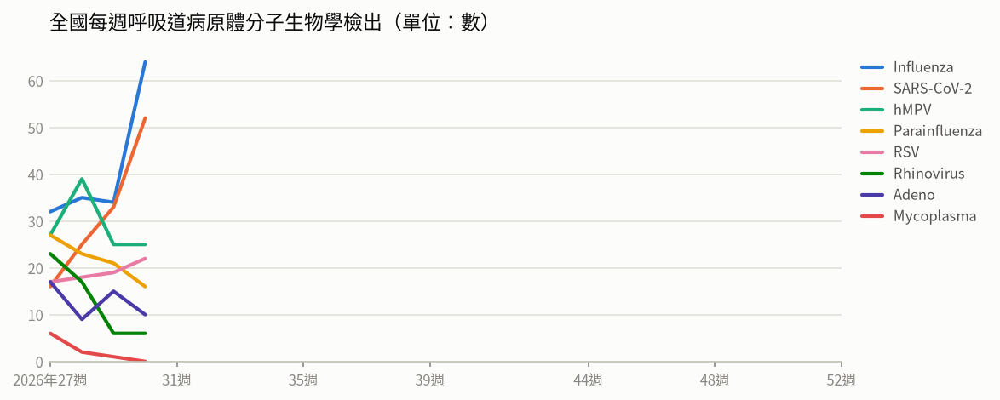

- **全國每週呼吸道病原體分子生物學檢出**（2026年第30週）：共 195，較前一週 ↑ +41（+27%）；陽性率 71.7%

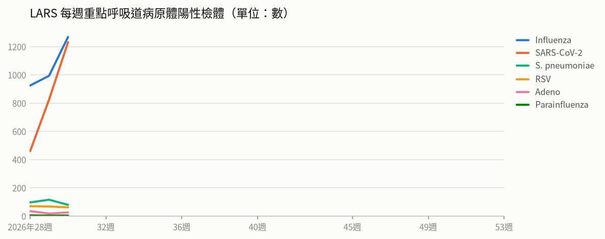

- **LARS 每週重點呼吸道病原體陽性檢體**（2026年第30週）：共 2,667，較前一週 ↑ +648（+32%）

### 新冠（COVID-19）

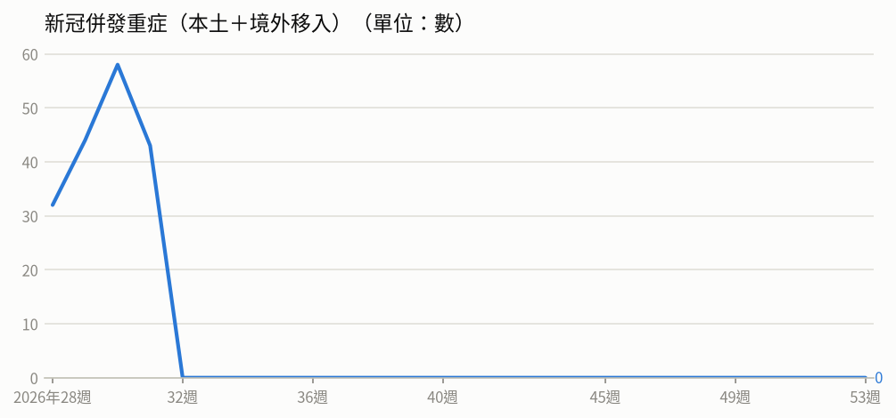

- **新冠併發重症（本土＋境外移入）**（2026年第30週）：共 58，較前一週 ↑ +14（+32%）
  - 統計摘要：上週累計數 58、今年累計數 267、去年總數 1718、今年累計死亡數 31

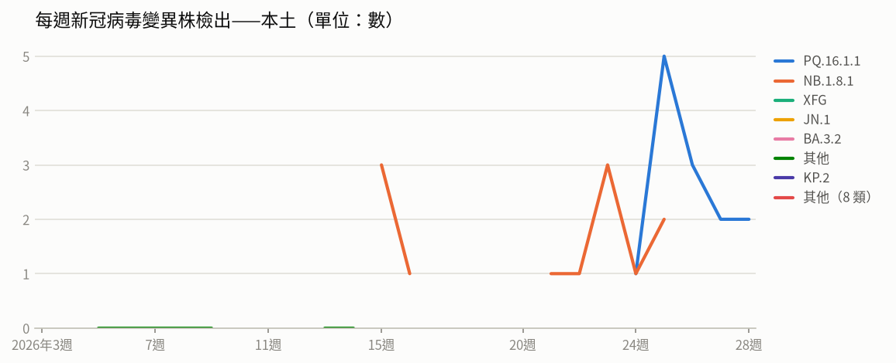

- **每週新冠病毒變異株檢出——本土**（2026年第28週）：共 2，較前一週 → +0（+0%）

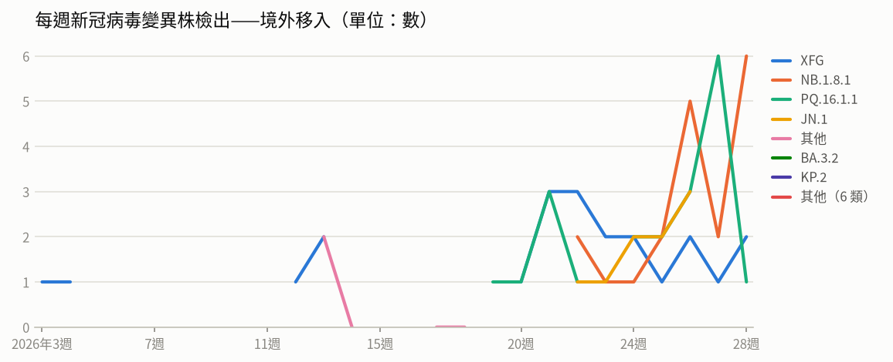

- **每週新冠病毒變異株檢出——境外移入**（2026年第28週）：共 11，較前一週 ↑ +2（+22%）

### 流感

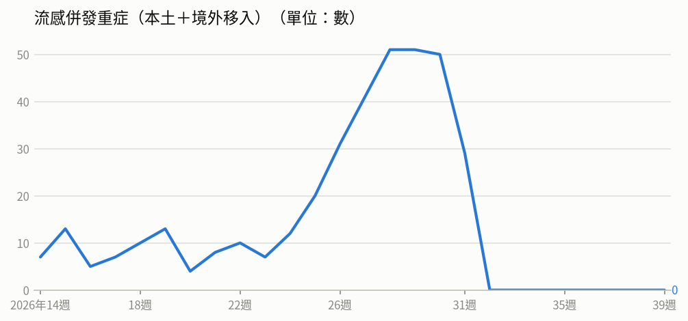

- **流感併發重症（本土＋境外移入）**（2026年第30週）：共 50，較前一週 ↓ -1（-2%）
  - 統計摘要：上週累計數 50、今年累計數 562、去年總數 2290、今年累計死亡數 99

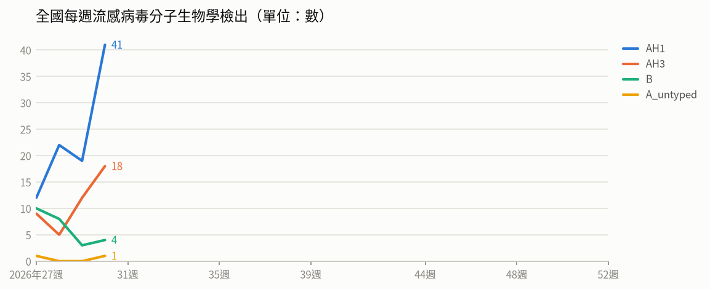

- **全國每週流感病毒分子生物學檢出**（2026年第30週）：共 64，較前一週 ↑ +30（+88%）；陽性率 23.5%

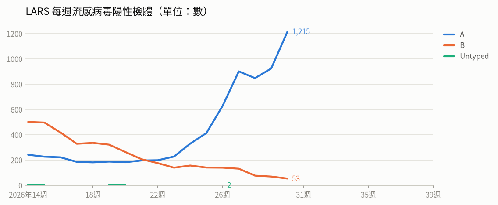

- **LARS 每週流感病毒陽性檢體**（2026年第30週）：共 1,268，較前一週 ↑ +275（+28%）

### 腸病毒

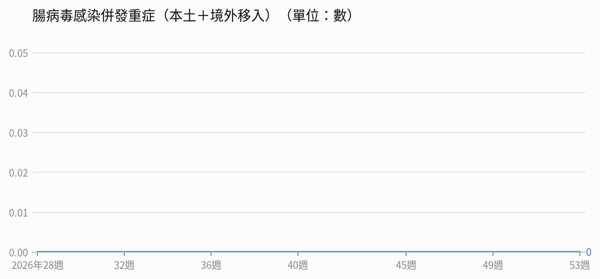

- **腸病毒感染併發重症（本土＋境外移入）**（2026年第30週）：共 0
  - 統計摘要：上週累計數 0、今年累計數 6、去年總數 19、今年累計死亡數 1

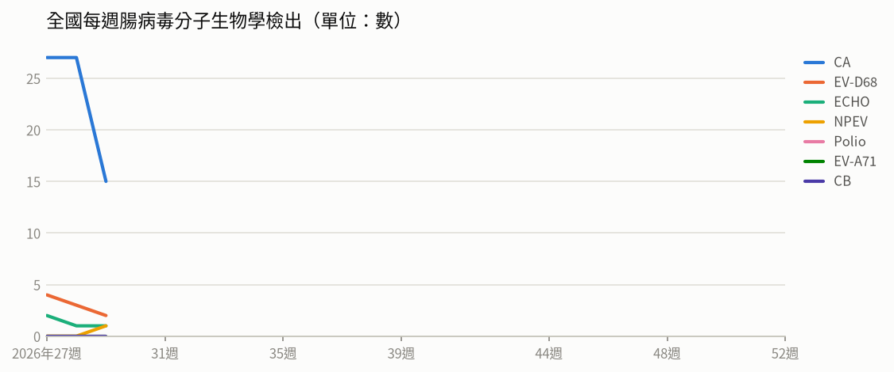

- **全國每週腸病毒分子生物學檢出**（2026年第29週）：共 19，較前一週 ↓ -12（-39%）；陽性率 7.4%

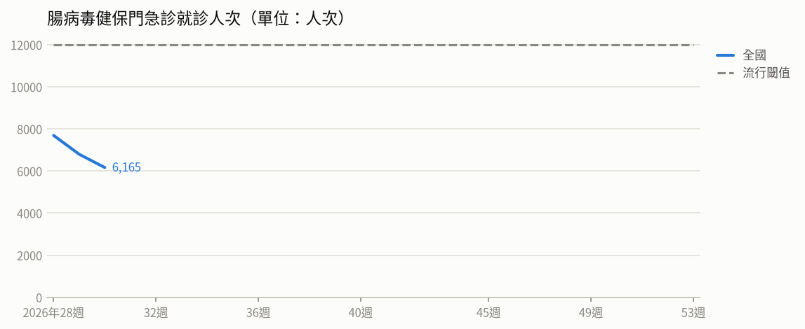

- **腸病毒健保門急診就診人次**（2026年第30週）：共 6,165人次，較前一週 ↓ -630（-9%）（流行閾值 12,000）

### 登革熱

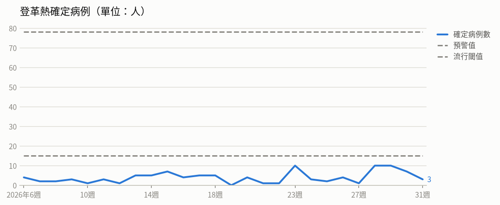

- **登革熱確定病例**（2026年第30週）：共 7人，較前一週 ↓ -3（-30%）
  - 統計摘要：上週累計數 7、今年累計數 117、去年總數 293、今年累計死亡數 0

> 數據取自 NIDSS（目前為 2026年第31週，統計上一完整週；定序類資料有時間落後，以各項標示的週次為準）。最新資料可能因後續回報而變動。
